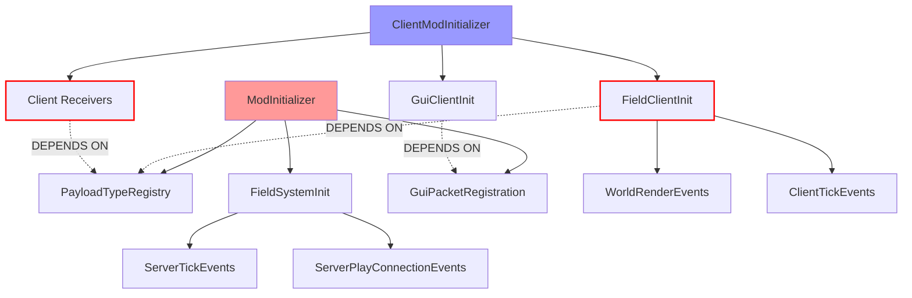

# Initialization Architecture v2: OOP-Driven Design

> **Purpose**: Comprehensive refactoring plan leveraging OOP principles and design patterns for a robust, traceable, and maintainable initialization system.

## Executive Summary

The current initialization system suffers from:
1. **Scattered responsibilities** across multiple files
2. **Implicit dependencies** that cause race conditions
3. **No progress tracking** or verification
4. **Inconsistent error handling** (failures are often silent)
5. **Duplicate code patterns** for similar registration tasks

This plan proposes an **OOP-driven initialization framework** using:
- **Abstract base classes** for common initialization patterns
- **Builder pattern** for phase configuration
- **Observer pattern** for progress tracking
- **Template Method pattern** for initialization sequences
- **Chain of Responsibility** for error handling

---

## Part 1: Current State Analysis

### 1.1 Initialization Files Identified

| File | Side | Purpose | Issues |
|------|------|---------|--------|
| `TheVirusBlock.java` | Common | Main mod initializer | God class: 450 lines, mixes payloads, handlers, game logic |
| `TheVirusBlockClient.java` | Client | Client initializer | Inline registrations, no structure |
| `FieldSystemInit.java` | Common | Field system init | Good structure, but isolated |
| `FieldClientInit.java` | Client | Field client init | Good structure, heavy inline logic |
| `GuiPacketRegistration.java` | Common | GUI packet types | Mixes payload registration and handlers |
| `GuiClientInit.java` | Client | GUI client init | Duplicate work with `TheVirusBlockClient` |

### 1.2 Current Registration Locations

```
PayloadTypeRegistry.playS2C() calls:
├── TheVirusBlock.java:         19 payloads (lines 241-257)
├── GuiPacketRegistration.java:  5 payloads (lines 20-24)
└── FieldNetworking.java:        4 payloads (DEAD CODE - never called!)

PayloadTypeRegistry.playC2S() calls:
├── TheVirusBlock.java:          2 payloads (lines 258-259)
└── GuiPacketRegistration.java:  5 payloads (lines 27-31)

ServerPlayNetworking.registerGlobalReceiver() calls:
├── TheVirusBlock.java:          2 handlers (lines 275-278)
└── GuiPacketRegistration.java:  5 handlers (lines 45-216)

ClientPlayNetworking.registerGlobalReceiver() calls:
├── TheVirusBlockClient.java:    7 receivers (lines 98-111)
├── FieldClientInit.java:        6 receivers (lines 53-76)
└── (Potential duplicates for same IDs!)
```

### 1.3 Dependency Graph Issues



**Critical Issue**: `FieldClientInit` and `TheVirusBlockClient` both register receivers for the same payloads, but their execution order is undefined!

---

## Part 2: Design Patterns Application

### 2.1 Abstract Base Classes

#### `InitPhase` - Base class for all initialization phases

```java
/**
 * Abstract base for all initialization phases.
 * Implements Template Method pattern for consistent lifecycle.
 */
public abstract class InitPhase {
    
    // Phase metadata
    private final String name;
    private final int order;
    private final Set<Class<? extends InitPhase>> dependencies;
    
    // State tracking
    private InitState state = InitState.PENDING;
    private long startTimeMs;
    private long endTimeMs;
    private Throwable error;
    private int itemsRegistered;
    
    protected InitPhase(String name, int order) {
        this.name = name;
        this.order = order;
        this.dependencies = new HashSet<>();
    }
    
    /**
     * Template Method: Defines the initialization sequence.
     */
    public final InitResult execute() {
        if (state != InitState.PENDING) {
            return InitResult.alreadyExecuted(this);
        }
        
        state = InitState.RUNNING;
        startTimeMs = System.currentTimeMillis();
        Logging.REGISTRY.info("▶ Starting phase: {}", name);
        
        try {
            // Hook: Pre-initialization validation
            if (!validate()) {
                throw new InitializationException("Validation failed for phase: " + name);
            }
            
            // Core registration work
            itemsRegistered = doInit();
            
            // Hook: Post-initialization verification
            verify();
            
            state = InitState.COMPLETED;
            endTimeMs = System.currentTimeMillis();
            Logging.REGISTRY.info("✓ Completed phase: {} ({} items, {}ms)", 
                name, itemsRegistered, endTimeMs - startTimeMs);
            
            return InitResult.success(this, itemsRegistered);
            
        } catch (Throwable t) {
            state = InitState.FAILED;
            error = t;
            endTimeMs = System.currentTimeMillis();
            Logging.REGISTRY.error("✗ Failed phase: {} - {}", name, t.getMessage());
            
            return InitResult.failure(this, t);
        }
    }
    
    // ========== Abstract Methods (must implement) ==========
    
    /** Perform the actual initialization work. Return count of items registered. */
    protected abstract int doInit();
    
    // ========== Hook Methods (optional override) ==========
    
    /** Pre-validation before init. Return false to abort. */
    protected boolean validate() { return true; }
    
    /** Post-verification after init. Throw if invalid. */
    protected void verify() {}
    
    /** Dependencies that must complete before this phase. */
    protected Set<Class<? extends InitPhase>> dependencies() {
        return Collections.emptySet();
    }
    
    // ========== Getters ==========
    
    public String name() { return name; }
    public int order() { return order; }
    public InitState state() { return state; }
    public long durationMs() { return endTimeMs - startTimeMs; }
    public int itemsRegistered() { return itemsRegistered; }
    public Optional<Throwable> error() { return Optional.ofNullable(error); }
}

public enum InitState {
    PENDING, RUNNING, COMPLETED, FAILED
}
```

#### Concrete Implementations

```java
/**
 * Payload type registration phase.
 * Abstract base for S2C and C2S payloads.
 */
public abstract class PayloadRegistrationPhase extends InitPhase {
    
    private final Set<Identifier> registered = new HashSet<>();
    
    protected PayloadRegistrationPhase(String name, int order) {
        super(name, order);
    }
    
    /** Register an S2C payload type with duplicate detection. */
    protected <T extends CustomPayload> void registerS2C(CustomPayload.Id<T> id, PacketCodec<?, T> codec) {
        if (registered.contains(id.id())) {
            throw new DuplicateRegistrationException("S2C payload already registered: " + id.id());
        }
        PayloadTypeRegistry.playS2C().register(id, codec);
        registered.add(id.id());
        Logging.REGISTRY.debug("  + S2C: {}", id.id());
    }
    
    /** Register a C2S payload type with duplicate detection. */
    protected <T extends CustomPayload> void registerC2S(CustomPayload.Id<T> id, PacketCodec<?, T> codec) {
        if (registered.contains(id.id())) {
            throw new DuplicateRegistrationException("C2S payload already registered: " + id.id());
        }
        PayloadTypeRegistry.playC2S().register(id, codec);
        registered.add(id.id());
        Logging.REGISTRY.debug("  + C2S: {}", id.id());
    }
    
    public Set<Identifier> registeredIds() {
        return Collections.unmodifiableSet(registered);
    }
}


/**
 * Client receiver registration phase.
 * Validates that payload types are registered before receivers.
 */
public abstract class ReceiverRegistrationPhase extends InitPhase {
    
    private final PayloadRegistrationPhase payloadPhase;
    private final Set<Identifier> registered = new HashSet<>();
    
    protected ReceiverRegistrationPhase(String name, int order, PayloadRegistrationPhase payloadPhase) {
        super(name, order);
        this.payloadPhase = payloadPhase;
    }
    
    @Override
    protected boolean validate() {
        // Validate that payload phase completed successfully
        if (payloadPhase.state() != InitState.COMPLETED) {
            Logging.REGISTRY.error("Cannot register receivers: payload phase not completed");
            return false;
        }
        return true;
    }
    
    /** Register a client receiver with validation. */
    protected <T extends CustomPayload> void registerReceiver(
            CustomPayload.Id<T> id, 
            BiConsumer<T, ClientPlayNetworking.Context> handler) {
        
        // Validate payload type exists
        if (!payloadPhase.registeredIds().contains(id.id())) {
            throw new UnknownPayloadException("No S2C payload registered for: " + id.id());
        }
        
        if (registered.contains(id.id())) {
            throw new DuplicateRegistrationException("Receiver already registered: " + id.id());
        }
        
        ClientPlayNetworking.registerGlobalReceiver(id, (payload, context) -> {
            Logging.NETWORK.trace("⟵ Received: {} (thread={})", id.id(), Thread.currentThread().getName());
            context.client().execute(() -> handler.accept(payload, context));
        });
        
        registered.add(id.id());
        Logging.REGISTRY.debug("  + Receiver: {}", id.id());
    }
}


/**
 * Event callback registration phase.
 */
public abstract class EventRegistrationPhase extends InitPhase {
    
    protected EventRegistrationPhase(String name, int order) {
        super(name, order);
    }
    
    // Convenince wrappers with logging
    protected void onClientTick(ClientTickEvents.EndTick handler) {
        ClientTickEvents.END_CLIENT_TICK.register(handler);
        Logging.REGISTRY.debug("  + Event: ClientTick.END");
    }
    
    protected void onWorldRender(WorldRenderEvents.AfterEntities handler) {
        WorldRenderEvents.AFTER_ENTITIES.register(handler);
        Logging.REGISTRY.debug("  + Event: WorldRender.AFTER_ENTITIES");
    }
    
    protected void onDisconnect(ClientPlayConnectionEvents.Disconnect handler) {
        ClientPlayConnectionEvents.DISCONNECT.register(handler);
        Logging.REGISTRY.debug("  + Event: ClientConnection.DISCONNECT");
    }
    
    protected void onServerTick(ServerTickEvents.EndWorldTick handler) {
        ServerTickEvents.END_WORLD_TICK.register(handler);
        Logging.REGISTRY.debug("  + Event: ServerTick.END_WORLD");
    }
    
    protected void onPlayerJoin(ServerPlayConnectionEvents.Join handler) {
        ServerPlayConnectionEvents.JOIN.register(handler);
        Logging.REGISTRY.debug("  + Event: ServerConnection.JOIN");
    }
}
```

### 2.2 Builder Pattern: Phase Configuration

```java
/**
 * Builder for constructing initialization phases with fluent API.
 */
public class PhaseBuilder<T extends InitPhase> {
    
    private final Supplier<T> factory;
    private boolean required = true;
    private boolean parallel = false;
    private Duration timeout = Duration.ofSeconds(30);
    private List<Consumer<T>> callbacks = new ArrayList<>();
    
    public static <T extends InitPhase> PhaseBuilder<T> create(Supplier<T> factory) {
        return new PhaseBuilder<>(factory);
    }
    
    public PhaseBuilder<T> optional() {
        this.required = false;
        return this;
    }
    
    public PhaseBuilder<T> parallel() {
        this.parallel = true;
        return this;
    }
    
    public PhaseBuilder<T> timeout(Duration timeout) {
        this.timeout = timeout;
        return this;
    }
    
    public PhaseBuilder<T> onComplete(Consumer<T> callback) {
        this.callbacks.add(callback);
        return this;
    }
    
    public PhaseConfig<T> build() {
        return new PhaseConfig<>(factory, required, parallel, timeout, callbacks);
    }
}
```

### 2.3 Orchestrator: Chain of Responsibility for Execution

```java
/**
 * Central initialization orchestrator.
 * Manages phase execution with dependency resolution, progress tracking, and error handling.
 */
public final class InitOrchestrator {
    
    private static final Logger LOGGER = LoggerFactory.getLogger("Init");
    
    private final List<InitPhase> phases = new ArrayList<>();
    private final List<InitProgressListener> listeners = new ArrayList<>();
    private InitState overallState = InitState.PENDING;
    
    private InitOrchestrator() {}
    
    public static InitOrchestrator create() {
        return new InitOrchestrator();
    }
    
    // ========== Phase Registration ==========
    
    public InitOrchestrator phase(InitPhase phase) {
        phases.add(phase);
        return this;
    }
    
    public InitOrchestrator phases(InitPhase... phases) {
        Collections.addAll(this.phases, phases);
        return this;
    }
    
    public InitOrchestrator listener(InitProgressListener listener) {
        listeners.add(listener);
        return this;
    }
    
    // ========== Execution ==========
    
    /**
     * Execute all phases in dependency-respecting order.
     * @return Summary of initialization results
     */
    public InitSummary execute() {
        if (overallState != InitState.PENDING) {
            throw new IllegalStateException("Orchestrator already executed");
        }
        
        overallState = InitState.RUNNING;
        long startTime = System.currentTimeMillis();
        
        // Sort phases by order and dependencies
        List<InitPhase> sorted = topologicalSort(phases);
        
        // Notify start
        notifyStart(sorted.size());
        
        // Track results
        List<InitResult> results = new ArrayList<>();
        boolean anyFailed = false;
        
        for (int i = 0; i < sorted.size(); i++) {
            InitPhase phase = sorted.get(i);
            
            // Notify progress
            notifyPhaseStart(phase, i, sorted.size());
            
            // Check if dependencies failed
            if (shouldSkip(phase, results)) {
                results.add(InitResult.skipped(phase, "Dependency failed"));
                notifyPhaseSkipped(phase);
                continue;
            }
            
            // Execute phase
            InitResult result = phase.execute();
            results.add(result);
            
            // Notify completion
            notifyPhaseComplete(phase, result);
            
            if (result.failed()) {
                anyFailed = true;
                // Continue to other phases (fail-soft) or stop (fail-fast)
                // Default: continue
            }
        }
        
        long totalTime = System.currentTimeMillis() - startTime;
        overallState = anyFailed ? InitState.FAILED : InitState.COMPLETED;
        
        InitSummary summary = buildSummary(results, totalTime);
        notifyComplete(summary);
        
        logSummary(summary);
        
        return summary;
    }
    
    // ========== Dependency Resolution ==========
    
    private List<InitPhase> topologicalSort(List<InitPhase> phases) {
        // Simple topological sort based on declared dependencies + order
        return phases.stream()
            .sorted(Comparator.comparingInt(InitPhase::order))
            .toList();
    }
    
    private boolean shouldSkip(InitPhase phase, List<InitResult> results) {
        Set<Class<? extends InitPhase>> deps = phase.dependencies();
        for (InitResult result : results) {
            if (deps.contains(result.phase().getClass()) && result.failed()) {
                return true;
            }
        }
        return false;
    }
    
    // ========== Progress Notification ==========
    
    private void notifyStart(int totalPhases) {
        listeners.forEach(l -> l.onStart(totalPhases));
    }
    
    private void notifyPhaseStart(InitPhase phase, int index, int total) {
        listeners.forEach(l -> l.onPhaseStart(phase, index, total));
    }
    
    private void notifyPhaseComplete(InitPhase phase, InitResult result) {
        listeners.forEach(l -> l.onPhaseComplete(phase, result));
    }
    
    private void notifyPhaseSkipped(InitPhase phase) {
        listeners.forEach(l -> l.onPhaseSkipped(phase, "Dependency failed"));
    }
    
    private void notifyComplete(InitSummary summary) {
        listeners.forEach(l -> l.onComplete(summary));
    }
    
    // ========== Summary ==========
    
    private void logSummary(InitSummary summary) {
        LOGGER.info("═══════════════════════════════════════════════════════════");
        LOGGER.info("  INITIALIZATION SUMMARY");
        LOGGER.info("═══════════════════════════════════════════════════════════");
        LOGGER.info("  Status:     {}", summary.overallState());
        LOGGER.info("  Phases:     {} completed, {} failed, {} skipped", 
            summary.completed(), summary.failed(), summary.skipped());
        LOGGER.info("  Items:      {} total registered", summary.totalItems());
        LOGGER.info("  Duration:   {}ms", summary.totalTimeMs());
        LOGGER.info("───────────────────────────────────────────────────────────");
        
        for (InitResult result : summary.results()) {
            String icon = result.state() == InitState.COMPLETED ? "✓" : 
                          result.state() == InitState.FAILED ? "✗" : "○";
            LOGGER.info("  {} {:30} {:4} items  {:5}ms", 
                icon, result.phase().name(), result.itemCount(), result.durationMs());
        }
        LOGGER.info("═══════════════════════════════════════════════════════════");
    }
}
```

### 2.4 Observer Pattern: Progress Tracking

```java
/**
 * Observer interface for initialization progress.
 * Enables UI overlays, logging, telemetry, etc.
 */
public interface InitProgressListener {
    
    /** Called when initialization starts. */
    default void onStart(int totalPhases) {}
    
    /** Called before each phase starts. */
    default void onPhaseStart(InitPhase phase, int index, int total) {}
    
    /** Called after each phase completes (success or failure). */
    default void onPhaseComplete(InitPhase phase, InitResult result) {}
    
    /** Called when a phase is skipped due to dependency failure. */
    default void onPhaseSkipped(InitPhase phase, String reason) {}
    
    /** Called when all phases are complete. */
    default void onComplete(InitSummary summary) {}
}

/**
 * Logs progress to the REGISTRY channel.
 */
public class LoggingProgressListener implements InitProgressListener {
    
    @Override
    public void onPhaseStart(InitPhase phase, int index, int total) {
        Logging.REGISTRY.info("[{}/{}] Starting: {}", index + 1, total, phase.name());
    }
    
    @Override
    public void onPhaseComplete(InitPhase phase, InitResult result) {
        if (result.succeeded()) {
            Logging.REGISTRY.info("[{}] ✓ Completed: {} ({} items in {}ms)", 
                phase.name(), result.itemCount(), result.durationMs());
        } else {
            Logging.REGISTRY.error("[{}] ✗ Failed: {} - {}", 
                phase.name(), result.error().map(Throwable::getMessage).orElse("Unknown"));
        }
    }
}

/**
 * Collects metrics for analysis.
 */
public class MetricsProgressListener implements InitProgressListener {
    
    private final Map<String, Long> durations = new LinkedHashMap<>();
    private final Map<String, Integer> counts = new LinkedHashMap<>();
    
    @Override
    public void onPhaseComplete(InitPhase phase, InitResult result) {
        durations.put(phase.name(), result.durationMs());
        counts.put(phase.name(), result.itemCount());
    }
    
    public Map<String, Long> getDurations() { return durations; }
    public Map<String, Integer> getCounts() { return counts; }
    
    /** Find slowest phase for optimization. */
    public Optional<String> slowestPhase() {
        return durations.entrySet().stream()
            .max(Map.Entry.comparingByValue())
            .map(Map.Entry::getKey);
    }
}
```

---

## Part 3: Concrete Phase Implementations

### 3.1 Server/Common Phases

```java
// ========== PHASE 1: Payload Types ==========

public final class CorePayloadPhase extends PayloadRegistrationPhase {
    
    public static final CorePayloadPhase INSTANCE = new CorePayloadPhase();
    
    private CorePayloadPhase() {
        super("Core Payloads", 100);
    }
    
    @Override
    protected int doInit() {
        // S2C: Visual/State payloads
        registerS2C(SkyTintPayload.ID, SkyTintPayload.CODEC);
        registerS2C(HorizonTintPayload.ID, HorizonTintPayload.CODEC);
        registerS2C(DifficultySyncPayload.ID, DifficultySyncPayload.CODEC);
        registerS2C(VoidTearSpawnPayload.ID, VoidTearSpawnPayload.CODEC);
        registerS2C(VoidTearBurstPayload.ID, VoidTearBurstPayload.CODEC);
        registerS2C(SingularityVisualStartPayload.ID, SingularityVisualStartPayload.CODEC);
        registerS2C(SingularityVisualStopPayload.ID, SingularityVisualStopPayload.CODEC);
        registerS2C(SingularityBorderPayload.ID, SingularityBorderPayload.CODEC);
        registerS2C(SingularitySchedulePayload.ID, SingularitySchedulePayload.CODEC);
        registerS2C(GrowthBeamPayload.ID, GrowthBeamPayload.CODEC);
        registerS2C(GrowthRingFieldPayload.ID, GrowthRingFieldPayload.CODEC);
        
        // C2S: Player actions
        registerC2S(PurificationTotemSelectPayload.ID, PurificationTotemSelectPayload.CODEC);
        registerC2S(VirusDifficultySelectPayload.ID, VirusDifficultySelectPayload.CODEC);
        
        return registeredIds().size();
    }
}

public final class FieldPayloadPhase extends PayloadRegistrationPhase {
    
    public static final FieldPayloadPhase INSTANCE = new FieldPayloadPhase();
    
    private FieldPayloadPhase() {
        super("Field Payloads", 101);
    }
    
    @Override
    protected int doInit() {
        registerS2C(FieldSpawnPayload.ID, FieldSpawnPayload.CODEC);
        registerS2C(FieldRemovePayload.ID, FieldRemovePayload.CODEC);
        registerS2C(FieldUpdatePayload.ID, FieldUpdatePayload.CODEC);
        registerS2C(FieldDefinitionSyncPayload.ID, FieldDefinitionSyncPayload.CODEC);
        registerS2C(ShieldFieldSpawnPayload.ID, ShieldFieldSpawnPayload.CODEC);
        registerS2C(ShieldFieldRemovePayload.ID, ShieldFieldRemovePayload.CODEC);
        
        return registeredIds().size();
    }
}

public final class GuiPayloadPhase extends PayloadRegistrationPhase {
    
    public static final GuiPayloadPhase INSTANCE = new GuiPayloadPhase();
    
    private GuiPayloadPhase() {
        super("GUI Payloads", 102);
    }
    
    @Override
    protected int doInit() {
        // S2C
        registerS2C(GuiOpenS2CPayload.ID, GuiOpenS2CPayload.CODEC);
        registerS2C(ProfileSyncS2CPayload.ID, ProfileSyncS2CPayload.CODEC);
        registerS2C(DebugFieldS2CPayload.ID, DebugFieldS2CPayload.CODEC);
        registerS2C(ServerProfilesS2CPayload.ID, ServerProfilesS2CPayload.CODEC);
        registerS2C(FieldEditUpdateS2CPayload.ID, FieldEditUpdateS2CPayload.CODEC);
        
        // C2S
        registerC2S(ProfileSaveC2SPayload.ID, ProfileSaveC2SPayload.CODEC);
        registerC2S(ProfileLoadC2SPayload.ID, ProfileLoadC2SPayload.CODEC);
        registerC2S(DebugFieldC2SPayload.ID, DebugFieldC2SPayload.CODEC);
        registerC2S(RequestProfilesC2SPayload.ID, RequestProfilesC2SPayload.CODEC);
        registerC2S(FieldSpawnC2SPayload.ID, FieldSpawnC2SPayload.CODEC);
        
        return registeredIds().size();
    }
}

// ========== PHASE 2: Server Handlers ==========

public final class ServerHandlersPhase extends InitPhase {
    
    public static final ServerHandlersPhase INSTANCE = new ServerHandlersPhase();
    
    private ServerHandlersPhase() {
        super("Server Handlers", 200);
    }
    
    @Override
    protected int doInit() {
        int count = 0;
        
        // Core handlers
        ServerPlayNetworking.registerGlobalReceiver(PurificationTotemSelectPayload.ID, 
            CoreServerHandlers::handlePurificationSelection);
        count++;
        
        ServerPlayNetworking.registerGlobalReceiver(VirusDifficultySelectPayload.ID,
            CoreServerHandlers::handleDifficultySelection);
        count++;
        
        return count;
    }
    
    @Override
    protected Set<Class<? extends InitPhase>> dependencies() {
        return Set.of(CorePayloadPhase.class);
    }
}

// ========== PHASE 3: Registries ==========

public final class ModRegistriesPhase extends InitPhase {
    
    public static final ModRegistriesPhase INSTANCE = new ModRegistriesPhase();
    
    private ModRegistriesPhase() {
        super("Mod Registries", 300);
    }
    
    @Override
    protected int doInit() {
        int count = 0;
        
        ModBlocks.bootstrap();
        count += countBlocks();
        
        ModItems.bootstrap();
        count += countItems();
        
        ModBlockEntities.bootstrap();
        count += countBlockEntities();
        
        ModEntities.bootstrap();
        count += countEntities();
        
        ModStatusEffects.bootstrap();
        count += 2; // Approximate
        
        ModItemGroups.bootstrap();
        count += 1;
        
        ModScreenHandlers.bootstrap();
        count += 2;
        
        return count;
    }
}

// ========== PHASE 4: Field System ==========

public final class FieldSystemPhase extends InitPhase {
    
    public static final FieldSystemPhase INSTANCE = new FieldSystemPhase();
    
    private FieldSystemPhase() {
        super("Field System", 400);
    }
    
    @Override
    protected int doInit() {
        int count = 0;
        
        // Commands
        CommandRegistrationCallback.EVENT.register((dispatcher, access, env) -> {
            FieldCommand.register(dispatcher);
            FieldTestCommand.register(dispatcher);
        });
        count += 2;
        
        // Resource reload listener
        ResourceManagerHelper.get(ResourceType.SERVER_DATA).registerReloadListener(
            new FieldDefinitionReloadListener());
        count++;
        
        // Field manager wiring
        FieldManagerWiring.wire();
        count++;
        
        // Register default definitions
        FieldRegistry.registerDefaults();
        count += FieldRegistry.count();
        
        // Load color themes
        ColorThemeRegistry.count(); // Force class load
        count++;
        
        return count;
    }
    
    @Override
    protected Set<Class<? extends InitPhase>> dependencies() {
        return Set.of(FieldPayloadPhase.class);
    }
}
```

### 3.2 Client Phases

```java
// ========== CLIENT PHASE 1: Receivers ==========

public final class CoreReceiverPhase extends ReceiverRegistrationPhase {
    
    public CoreReceiverPhase(CorePayloadPhase payloadPhase) {
        super("Core Receivers", 100, payloadPhase);
    }
    
    @Override
    protected int doInit() {
        registerReceiver(SkyTintPayload.ID, 
            (p, c) -> VirusSkyClientState.setState(p.skyCorrupted(), p.fluidsCorrupted()));
        registerReceiver(HorizonTintPayload.ID,
            (p, c) -> VirusHorizonClientState.apply(p.enabled(), p.intensity(), p.argb()));
        registerReceiver(DifficultySyncPayload.ID,
            (p, c) -> VirusDifficultyClientState.set(p.difficulty()));
        registerReceiver(SingularityVisualStartPayload.ID,
            (p, c) -> SingularityVisualManager.add(p.pos()));
        registerReceiver(SingularityVisualStopPayload.ID,
            (p, c) -> SingularityVisualManager.remove(p.pos()));
        registerReceiver(SingularityBorderPayload.ID,
            (p, c) -> SingularityBorderClientState.apply(p));
        registerReceiver(SingularitySchedulePayload.ID,
            (p, c) -> SingularityScheduleClientState.apply(p));
        
        return 7;
    }
}

public final class FieldReceiverPhase extends ReceiverRegistrationPhase {
    
    public FieldReceiverPhase(FieldPayloadPhase payloadPhase) {
        super("Field Receivers", 101, payloadPhase);
    }
    
    @Override
    protected int doInit() {
        registerReceiver(FieldSpawnPayload.ID, FieldClientHandlers::handleSpawn);
        registerReceiver(FieldRemovePayload.ID, FieldClientHandlers::handleRemove);
        registerReceiver(FieldUpdatePayload.ID, FieldClientHandlers::handleUpdate);
        registerReceiver(FieldDefinitionSyncPayload.ID, FieldClientHandlers::handleDefinitionSync);
        registerReceiver(ShieldFieldSpawnPayload.ID, FieldClientHandlers::handleLegacyShieldSpawn);
        registerReceiver(ShieldFieldRemovePayload.ID, FieldClientHandlers::handleLegacyShieldRemove);
        
        return 6;
    }
}

// ========== CLIENT PHASE 2: Renderers ==========

public final class RenderersPhase extends InitPhase {
    
    public RenderersPhase() {
        super("Renderers", 200);
    }
    
    @Override
    protected int doInit() {
        int count = 0;
        
        // Block renders
        BlockRenderLayerMap.putBlocks(BlockRenderLayer.TRANSLUCENT,
            ModBlocks.CORRUPTED_GLASS,
            ModBlocks.CORRUPTED_ICE,
            ModBlocks.CORRUPTED_PACKED_ICE,
            ModBlocks.PROGRESSIVE_GROWTH_BLOCK);
        count += 4;
        
        // Block entity renderers
        BlockEntityRendererFactories.register(ModBlockEntities.SINGULARITY_BLOCK, 
            SingularityBlockEntityRenderer::new);
        BlockEntityRendererFactories.register(ModBlockEntities.PROGRESSIVE_GROWTH, 
            ProgressiveGrowthBlockEntityRenderer::new);
        count += 2;
        
        // Entity renderers
        EntityRendererRegistry.register(ModEntities.FALLING_MATRIX_CUBE, FallingBlockEntityRenderer::new);
        EntityRendererRegistry.register(ModEntities.CORRUPTED_WORM, CorruptedWormRenderer::new);
        EntityRendererRegistry.register(ModEntities.CORRUPTED_TNT, TntEntityRenderer::new);
        EntityRendererRegistry.register(ModEntities.VIRUS_FUSE, TntEntityRenderer::new);
        count += 4;
        
        return count;
    }
}

// ========== CLIENT PHASE 3: Events ==========

public final class ClientEventsPhase extends EventRegistrationPhase {
    
    public ClientEventsPhase() {
        super("Client Events", 300);
    }
    
    @Override
    protected int doInit() {
        int count = 0;
        
        // Field rendering
        onWorldRender(context -> ClientFieldManager.get().render(context));
        count++;
        
        // Field ticking
        onClientTick(client -> {
            ClientFieldManager.get().tick();
            ClientForceApplicator.tick();
        });
        count++;
        
        // Cleanup on disconnect
        onDisconnect((handler, client) -> {
            ClientFieldManager.get().clear();
            VirusSkyClientState.reset();
            VirusHorizonClientState.reset();
            VirusDifficultyClientState.set(VirusDifficulty.HARD);
            SingularityBorderClientState.reset();
            SingularityScheduleClientState.reset();
            FieldEditStateHolder.despawnTestField();
        });
        count++;
        
        return count;
    }
}

// ========== CLIENT PHASE 4: Warmup ==========

public final class WarmupPhase extends InitPhase {
    
    public WarmupPhase() {
        super("Warmup", 400);
    }
    
    @Override
    protected int doInit() {
        int count = 0;
        
        // Fragment presets
        FragmentRegistry.ensureLoaded();
        count++;
        
        // Wave shader
        WaveShaderRegistry.register();
        count++;
        
        // Bundled profiles -> FieldRegistry
        registerBundledServerProfiles();
        count++;
        
        // Tessellation warmup
        warmupRenderingPipeline();
        count++;
        
        return count;
    }
}
```

---

## Part 4: Refactored Entry Points

### 4.1 TheVirusBlock.java (New)

```java
public class TheVirusBlock implements ModInitializer {
    
    public static final String MOD_ID = "the-virus-block";
    
    // Centralized packet IDs
    public static final class PacketIds {
        public static final Identifier SKY_TINT = id("sky_tint");
        // ... all others
        
        private static Identifier id(String path) {
            return Identifier.of(MOD_ID, path);
        }
    }
    
    // Game rules (unchanged)
    public static final GameRules.Key<GameRules.BooleanRule> VIRUS_BLOCK_TELEPORT_ENABLED = ...;
    // ... all others
    
    @Override
    public void onInitialize() {
        // Bootstrap config
        ServerRef.init();
        GrowthScheduler.registerSchedulerTasks();
        ModConfigBootstrap.prepareCommon();
        InfectionConfigRegistry.loadCommon();
        CommandProtection.reload();
        LogConfig.load();
        
        // Execute initialization orchestration
        InitSummary summary = InitOrchestrator.create()
            .listener(new LoggingProgressListener())
            .listener(new MetricsProgressListener())
            .phase(CorePayloadPhase.INSTANCE)
            .phase(FieldPayloadPhase.INSTANCE)
            .phase(GuiPayloadPhase.INSTANCE)
            .phase(ServerHandlersPhase.INSTANCE)
            .phase(GuiServerHandlersPhase.INSTANCE)
            .phase(ModRegistriesPhase.INSTANCE)
            .phase(FieldSystemPhase.INSTANCE)
            .phase(new CommandsPhase())
            .execute();
        
        // Fail-fast if critical phases failed
        if (summary.hasCriticalFailure()) {
            throw new RuntimeException("Mod initialization failed: " + summary.failureReason());
        }
        
        Logging.CONFIG.info("The Virus Block is primed. Containment is impossible.");
    }
}
```

### 4.2 TheVirusBlockClient.java (New)

```java
public class TheVirusBlockClient implements ClientModInitializer {
    
    @Override
    public void onInitializeClient() {
        ModConfigBootstrap.prepareClient();
        InfectionConfigRegistry.loadClient();
        
        // Execute client initialization orchestration
        InitSummary summary = InitOrchestrator.create()
            .listener(new LoggingProgressListener())
            .phase(new CoreReceiverPhase(CorePayloadPhase.INSTANCE))
            .phase(new FieldReceiverPhase(FieldPayloadPhase.INSTANCE))
            .phase(new GuiReceiverPhase(GuiPayloadPhase.INSTANCE))
            .phase(new RenderersPhase())
            .phase(new ScreensPhase())
            .phase(new ClientEventsPhase())
            .phase(new WarmupPhase())
            .execute();
        
        // Show warmup overlay if slow
        if (summary.totalTimeMs() > 1000) {
            Logging.REGISTRY.warn("Client initialization took {}ms - consider optimizing", 
                summary.totalTimeMs());
        }
        
        Logging.GUI.info("Client initialized ({} items in {}ms)", 
            summary.totalItems(), summary.totalTimeMs());
    }
}
```

---

## Part 5: Error Handling Strategy

### 5.1 Custom Exceptions

```java
public class InitializationException extends RuntimeException {
    private final InitPhase phase;
    private final boolean recoverable;
    
    public InitializationException(String message) {
        this(message, null, false);
    }
    
    public InitializationException(String message, InitPhase phase, boolean recoverable) {
        super(message);
        this.phase = phase;
        this.recoverable = recoverable;
    }
}

public class DuplicateRegistrationException extends InitializationException {
    public DuplicateRegistrationException(String message) {
        super(message, null, false); // Never recoverable
    }
}

public class UnknownPayloadException extends InitializationException {
    public UnknownPayloadException(String message) {
        super(message, null, false);
    }
}
```

### 5.2 Recovery Strategies

```java
public interface RecoveryStrategy {
    boolean canRecover(InitPhase phase, Throwable error);
    void recover(InitPhase phase, Throwable error);
}

public class SkipOptionalPhaseRecovery implements RecoveryStrategy {
    private final Set<Class<? extends InitPhase>> optional;
    
    public SkipOptionalPhaseRecovery(Class<?>... optionalPhases) {
        this.optional = Set.of(optionalPhases.toArray(Class[]::new));
    }
    
    @Override
    public boolean canRecover(InitPhase phase, Throwable error) {
        return optional.contains(phase.getClass());
    }
    
    @Override
    public void recover(InitPhase phase, Throwable error) {
        Logging.REGISTRY.warn("Skipping optional phase {} due to: {}", 
            phase.name(), error.getMessage());
    }
}
```

---

## Part 6: Migration Plan

### Phase 1: Infrastructure (Low Risk)
1. Create `init` package structure
2. Add base classes (`InitPhase`, `InitOrchestrator`, etc.)
3. Add progress listeners
4. No behavior changes yet

### Phase 2: Extract Phases (Medium Risk)
1. Create concrete phase classes from existing code
2. Keep old code working alongside new
3. Add feature flag: `USE_NEW_INIT = false`

### Phase 3: Wire Orchestrator (Medium Risk)
1. Integrate orchestrator into entry points
2. Enable feature flag
3. Compare logs to old behavior

### Phase 4: Cleanup (Low Risk)
1. Remove duplicate registrations
2. Delete dead code (`FieldNetworking.registerPayloads()`)
3. Update documentation

### Phase 5: Verification (Low Risk)
1. Add startup verification checks
2. Add S2C → receiver validation
3. Add summary reports

---

## Part 7: File Structure

```
src/main/java/net/cyberpunk042/
├── init/
│   ├── phase/
│   │   ├── InitPhase.java                    # Abstract base
│   │   ├── PayloadRegistrationPhase.java     # Payload type registration
│   │   ├── ReceiverRegistrationPhase.java    # Client receiver registration  
│   │   ├── EventRegistrationPhase.java       # Callback/event registration
│   │   ├── server/
│   │   │   ├── CorePayloadPhase.java
│   │   │   ├── FieldPayloadPhase.java
│   │   │   ├── GuiPayloadPhase.java
│   │   │   ├── ServerHandlersPhase.java
│   │   │   ├── ModRegistriesPhase.java
│   │   │   └── FieldSystemPhase.java
│   │   └── client/
│   │       ├── CoreReceiverPhase.java
│   │       ├── FieldReceiverPhase.java
│   │       ├── GuiReceiverPhase.java
│   │       ├── RenderersPhase.java
│   │       ├── ScreensPhase.java
│   │       ├── ClientEventsPhase.java
│   │       └── WarmupPhase.java
│   ├── orchestrator/
│   │   ├── InitOrchestrator.java             # Central execution
│   │   ├── InitResult.java                   # Phase result
│   │   ├── InitSummary.java                  # Overall summary
│   │   └── InitState.java                    # State enum
│   ├── progress/
│   │   ├── InitProgressListener.java         # Observer interface
│   │   ├── LoggingProgressListener.java      # Log output
│   │   └── MetricsProgressListener.java      # Metrics collection
│   ├── exception/
│   │   ├── InitializationException.java
│   │   ├── DuplicateRegistrationException.java
│   │   └── UnknownPayloadException.java
│   └── recovery/
│       ├── RecoveryStrategy.java
│       └── SkipOptionalPhaseRecovery.java
├── TheVirusBlock.java                         # Simplified entry point
└── ...

src/client/java/net/cyberpunk042/
├── TheVirusBlockClient.java                   # Simplified entry point
└── ...
```

---

## Summary: OOP Patterns Applied

| Pattern | Usage | Benefit |
|---------|-------|---------|
| **Template Method** | `InitPhase.execute()` | Consistent lifecycle, hooks for validation/verification |
| **Abstract Factory** | `PayloadRegistrationPhase`, `EventRegistrationPhase` | Common registration patterns with type safety |
| **Builder** | `PhaseBuilder` | Fluent configuration of phases |
| **Observer** | `InitProgressListener` | Decoupled progress tracking |
| **Chain of Responsibility** | `InitOrchestrator` | Ordered, dependency-aware execution |
| **Strategy** | `RecoveryStrategy` | Pluggable error recovery |
| **Singleton** | `*Phase.INSTANCE` | Controlled instantiation, dependency injection ready |

---

## Next Steps

1. [ ] Review this design document
2. [ ] Create infrastructure classes (Phase 1)
3. [ ] Extract first phase (payloads) as proof of concept
4. [ ] Iterate based on feedback
