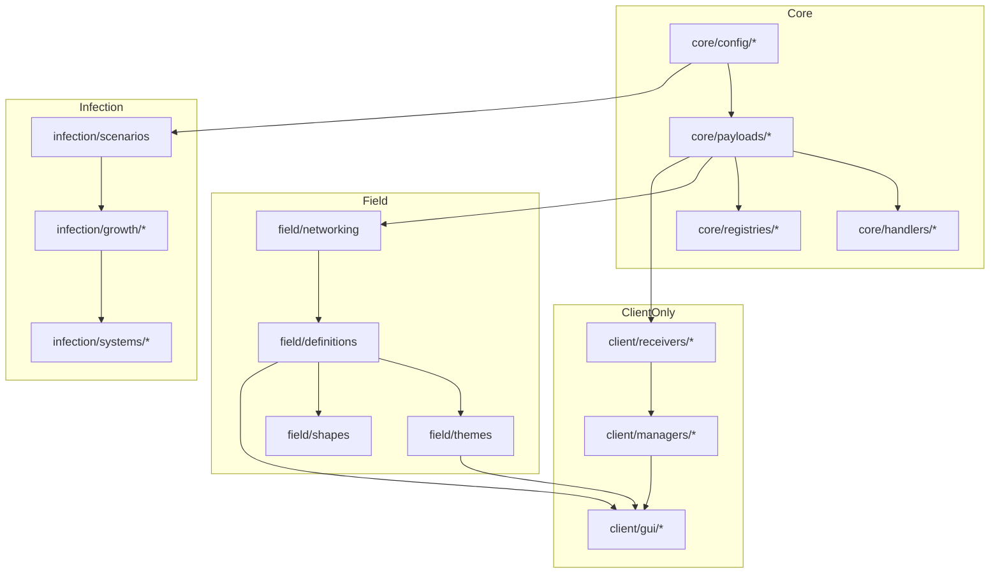

# Initialization Architecture v3: Redux-Inspired State Tree

> **Purpose**: Complete initialization system with Redux-like state management for cross-component communication, hook-based registration, and comprehensive reload support.

---

## Part 1: Complete Registry & Loader Inventory

### 1.1 All Registries Discovered

| Registry | Side | Path | Purpose | Has Reload? |
|----------|------|------|---------|-------------|
| **FieldRegistry** | Common | `field/FieldRegistry.java` | Field definitions lookup | ✓ reload() |
| **ColorThemeRegistry** | Common | `visual/color/ColorThemeRegistry.java` | Color themes | ✓ reload() |
| **ShapeRegistry** | Common | `visual/shape/ShapeRegistry.java` | Shape factories | ✗ |
| **ScenarioRegistry** | Common | `infection/api/ScenarioRegistry.java` | Infection scenarios | ✗ (interface) |
| **SimpleScenarioRegistry** | Common | `infection/api/SimpleScenarioRegistry.java` | Scenario impl | ✗ |
| **GrowthRegistry** | Common | `growth/GrowthRegistry.java` | Growth profiles (glow, particle, force, fuse, explosion) | ✓ load(ConfigService) |
| **EffectPaletteRegistry** | Common | `infection/scenario/EffectPaletteRegistry.java` | Effect palettes | ? |
| **DimensionProfileRegistry** | Common | `infection/profile/DimensionProfileRegistry.java` | Dimension configs | ✓ reload() |
| **VirusSchedulerTaskRegistry** | Common | `infection/api/VirusSchedulerTaskRegistry.java` | Scheduled tasks | ? |
| **InfectionConfigRegistry** | Common | `config/InfectionConfigRegistry.java` | Config modules | ✓ loadCommon/loadClient |
| **FragmentRegistry** | Client | `client/gui/util/FragmentRegistry.java` | GUI shape fragments | ✓ reload() / ensureLoaded() |
| **PresetRegistry** | Client | `client/gui/util/PresetRegistry.java` | Multi-scope presets | ✓ loadAll() / reset() |
| **WaveShaderRegistry** | Client | `client/visual/render/WaveShaderRegistry.java` | Wave shaders | ✓ register() |
| **ProfileRegistry** | Common | `field/registry/ProfileRegistry.java` | Field profiles | ? |

### 1.2 All Loaders Discovered

| Loader | Side | Path | Purpose | Invoked By |
|--------|------|------|---------|------------|
| **FieldLoader** | Common | `field/loader/FieldLoader.java` | Load JSON field definitions | FieldRegistry |
| **ScenarioRegistryLoader** | Common | `infection/service/ScenarioRegistryLoader.java` | Load scenarios from JSON | InfectionServices |
| **GrowthProfileParser** | Common | `growth/GrowthProfileParser.java` | Parse growth profiles | GrowthRegistry |

### 1.3 All Managers Discovered

| Manager | Side | Path | Purpose | Initialization |
|---------|------|------|---------|----------------|
| **FieldManager** | Server | `field/FieldManager.java` | Server field instances | Per-world via WeakHashMap |
| **ClientFieldManager** | Client | `client/visual/ClientFieldManager.java` | Client field rendering | Singleton |
| **ProfileManager** | Client | `client/profile/ProfileManager.java` | Profile loading/saving | Singleton.getInstance() |
| **ProfileManager (GUI)** | Client | `client/gui/state/manager/ProfileManager.java` | GUI profile state | Per-screen |
| **LayerManager** | Client | `client/gui/state/manager/LayerManager.java` | Layer state | Per-screen |
| **StateManager** | Client | `client/gui/state/manager/StateManager.java` | GUI state coordination | Per-screen |
| **LayoutManager** | Client | `client/gui/layout/LayoutManager.java` | GUI layout bounds | Per-screen |
| **UndoManager** | Client | `client/gui/state/UndoManager.java` | Undo/redo stack | Per-screen |
| **BindingsManager** | Client | `client/gui/state/manager/BindingsManager.java` | Property bindings | Per-screen |
| **TriggerManager** | Client | `client/gui/state/manager/TriggerManager.java` | Event triggers | Per-screen |
| **SerializationManager** | Client | `client/gui/state/manager/SerializationManager.java` | JSON serialization | Per-screen |
| **SingularityVisualManager** | Client | `client/render/SingularityVisualManager.java` | Singularity visuals | ✓ init() |
| **VoidTearVisualManager** | Client | `client/render/VoidTearVisualManager.java` | Void tear visuals | ✓ init() |
| **JoinWarmupManager** | Client | `client/field/JoinWarmupManager.java` | Tessellation warmup | ✓ init() |
| **ScenarioManager** | Common | `infection/orchestrator/ScenarioManager.java` | Scenario orchestration | ? |
| **PhaseManager** | Common | `infection/orchestrator/PhaseManager.java` | Phase orchestration | ? |

### 1.4 All Config Modules

| Config | Side | Path | Purpose |
|--------|------|------|---------|
| **LogConfig** | Common | `log/LogConfig.java` | Log levels |
| **CommandKnobConfig** | Common | `command/util/CommandKnobConfig.java` | Command toggles |
| **ModConfigBootstrap** | Common | `config/ModConfigBootstrap.java` | Core config setup |
| **GuiConfig** | Client | `client/gui/config/GuiConfig.java` | GUI preferences |
| **PreviewConfig** | Client | `client/gui/preview/PreviewConfig.java` | Preview settings |
| **SingularityConfig** | Common | `config/SingularityConfig.java` | Singularity settings |
| **ColorConfig** | Common | `config/ColorConfig.java` | Color settings |

### 1.5 All Initialization Points

```
Server/Common Init Chain:
──────────────────────────────────────────────────────────────────
TheVirusBlock.onInitialize()
├── ServerRef.init()
├── GrowthScheduler.registerSchedulerTasks()
├── ModConfigBootstrap.prepareCommon()
├── InfectionConfigRegistry.loadCommon()
├── CommandKnobConfig.reload()
├── CommandProtection.reload()
├── LogConfig.load()
├── FieldSystemInit.init()                    ← Field subsystem
│   ├── Commands (FieldCommand, FieldTestCommand)
│   ├── ResourceReloadListener (field_definitions)
│   ├── ServerTickEvents.END_WORLD_TICK
│   ├── ServerPlayConnectionEvents.JOIN
│   ├── ColorThemeRegistry (force class load)
│   └── FieldRegistry.registerDefaults()
├── PayloadTypeRegistry.playS2C() × 19
├── PayloadTypeRegistry.playC2S() × 2
├── GuiPacketRegistration.registerAll()       ← GUI payloads (S2C×5, C2S×5)
├── GuiPacketRegistration.registerServerHandlers() ← Server handlers
│   └── ServerProfileProvider.load()
├── ModBlocks.bootstrap()
├── ModItems.bootstrap()
├── ModBlockEntities.bootstrap()
├── ModEntities.bootstrap()
├── ModStatusEffects.bootstrap()
├── ModItemGroups.bootstrap()
├── ModScreenHandlers.bootstrap()
├── VirusDebugCommands.register()
├── GrowthBlockCommands.register()
├── GrowthCollisionCommand.register()
├── VirusInfectionSystem.init()               ← Infection subsystem
│   ├── VirusBlockProtection.init()
│   ├── VirusTierBossBar.init()
│   ├── VirusInventoryAnnouncements.init()
│   ├── GlobalTerrainCorruption.init()
│   ├── VirusItemAlerts.init()
│   ├── DelayedServerTasks.init()
│   ├── CommandRegistrationCallback (VirusCommand)
│   └── ServerTickEvents / ServerWorldEvents
├── VirusInventoryAnnouncements.init()
├── ServerPlayNetworking receivers × 2
└── ServerPlayConnectionEvents.JOIN

Client Init Chain:
──────────────────────────────────────────────────────────────────
TheVirusBlockClient.onInitializeClient()
├── ModConfigBootstrap.prepareClient()
├── InfectionConfigRegistry.loadClient()
├── BlockRenderLayerMap (4 blocks)
├── BlockEntityRenderers × 2
├── ProgressiveGrowthItemRenderer.bootstrap()
├── CorruptedColorProviders.register()
├── VoidTearVisualManager.init()
├── FieldRegistry.registerDefaults()
├── FieldClientInit.init()                    ← Field client subsystem
│   ├── ClientPlayNetworking receivers × 6
│   ├── WorldRenderEvents.AFTER_ENTITIES
│   ├── ClientTickEvents.END_CLIENT_TICK
│   ├── ClientPlayConnectionEvents.DISCONNECT
│   ├── registerBundledServerProfiles()
│   │   └── ProfileManager.getInstance().loadAll()
│   ├── warmupRenderingPipeline()
│   ├── JoinWarmupManager.init()
│   └── WarmupOverlay.init()
├── GuiClientHandlers.register()
├── TestFieldRenderer.init()
├── FragmentRegistry.ensureLoaded()
├── WaveShaderRegistry.register()
├── SingularityVisualManager.init()
├── SingularityBorderClientState.init()
├── VirusFluidRenderers.register()
├── EntityRenderers × 4
├── HandledScreens × 2
├── CorruptedFireTextures.bootstrap()
├── GrowthBeamRenderer.init()
├── GrowthRingFieldRenderer.init()
├── ClientPlayNetworking receivers × 7
└── ClientPlayConnectionEvents.DISCONNECT

GuiClientInit.onInitializeClient() ← SECONDARY entry point!
├── GuiClientHandlers.register()              ← DUPLICATE!
├── TestFieldRenderer.init()                  ← DUPLICATE!
├── FragmentRegistry.reload()
├── ClientPlayConnectionEvents.DISCONNECT
└── ClientCommandRegistrationCallback
```

---

## Part 2: Redux-Inspired State Tree Architecture

### 2.1 Core Concept: The Init Store

Just like Redux has a single store, we create a **single source of truth** for initialization state that components can subscribe to.

```
┌─────────────────────────────────────────────────────────────────────────┐
│                            InitStore                                     │
│  (Single source of truth for initialization state)                       │
├─────────────────────────────────────────────────────────────────────────┤
│                                                                          │
│  ┌─────────────────────────────────────────────────────────────────┐    │
│  │  State Tree                                                      │    │
│  │  ├── core/                                                       │    │
│  │  │   ├── payloads: { registered: Set<Id>, state: COMPLETE }     │    │
│  │  │   ├── handlers: { registered: Set<Id>, state: COMPLETE }     │    │
│  │  │   └── registries: { items: 47, state: COMPLETE }             │    │
│  │  ├── field/                                                      │    │
│  │  │   ├── definitions: { count: 12, state: COMPLETE }            │    │
│  │  │   ├── themes: { count: 6, state: COMPLETE }                  │    │
│  │  │   └── shapes: { count: 15, state: COMPLETE }                 │    │
│  │  ├── infection/                                                  │    │
│  │  │   ├── scenarios: { count: 2, state: COMPLETE }               │    │
│  │  │   └── growth: { count: 24, state: COMPLETE }                 │    │
│  │  ├── client/                                                     │    │
│  │  │   ├── receivers: { count: 13, state: COMPLETE }              │    │
│  │  │   ├── renderers: { count: 10, state: COMPLETE }              │    │
│  │  │   └── gui/                                                   │    │
│  │  │       ├── fragments: { count: 87, state: COMPLETE }          │    │
│  │  │       ├── presets: { count: 34, state: COMPLETE }            │    │
│  │  │       └── profiles: { count: 8, state: COMPLETE }            │    │
│  │  └── _meta/                                                      │    │
│  │      ├── startTime: 1702000000000                               │    │
│  │      ├── totalDuration: 156                                     │    │
│  │      └── overallState: COMPLETE                                 │    │
│  └─────────────────────────────────────────────────────────────────┘    │
│                                                                          │
│  ┌─────────────────────────────────────────────────────────────────┐    │
│  │  Subscribers (Components listening for changes)                  │    │
│  │  ├── LoggingSubscriber                                          │    │
│  │  ├── MetricsSubscriber                                          │    │
│  │  ├── WarmupOverlay                                              │    │
│  │  ├── FieldRegistry                                              │    │
│  │  └── FragmentRegistry                                           │    │
│  └─────────────────────────────────────────────────────────────────┘    │
│                                                                          │
│  ┌─────────────────────────────────────────────────────────────────┐    │
│  │  Actions (State mutations)                                       │    │
│  │  ├── PHASE_START { path: "field/definitions", ... }             │    │
│  │  ├── PHASE_COMPLETE { path: "field/definitions", count: 12 }    │    │
│  │  ├── PHASE_FAILED { path: "field/definitions", error: ... }     │    │
│  │  ├── RELOAD_REQUESTED { paths: ["field/themes"] }               │    │
│  │  └── RELOAD_COMPLETE { paths: ["field/themes"], count: 7 }      │    │
│  └─────────────────────────────────────────────────────────────────┘    │
│                                                                          │
└─────────────────────────────────────────────────────────────────────────┘
```

### 2.2 State Node Interface

```java
/**
 * Represents a node in the initialization state tree.
 * Each node tracks its own state and can have children.
 */
public interface StateNode {
    
    /** Unique path in the tree (e.g., "field/definitions") */
    String path();
    
    /** Human-readable name */
    String name();
    
    /** Current state */
    NodeState state();
    
    /** Child nodes (empty for leaf nodes) */
    Collection<StateNode> children();
    
    /** Parent node (null for root) */
    StateNode parent();
    
    /** Items registered/loaded in this node */
    int itemCount();
    
    /** Duration in ms (set after completion) */
    long durationMs();
    
    /** Error if failed */
    Optional<Throwable> error();
    
    /** Whether this node supports hot-reload */
    boolean reloadable();
    
    /** Dependencies that must complete before this node */
    Set<String> dependencies();
}

public enum NodeState {
    PENDING,    // Not yet started
    RUNNING,    // Currently executing
    COMPLETE,   // Successfully completed
    FAILED,     // Failed with error
    RELOADING,  // Hot-reload in progress
    STALE       // Needs reload (dependency changed)
}
```

### 2.3 Init Store - The Central Hub

```java
/**
 * Redux-inspired central store for initialization state.
 * Provides a single source of truth and notifies subscribers of changes.
 */
public final class InitStore {
    
    private static final InitStore INSTANCE = new InitStore();
    
    private final StateTreeNode root = new StateTreeNode("root", "Root");
    private final List<InitSubscriber> subscribers = new CopyOnWriteArrayList<>();
    private final ReentrantReadWriteLock lock = new ReentrantReadWriteLock();
    
    // ========== Singleton ==========
    
    public static InitStore get() { return INSTANCE; }
    
    // ========== State Access ==========
    
    /** Get the entire state tree */
    public StateNode getState() {
        return root;
    }
    
    /** Get a specific node by path */
    public Optional<StateNode> getNode(String path) {
        lock.readLock().lock();
        try {
            return root.findNode(path);
        } finally {
            lock.readLock().unlock();
        }
    }
    
    /** Check if a path is complete */
    public boolean isComplete(String path) {
        return getNode(path)
            .map(n -> n.state() == NodeState.COMPLETE)
            .orElse(false);
    }
    
    /** Wait for a path to complete (with timeout) */
    public boolean awaitComplete(String path, Duration timeout) {
        long deadline = System.currentTimeMillis() + timeout.toMillis();
        while (System.currentTimeMillis() < deadline) {
            if (isComplete(path)) return true;
            try {
                Thread.sleep(10);
            } catch (InterruptedException e) {
                Thread.currentThread().interrupt();
                return false;
            }
        }
        return false;
    }
    
    // ========== Actions (State Mutations) ==========
    
    /** Dispatch an action to update state */
    public void dispatch(InitAction action) {
        lock.writeLock().lock();
        try {
            StateTreeNode node = findOrCreateNode(action.path());
            
            switch (action.type()) {
                case PHASE_START -> {
                    node.setState(NodeState.RUNNING);
                    node.setStartTime(System.currentTimeMillis());
                }
                case PHASE_COMPLETE -> {
                    node.setState(NodeState.COMPLETE);
                    node.setItemCount(action.itemCount());
                    node.setEndTime(System.currentTimeMillis());
                }
                case PHASE_FAILED -> {
                    node.setState(NodeState.FAILED);
                    node.setError(action.error());
                    node.setEndTime(System.currentTimeMillis());
                }
                case RELOAD_REQUESTED -> {
                    node.setState(NodeState.RELOADING);
                    markDependentsStale(node);
                }
                case RELOAD_COMPLETE -> {
                    node.setState(NodeState.COMPLETE);
                    node.setItemCount(action.itemCount());
                }
            }
        } finally {
            lock.writeLock().unlock();
        }
        
        // Notify subscribers outside lock
        notifySubscribers(action);
    }
    
    // ========== Subscriptions ==========
    
    /** Subscribe to state changes */
    public Subscription subscribe(InitSubscriber subscriber) {
        subscribers.add(subscriber);
        return () -> subscribers.remove(subscriber);
    }
    
    /** Subscribe to specific paths only */
    public Subscription subscribe(InitSubscriber subscriber, String... paths) {
        Set<String> pathSet = Set.of(paths);
        InitSubscriber filtered = action -> {
            if (pathSet.isEmpty() || pathSet.stream().anyMatch(p -> action.path().startsWith(p))) {
                subscriber.onAction(action);
            }
        };
        return subscribe(filtered);
    }
    
    private void notifySubscribers(InitAction action) {
        for (InitSubscriber sub : subscribers) {
            try {
                sub.onAction(action);
            } catch (Exception e) {
                Logging.REGISTRY.error("Subscriber error for action {}: {}", 
                    action.type(), e.getMessage());
            }
        }
    }
    
    // ========== Tree Navigation ==========
    
    private StateTreeNode findOrCreateNode(String path) {
        String[] parts = path.split("/");
        StateTreeNode current = root;
        
        for (String part : parts) {
            current = current.getOrCreateChild(part);
        }
        
        return current;
    }
    
    private void markDependentsStale(StateTreeNode node) {
        // Find all nodes that depend on this one and mark them stale
        root.traverse(n -> {
            if (n.dependencies().contains(node.path())) {
                n.setState(NodeState.STALE);
            }
        });
    }
}

// ========== Actions ==========

public record InitAction(
    ActionType type,
    String path,
    int itemCount,
    Throwable error,
    Map<String, Object> metadata
) {
    public enum ActionType {
        PHASE_START,
        PHASE_COMPLETE,
        PHASE_FAILED,
        RELOAD_REQUESTED,
        RELOAD_COMPLETE
    }
    
    // Convenience factories
    public static InitAction start(String path) {
        return new InitAction(ActionType.PHASE_START, path, 0, null, Map.of());
    }
    
    public static InitAction complete(String path, int count) {
        return new InitAction(ActionType.PHASE_COMPLETE, path, count, null, Map.of());
    }
    
    public static InitAction failed(String path, Throwable error) {
        return new InitAction(ActionType.PHASE_FAILED, path, 0, error, Map.of());
    }
    
    public static InitAction reloadRequest(String path) {
        return new InitAction(ActionType.RELOAD_REQUESTED, path, 0, null, Map.of());
    }
    
    public static InitAction reloadComplete(String path, int count) {
        return new InitAction(ActionType.RELOAD_COMPLETE, path, count, null, Map.of());
    }
}

// ========== Subscriber Interface ==========

@FunctionalInterface
public interface InitSubscriber {
    void onAction(InitAction action);
}

@FunctionalInterface
public interface Subscription {
    void unsubscribe();
}
```

### 2.4 Hookable Init Node

```java
/**
 * Abstract base for registries/loaders that want to hook into the init system.
 * Provides lifecycle hooks and automatic state tracking.
 */
public abstract class HookableInitNode {
    
    private final String path;
    private final String name;
    private final Set<String> dependencies;
    private final boolean reloadable;
    
    protected HookableInitNode(String path, String name) {
        this(path, name, Set.of(), true);
    }
    
    protected HookableInitNode(String path, String name, Set<String> dependencies, boolean reloadable) {
        this.path = path;
        this.name = name;
        this.dependencies = dependencies;
        this.reloadable = reloadable;
    }
    
    // ========== Lifecycle ==========
    
    /** Called during initialization. Override to perform loading. */
    public final int init() {
        InitStore.get().dispatch(InitAction.start(path));
        
        try {
            // Validate dependencies
            for (String dep : dependencies) {
                if (!InitStore.get().isComplete(dep)) {
                    throw new InitializationException(
                        String.format("Dependency not ready: %s (required by %s)", dep, path));
                }
            }
            
            // Pre-init hook
            beforeInit();
            
            // Actual initialization
            int count = doInit();
            
            // Post-init hook
            afterInit(count);
            
            InitStore.get().dispatch(InitAction.complete(path, count));
            return count;
            
        } catch (Throwable t) {
            onError(t);
            InitStore.get().dispatch(InitAction.failed(path, t));
            throw t;
        }
    }
    
    /** Called during hot-reload. Override if reload differs from init. */
    public final int reload() {
        if (!reloadable) {
            throw new UnsupportedOperationException("Node does not support reload: " + path);
        }
        
        InitStore.get().dispatch(InitAction.reloadRequest(path));
        
        try {
            beforeReload();
            int count = doReload();
            afterReload(count);
            InitStore.get().dispatch(InitAction.reloadComplete(path, count));
            return count;
        } catch (Throwable t) {
            onError(t);
            InitStore.get().dispatch(InitAction.failed(path, t));
            throw t;
        }
    }
    
    // ========== Abstract Methods ==========
    
    /** Perform the actual initialization work. Return item count. */
    protected abstract int doInit();
    
    /** Perform reload. Default delegates to doInit(). */
    protected int doReload() {
        return doInit();
    }
    
    // ========== Hooks (Optional Override) ==========
    
    /** Called before init starts */
    protected void beforeInit() {}
    
    /** Called after successful init */
    protected void afterInit(int count) {}
    
    /** Called before reload starts */
    protected void beforeReload() {}
    
    /** Called after successful reload */
    protected void afterReload(int count) {}
    
    /** Called on any error */
    protected void onError(Throwable t) {}
    
    // ========== Getters ==========
    
    public String path() { return path; }
    public String name() { return name; }
    public Set<String> dependencies() { return dependencies; }
    public boolean reloadable() { return reloadable; }
}
```

---

## Part 3: State Tree Structure

### 3.1 Complete Path Hierarchy

```
root/
├── core/
│   ├── config/
│   │   ├── log                          # LogConfig
│   │   ├── command                      # CommandKnobConfig, CommandProtection
│   │   └── infection                    # InfectionConfigRegistry
│   ├── payloads/
│   │   ├── s2c                          # Server-to-client payloads
│   │   └── c2s                          # Client-to-server payloads
│   ├── handlers/
│   │   └── server                       # ServerPlayNetworking handlers
│   └── registries/
│       ├── blocks                       # ModBlocks
│       ├── items                        # ModItems
│       ├── entities                     # ModEntities
│       ├── blockEntities                # ModBlockEntities
│       ├── statusEffects                # ModStatusEffects
│       ├── itemGroups                   # ModItemGroups
│       └── screenHandlers               # ModScreenHandlers
│
├── field/
│   ├── definitions                      # FieldRegistry definitions
│   ├── themes                           # ColorThemeRegistry
│   ├── shapes                           # ShapeRegistry factories
│   ├── profiles                         # ProfileRegistry (field profiles)
│   ├── networking                       # Field-specific payloads + handlers
│   └── events                           # ServerTickEvents, JOIN callbacks
│
├── infection/
│   ├── scenarios                        # ScenarioRegistry + loader
│   ├── growth/
│   │   ├── glow                         # GrowthRegistry glow profiles
│   │   ├── particle                     # GrowthRegistry particle profiles
│   │   ├── force                        # GrowthRegistry force profiles
│   │   ├── field                        # GrowthRegistry field profiles
│   │   ├── fuse                         # GrowthRegistry fuse profiles
│   │   ├── explosion                    # GrowthRegistry explosion profiles
│   │   ├── opacity                      # GrowthRegistry opacity profiles
│   │   ├── spin                         # GrowthRegistry spin profiles
│   │   └── wobble                       # GrowthRegistry wobble profiles
│   ├── dimensions                       # DimensionProfileRegistry
│   ├── effects                          # EffectPaletteRegistry
│   └── systems/
│       ├── protection                   # VirusBlockProtection
│       ├── bossbar                      # VirusTierBossBar
│       ├── announcements                # VirusInventoryAnnouncements
│       ├── terrain                      # GlobalTerrainCorruption
│       └── alerts                       # VirusItemAlerts
│
├── gui/
│   ├── payloads                         # GUI S2C + C2S payloads
│   ├── handlers                         # GuiPacketRegistration handlers
│   └── serverProfiles                   # ServerProfileProvider
│
├── commands/
│   ├── virus                            # VirusCommand, VirusDebugCommands
│   ├── field                            # FieldCommand, FieldTestCommand
│   ├── growth                           # GrowthBlockCommands
│   └── log                              # LogCommands
│
└── client/                              # CLIENT-SIDE ONLY
    ├── config                           # GuiConfig, PreviewConfig
    ├── receivers/
    │   ├── core                         # Core receivers (sky, horizon, etc.)
    │   ├── field                        # Field receivers
    │   └── gui                          # GUI receivers
    ├── renderers/
    │   ├── blocks                       # Block renderers
    │   ├── entities                     # Entity renderers
    │   ├── blockEntities                # BE renderers
    │   └── effects                      # Visual effect renderers
    ├── managers/
    │   ├── clientField                  # ClientFieldManager
    │   ├── singularity                  # SingularityVisualManager
    │   ├── voidTear                     # VoidTearVisualManager
    │   ├── warmup                       # JoinWarmupManager
    │   └── profiles                     # ProfileManager (client)
    ├── gui/
    │   ├── fragments                    # FragmentRegistry (87+ presets)
    │   ├── presets                      # PresetRegistry (multi-scope)
    │   └── profiles                     # Profile loading/saving
    ├── shaders/
    │   └── wave                         # WaveShaderRegistry
    └── warmup/
        ├── tessellation                 # Mesh warmup
        └── profiles                     # Profile preloading
```

### 3.2 Dependency Graph



---

## Part 4: Concrete Node Implementations

### 4.1 Example: FieldDefinitionsNode

```java
/**
 * Hookable node for field definitions.
 * Wraps FieldRegistry with lifecycle hooks.
 */
public final class FieldDefinitionsNode extends HookableInitNode {
    
    public static final String PATH = "field/definitions";
    
    private final FieldLoader loader;
    
    public FieldDefinitionsNode() {
        super(PATH, "Field Definitions", 
            Set.of("core/payloads/s2c"),  // Depends on payloads
            true);                         // Reloadable
        this.loader = new FieldLoader();
    }
    
    @Override
    protected void beforeInit() {
        FieldRegistry.initialize(loader);
        Logging.REGISTRY.topic("field").info("Initializing field definitions...");
    }
    
    @Override
    protected int doInit() {
        loader.loadAll();
        return FieldRegistry.count();
    }
    
    @Override
    protected int doReload() {
        FieldRegistry.clear();
        loader.reload();
        return FieldRegistry.count();
    }
    
    @Override
    protected void afterInit(int count) {
        Logging.REGISTRY.topic("field").info("Loaded {} field definitions", count);
    }
    
    @Override
    protected void afterReload(int count) {
        Logging.REGISTRY.topic("field").info("Reloaded {} field definitions", count);
    }
}
```

### 4.2 Example: FragmentRegistryNode (Client)

```java
/**
 * Hookable node for GUI fragment presets.
 */
@Environment(EnvType.CLIENT)
public final class FragmentRegistryNode extends HookableInitNode {
    
    public static final String PATH = "client/gui/fragments";
    
    public FragmentRegistryNode() {
        super(PATH, "GUI Fragments",
            Set.of("field/shapes"),  // Need shapes for fragment validation
            true);
    }
    
    @Override
    protected int doInit() {
        FragmentRegistry.ensureLoaded();
        return countFragments();
    }
    
    @Override
    protected int doReload() {
        FragmentRegistry.reload();
        return countFragments();
    }
    
    private int countFragments() {
        int count = 0;
        count += FragmentRegistry.listShapeFragments("sphere").size();
        count += FragmentRegistry.listShapeFragments("ring").size();
        count += FragmentRegistry.listFillFragments().size();
        // ... etc
        return count;
    }
    
    @Override
    protected void afterReload(int count) {
        // Notify any open GUIs that fragments changed
        // They can subscribe to this path
    }
}
```

### 4.3 Subscriber Example: Warmup Overlay

```java
/**
 * HUD overlay that shows initialization progress.
 */
@Environment(EnvType.CLIENT)
public class WarmupOverlaySubscriber implements InitSubscriber {
    
    private String currentPhase = "";
    private int totalComplete = 0;
    private int totalExpected = 25; // Approximate total phases
    private long startTime = 0;
    
    public WarmupOverlaySubscriber() {
        // Subscribe only to client phases
        InitStore.get().subscribe(this, "client/");
    }
    
    @Override
    public void onAction(InitAction action) {
        if (startTime == 0) startTime = System.currentTimeMillis();
        
        switch (action.type()) {
            case PHASE_START -> currentPhase = action.path();
            case PHASE_COMPLETE -> {
                totalComplete++;
                currentPhase = "";
            }
            case PHASE_FAILED -> {
                // Show error
            }
        }
    }
    
    public void render(DrawContext context) {
        if (totalComplete >= totalExpected) return;
        
        long elapsed = System.currentTimeMillis() - startTime;
        float progress = (float) totalComplete / totalExpected;
        
        // Draw progress bar
        int barWidth = 200;
        int barHeight = 4;
        int x = (context.getScaledWindowWidth() - barWidth) / 2;
        int y = context.getScaledWindowHeight() - 40;
        
        context.fill(x, y, x + barWidth, y + barHeight, 0x40FFFFFF);
        context.fill(x, y, x + (int)(barWidth * progress), y + barHeight, 0xCC00FF88);
        
        // Draw current phase name
        if (!currentPhase.isEmpty()) {
            String text = "Loading: " + currentPhase.replace("client/", "");
            context.drawCenteredTextWithShadow(
                MinecraftClient.getInstance().textRenderer,
                text, context.getScaledWindowWidth() / 2, y - 12, 0xFFFFFF);
        }
    }
}
```

---

## Part 5: Reload System

### 5.1 Reload Coordinator

```java
/**
 * Coordinates hot-reload of specific subsystems.
 * Handles dependency cascading and subscriber notification.
 */
public final class ReloadCoordinator {
    
    private static final Map<String, HookableInitNode> NODES = new LinkedHashMap<>();
    
    /** Register a node for reload coordination */
    public static void register(HookableInitNode node) {
        NODES.put(node.path(), node);
    }
    
    /** Reload a specific path and its dependents */
    public static void reload(String path) {
        HookableInitNode node = NODES.get(path);
        if (node == null) {
            Logging.REGISTRY.warn("Unknown reload path: {}", path);
            return;
        }
        
        if (!node.reloadable()) {
            Logging.REGISTRY.warn("Path not reloadable: {}", path);
            return;
        }
        
        // Find all dependent nodes
        List<HookableInitNode> toReload = new ArrayList<>();
        toReload.add(node);
        collectDependents(path, toReload);
        
        // Reload in dependency order
        for (HookableInitNode n : toReload) {
            Logging.REGISTRY.info("Reloading: {}", n.path());
            n.reload();
        }
    }
    
    /** Reload all reloadable nodes */
    public static void reloadAll() {
        for (HookableInitNode node : NODES.values()) {
            if (node.reloadable()) {
                node.reload();
            }
        }
    }
    
    private static void collectDependents(String path, List<HookableInitNode> out) {
        for (HookableInitNode n : NODES.values()) {
            if (n.dependencies().contains(path) && !out.contains(n)) {
                out.add(n);
                collectDependents(n.path(), out); // Recursive
            }
        }
    }
}
```

### 5.2 Command Integration

```java
// Add to existing reload commands
public class ReloadCommands {
    
    public static void register(CommandDispatcher<ServerCommandSource> dispatcher) {
        dispatcher.register(literal("virus")
            .then(literal("reload")
                .requires(src -> src.hasPermissionLevel(2))
                .executes(ctx -> {
                    ReloadCoordinator.reloadAll();
                    ctx.getSource().sendFeedback(() -> Text.literal("Reloaded all configs"), true);
                    return 1;
                })
                .then(argument("path", StringArgumentType.greedyString())
                    .suggests((ctx, builder) -> {
                        InitStore.get().getState().children().forEach(node -> 
                            builder.suggest(node.path()));
                        return builder.buildFuture();
                    })
                    .executes(ctx -> {
                        String path = StringArgumentType.getString(ctx, "path");
                        ReloadCoordinator.reload(path);
                        ctx.getSource().sendFeedback(() -> 
                            Text.literal("Reloaded: " + path), true);
                        return 1;
                    }))));
    }
}
```

---

## Part 6: Integration with Existing Code

### 6.1 Wrapping Existing Registries

```java
// FieldRegistry wrapper
public class FieldRegistryNode extends HookableInitNode {
    public static final FieldRegistryNode INSTANCE = new FieldRegistryNode();
    
    private FieldRegistryNode() {
        super("field/definitions", "Field Definitions", Set.of("core/payloads/s2c"), true);
    }
    
    @Override
    protected int doInit() {
        FieldRegistry.registerDefaults();
        return FieldRegistry.count();
    }
    
    @Override
    protected int doReload() {
        FieldRegistry.reload();
        return FieldRegistry.count();
    }
}

// ColorThemeRegistry wrapper
public class ColorThemesNode extends HookableInitNode {
    public static final ColorThemesNode INSTANCE = new ColorThemesNode();
    
    private ColorThemesNode() {
        super("field/themes", "Color Themes", Set.of(), true);
    }
    
    @Override
    protected int doInit() {
        return ColorThemeRegistry.count(); // Static init already done
    }
    
    @Override
    protected int doReload() {
        ColorThemeRegistry.reload();
        return ColorThemeRegistry.count();
    }
}

// FragmentRegistry wrapper (CLIENT)
@Environment(EnvType.CLIENT)
public class FragmentsNode extends HookableInitNode {
    public static final FragmentsNode INSTANCE = new FragmentsNode();
    
    private FragmentsNode() {
        super("client/gui/fragments", "GUI Fragments", Set.of("field/shapes"), true);
    }
    
    @Override
    protected int doInit() {
        FragmentRegistry.ensureLoaded();
        return estimateCount();
    }
    
    @Override
    protected int doReload() {
        FragmentRegistry.reload();
        return estimateCount();
    }
    
    private int estimateCount() {
        // Sum of all fragment types
        return FragmentRegistry.listShapeFragments("sphere").size()
             + FragmentRegistry.listShapeFragments("ring").size()
             + FragmentRegistry.listFillFragments().size()
             + FragmentRegistry.listVisibilityFragments().size();
    }
}
```

### 6.2 Entry Point Integration

```java
// TheVirusBlock.java
public void onInitialize() {
    long startTime = System.currentTimeMillis();
    
    // Create orchestrator that populates the store
    InitOrchestrator orchestrator = InitOrchestrator.create()
        .store(InitStore.get())  // Connect to global store
        
        // Core phase
        .node(new LogConfigNode())
        .node(new CommandConfigNode())
        .node(CorePayloadsNode.INSTANCE)
        .node(FieldPayloadsNode.INSTANCE)
        .node(GuiPayloadsNode.INSTANCE)
        .node(ServerHandlersNode.INSTANCE)
        .node(ModRegistriesNode.INSTANCE)
        
        // Field phase
        .node(FieldRegistryNode.INSTANCE)
        .node(ColorThemesNode.INSTANCE)
        .node(ShapeRegistryNode.INSTANCE)
        .node(FieldEventsNode.INSTANCE)
        
        // Infection phase
        .node(ScenarioRegistryNode.INSTANCE)
        .node(GrowthRegistryNode.INSTANCE)
        .node(InfectionSystemsNode.INSTANCE)
        
        // Commands phase
        .node(CommandsNode.INSTANCE);
    
    InitSummary summary = orchestrator.execute();
    
    // Log summary
    long duration = System.currentTimeMillis() - startTime;
    Logging.CONFIG.info("═══════════════════════════════════════════════════════");
    Logging.CONFIG.info("  The Virus Block initialized in {}ms", duration);
    Logging.CONFIG.info("  {} nodes complete, {} failed", 
        summary.completed(), summary.failed());
    Logging.CONFIG.info("═══════════════════════════════════════════════════════");
}

// TheVirusBlockClient.java
@Environment(EnvType.CLIENT)
public void onInitializeClient() {
    // Subscribe to progress for overlay
    WarmupOverlaySubscriber overlay = new WarmupOverlaySubscriber();
    HudRenderCallback.EVENT.register((context, tickCounter) -> overlay.render(context));
    
    InitOrchestrator orchestrator = InitOrchestrator.create()
        .store(InitStore.get())
        
        // Client receivers
        .node(CoreReceiversNode.INSTANCE)
        .node(FieldReceiversNode.INSTANCE)
        .node(GuiReceiversNode.INSTANCE)
        
        // Client renderers
        .node(BlockRenderersNode.INSTANCE)
        .node(EntityRenderersNode.INSTANCE)
        .node(EffectRenderersNode.INSTANCE)
        
        // Client managers
        .node(ClientFieldManagerNode.INSTANCE)
        .node(SingularityManagerNode.INSTANCE)
        .node(VoidTearManagerNode.INSTANCE)
        .node(ProfileManagerNode.INSTANCE)
        
        // GUI
        .node(FragmentsNode.INSTANCE)
        .node(PresetsNode.INSTANCE)
        
        // Warmup
        .node(TessellationWarmupNode.INSTANCE)
        .node(ShaderWarmupNode.INSTANCE);
    
    InitSummary summary = orchestrator.execute();
    
    Logging.GUI.info("Client initialized: {} nodes in {}ms",
        summary.totalNodes(), summary.totalTimeMs());
}
```

---

## Part 7: File Structure

```
src/main/java/net/cyberpunk042/
├── init/
│   ├── store/
│   │   ├── InitStore.java              # Redux-like central store
│   │   ├── InitAction.java             # Action types
│   │   ├── InitSubscriber.java         # Subscriber interface
│   │   ├── StateNode.java              # State node interface
│   │   └── StateTreeNode.java          # Mutable impl
│   ├── node/
│   │   ├── HookableInitNode.java       # Abstract base with hooks
│   │   ├── server/
│   │   │   ├── LogConfigNode.java
│   │   │   ├── CorePayloadsNode.java
│   │   │   ├── FieldPayloadsNode.java
│   │   │   ├── ServerHandlersNode.java
│   │   │   ├── ModRegistriesNode.java
│   │   │   ├── FieldRegistryNode.java
│   │   │   ├── ColorThemesNode.java
│   │   │   ├── ShapeRegistryNode.java
│   │   │   ├── ScenarioRegistryNode.java
│   │   │   ├── GrowthRegistryNode.java
│   │   │   └── CommandsNode.java
│   │   └── client/
│   │       ├── CoreReceiversNode.java
│   │       ├── FieldReceiversNode.java
│   │       ├── FragmentsNode.java
│   │       ├── PresetsNode.java
│   │       ├── ProfileManagerNode.java
│   │       └── WarmupNodes.java
│   ├── orchestrator/
│   │   ├── InitOrchestrator.java       # Execution controller
│   │   ├── InitSummary.java            # Results summary
│   │   └── ReloadCoordinator.java      # Hot-reload handler
│   └── subscriber/
│       ├── LoggingSubscriber.java      # Logs all actions
│       ├── MetricsSubscriber.java      # Collects timing data
│       └── WarmupOverlaySubscriber.java # Client HUD
└── ...

src/client/java/net/cyberpunk042/
├── init/
│   └── node/
│       ├── ... (client-only nodes)
│       └── ...
└── ...
```

---

## Part 8: Migration Path

### Phase 1: Add Infrastructure (No Behavior Change)
1. Create `init/store/` package with `InitStore`, `InitAction`, etc.
2. Create `init/node/HookableInitNode.java`
3. Create `init/orchestrator/InitOrchestrator.java`
4. All existing code continues to work

### Phase 2: Create Node Wrappers
1. Create wrapper nodes for each existing registry
2. Register them with `ReloadCoordinator.register()`
3. Existing init code still runs, nodes just track state

### Phase 3: Wire Entry Points
1. Add store population to `TheVirusBlock` and `TheVirusBlockClient`
2. Add subscribers for logging/metrics
3. Enable warmup overlay on client

### Phase 4: Remove Duplicates
1. Use store queries to detect duplicate registrations
2. Consolidate `GuiClientInit` into `TheVirusBlockClient`
3. Remove redundant calls

### Phase 5: Add Commands
1. Add `/virus reload <path>` command
2. Add `/virus init status` command to show tree state
3. Add client-side debug overlay toggle

---

## Summary

| Feature | Redux Equivalent | Our Implementation |
|---------|------------------|-------------------|
| Single Store | `createStore()` | `InitStore.get()` |
| State Tree | State object | `StateNode` hierarchy |
| Actions | Action objects | `InitAction` record |
| Reducers | Reducer functions | `dispatch()` switch logic |
| Subscribers | `store.subscribe()` | `InitSubscriber` interface |
| Middleware | Middleware chain | Subscriber filters |
| Selectors | Selector functions | `getNode()`, `isComplete()` |
| Async Actions | Thunks/Sagas | `HookableInitNode.init()` |

This architecture gives you:
- **Single source of truth** for all init state
- **Observable state changes** via subscriptions
- **Dependency tracking** with automatic cascading
- **Hot-reload support** with dependent invalidation
- **Progress tracking** for UI overlays
- **Hookable lifecycle** for extensibility

Ready to start implementing the infrastructure?
