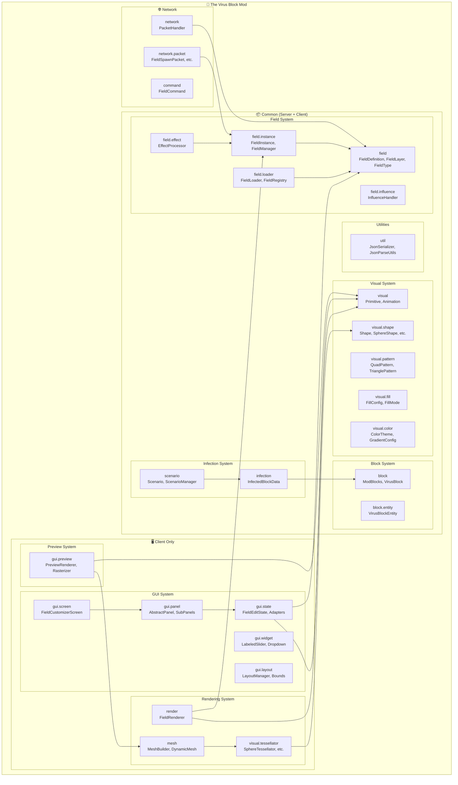

# 🏗️ System Architecture

> Auto-generated from 759 classes across 118 packages.

## Complete System Overview



## Package Breakdown

### Blocks

| Package | Classes | Key Types |
|---------|---------|------------|
| `net.cyberpunk042.block.core` | 5 | BacteriaBlock, CuredInfectiousCubeBlock, InfectedBlock, ... |
| `net.cyberpunk042.block.corrupted` | 14 | CorruptedCryingObsidianBlock, CorruptedDiamondBlock, CorruptedDirtBlock, ... |
| `net.cyberpunk042.block.entity` | 10 | GrowthCollisionTracker, GrowthEventPublisher, GrowthExplosionHandler, ... |
| `net.cyberpunk042.block.growth` | 1 | ProgressiveGrowthBlock |
| `net.cyberpunk042.block.matrix` | 1 | MatrixCubeBlock |
| `net.cyberpunk042.block.singularity` | 1 | SingularityBlock |
| `net.cyberpunk042.block.virus` | 2 | VirusBlock, VirusBlockProtection |
| `net.cyberpunk042.client.render.blockentity` | 7 | FieldMeshRenderer, GlowQuadEmitter, GlowTextureResolver, ... |

### Field

| Package | Classes | Key Types |
|---------|---------|------------|
| `net.cyberpunk042.client.field` | 2 | JoinWarmupManager, WarmupOverlay |
| `net.cyberpunk042.client.field.render` | 15 | AbstractPrimitiveRenderer, BeamRenderer, CapsuleRenderer, ... |
| `net.cyberpunk042.client.render.field` | 1 | GrowthRingFieldRenderer |
| `net.cyberpunk042.command.field` | 7 | FieldCommand, FieldEditSubcommand, FieldTestCommand, ... |
| `net.cyberpunk042.field` | 9 | BeamConfig, ClientFieldState, FieldDefinition, ... |
| `net.cyberpunk042.field.category` | 3 | PresetCategory, ProfileCategory, ProfileSource |
| `net.cyberpunk042.field.effect` | 5 | ActiveEffect, EffectConfig, EffectProcessor, ... |
| `net.cyberpunk042.field.force` | 1 | ForceFieldConfig |
| `net.cyberpunk042.field.force.core` | 1 | ForceContext |
| `net.cyberpunk042.field.force.field` | 2 | ForceField, RadialForceField |
| `net.cyberpunk042.field.influence` | 15 | ActiveTrigger, BindingConfig, BindingResolver, ... |
| `net.cyberpunk042.field.instance` | 7 | AnchoredFieldInstance, FieldEffect, FieldInstance, ... |
| `net.cyberpunk042.field.loader` | 6 | DefaultsProvider, FieldLoader, JsonParseUtils, ... |
| `net.cyberpunk042.field.primitive` | 4 | LinkResolver, LinkResolverTest, Primitive, ... |
| `net.cyberpunk042.field.profile` | 1 | Profile |
| `net.cyberpunk042.field.registry` | 1 | ProfileRegistry |

### GUI

| Package | Classes | Key Types |
|---------|---------|------------|
| `net.cyberpunk042.client.gui.annotation` | 2 | ShowWhen, ShowWhenConditions |
| `net.cyberpunk042.client.gui.builder` | 4 | Bound, BoundPanel, ContentBuilder, ... |
| `net.cyberpunk042.client.gui.component` | 7 | ContentArea, ContentProviderFactory, HeaderBar, ... |
| `net.cyberpunk042.client.gui.config` | 1 | GuiConfig |
| `net.cyberpunk042.client.gui.layout` | 10 | Bounds, FullscreenLayout, GuiMode, ... |
| `net.cyberpunk042.client.gui.panel` | 8 | AbstractPanel, ActionPanel, AdvancedPanel, ... |
| `net.cyberpunk042.client.gui.panel.layout` | 3 | DualColumnLayout, ProfilesPanelLayout, SingleColumnLayout |
| `net.cyberpunk042.client.gui.panel.service` | 1 | ProfileActionService |
| `net.cyberpunk042.client.gui.panel.sub` | 15 | AppearanceSubPanel, ArrangeSubPanel, BeamSubPanel, ... |
| `net.cyberpunk042.client.gui.preview` | 6 | FieldPreviewRenderer, FramebufferFboAccess, PreviewConfig, ... |
| `net.cyberpunk042.client.gui.render` | 1 | TestFieldRenderer |
| `net.cyberpunk042.client.gui.screen` | 3 | FieldCustomizerScreen, LogViewerScreen, TabType |
| `net.cyberpunk042.client.gui.shape` | 3 | ShapeControlBuilder, ShapePerformanceHint, ShapeWidgetSpec |
| `net.cyberpunk042.client.gui.state` | 15 | AppearanceState, ChangeType, DefinitionBuilder, ... |
| `net.cyberpunk042.client.gui.state.adapter` | 14 | AbstractAdapter, AnimationAdapter, AppearanceAdapter, ... |
| `net.cyberpunk042.client.gui.state.manager` | 7 | AbstractManager, BindingsManager, LayerManager, ... |
| `net.cyberpunk042.client.gui.util` | 11 | FragmentRegistry, GuiAnimations, GuiConfigPersistence, ... |
| `net.cyberpunk042.client.gui.visibility` | 1 | WidgetVisibilityResolver |
| `net.cyberpunk042.client.gui.widget` | 17 | BidirectionalCyclingButton, BottomActionBar, ColorButton, ... |
| `net.cyberpunk042.network.gui` | 14 | DebugFieldC2SPayload, DebugFieldS2CPayload, DebugFieldTracker, ... |

### Infection

| Package | Classes | Key Types |
|---------|---------|------------|
| `net.cyberpunk042.block.virus` | 2 | VirusBlock, VirusBlockProtection |
| `net.cyberpunk042.infection` | 18 | BoobytrapHelper, CollapseOperations, CorruptionProfiler, ... |
| `net.cyberpunk042.infection.api` | 16 | BasicSingularityContext, BasicVirusWorldContext, EffectBus, ... |
| `net.cyberpunk042.infection.collapse` | 2 | BufferedCollapseBroadcastManager, NoopCollapseBroadcastManager |
| `net.cyberpunk042.infection.command` | 1 | CommandFacade |
| `net.cyberpunk042.infection.controller.phase` | 7 | CollapsePhaseHandler, CorePhaseHandler, DissipationPhaseHandler, ... |
| `net.cyberpunk042.infection.events` | 12 | CollapseChunkVeilEvent, CollapseRingActivatedEvent, CoreChargeTickEvent, ... |
| `net.cyberpunk042.infection.mutation` | 1 | BlockMutationHelper |
| `net.cyberpunk042.infection.orchestrator` | 8 | DefaultWorldOrchestrator, IWorldCallbacks, OrchestratorDependencies, ... |
| `net.cyberpunk042.infection.profile` | 9 | CollapseBroadcastMode, CollapseFillMode, CollapseFillProfile, ... |
| `net.cyberpunk042.infection.scenario` | 10 | AbstractDimensionInfectionScenario, ConfiguredScenarioEffectSet, EffectPaletteConfig, ... |
| `net.cyberpunk042.infection.service` | 47 | AlertingService, AmbientPressureService, ChunkPreparationService, ... |
| `net.cyberpunk042.infection.singularity` | 6 | BulkFillHelper, CollapseErosionSettings, SingularityChunkContext, ... |
| `net.cyberpunk042.infection.state` | 6 | CollapseModule, CombatModule, InfectionState, ... |

### Network

| Package | Classes | Key Types |
|---------|---------|------------|
| `net.cyberpunk042.client.command` | 5 | FieldBindingCommands, FieldEditCommands, FieldFragmentCommands, ... |
| `net.cyberpunk042.client.command.util` | 4 | CommandScanner, FieldEditKnob, FieldPath, ... |
| `net.cyberpunk042.client.network` | 2 | GuiClientHandlers, GuiPacketSender |
| `net.cyberpunk042.command` | 11 | FieldSubcommands, GrowthBlockCommands, GrowthCollisionCommand, ... |
| `net.cyberpunk042.command.field` | 7 | FieldCommand, FieldEditSubcommand, FieldTestCommand, ... |
| `net.cyberpunk042.command.util` | 16 | CommandFeedback, CommandFormatters, CommandKnob, ... |
| `net.cyberpunk042.infection.command` | 1 | CommandFacade |
| `net.cyberpunk042.network` | 20 | DifficultySyncPayload, FieldDefinitionSyncPayload, FieldNetworking, ... |
| `net.cyberpunk042.network.gui` | 14 | DebugFieldC2SPayload, DebugFieldS2CPayload, DebugFieldTracker, ... |

### Rendering

| Package | Classes | Key Types |
|---------|---------|------------|
| `net.cyberpunk042.client.field.render` | 15 | AbstractPrimitiveRenderer, BeamRenderer, CapsuleRenderer, ... |
| `net.cyberpunk042.client.gui.render` | 1 | TestFieldRenderer |
| `net.cyberpunk042.client.render` | 8 | CorruptedFireTextures, SingularityBorderClientState, SingularityFieldController, ... |
| `net.cyberpunk042.client.render.beam` | 1 | GrowthBeamRenderer |
| `net.cyberpunk042.client.render.blockentity` | 7 | FieldMeshRenderer, GlowQuadEmitter, GlowTextureResolver, ... |
| `net.cyberpunk042.client.render.entity` | 1 | CorruptedWormRenderer |
| `net.cyberpunk042.client.render.feature` | 1 | CompositeElytraFeatureRenderer |
| `net.cyberpunk042.client.render.field` | 1 | GrowthRingFieldRenderer |
| `net.cyberpunk042.client.render.item` | 1 | ProgressiveGrowthItemRenderer |
| `net.cyberpunk042.client.render.util` | 1 | BeaconBeamRenderer |
| `net.cyberpunk042.client.visual.mesh` | 14 | CapsuleTessellator, ConeTessellator, CylinderTessellator, ... |
| `net.cyberpunk042.client.visual.render` | 6 | FieldRenderLayers, GlowRenderer, RenderLayerFactory, ... |

### Visual

| Package | Classes | Key Types |
|---------|---------|------------|
| `net.cyberpunk042.client.visual` | 2 | ClientFieldManager, PersonalFieldTracker |
| `net.cyberpunk042.client.visual.animation` | 2 | AnimationApplier, WaveDeformer |
| `net.cyberpunk042.client.visual.mesh` | 14 | CapsuleTessellator, ConeTessellator, CylinderTessellator, ... |
| `net.cyberpunk042.client.visual.render` | 6 | FieldRenderLayers, GlowRenderer, RenderLayerFactory, ... |
| `net.cyberpunk042.client.visual.transform` | 3 | FacingResolver, BillboardResolver, TransformApplier |
| `net.cyberpunk042.visual.animation` | 14 | AlphaPulseConfig, Animation, Axis, ... |
| `net.cyberpunk042.visual.appearance` | 5 | Alpha, AlphaRange, Appearance, ... |
| `net.cyberpunk042.visual.color` | 4 | ColorMath, ColorResolver, ColorTheme, ... |
| `net.cyberpunk042.visual.fill` | 11 | CageOptions, CageOptionsAdapter, ConeCageOptions, ... |
| `net.cyberpunk042.visual.layer` | 1 | BlendMode |
| `net.cyberpunk042.visual.pattern` | 15 | ArrangementConfig, CellType, DynamicEdgePattern, ... |
| `net.cyberpunk042.visual.shape` | 13 | CapsuleShape, ConeShape, CylinderShape, ... |
| `net.cyberpunk042.visual.transform` | 13 | Anchor, AnchorResolver, AnimatedTransform, ... |
| `net.cyberpunk042.visual.util` | 2 | FieldColor, FieldMath |
| `net.cyberpunk042.visual.validation` | 2 | Range, ValueRange |
| `net.cyberpunk042.visual.visibility` | 3 | MaskType, VisibilityMask, VisibilityMaskApplier |

## Data Flow

```
┌─────────────────────────────────────────────────────────────────┐
│                        USER INTERACTION                          │
└─────────────────────────────┬───────────────────────────────────┘
                              │
                              ▼
┌─────────────────────────────────────────────────────────────────┐
│  FieldCustomizerScreen (GUI)                                     │
│  ├─ HeaderBar, StatusBar                                         │
│  ├─ Panels: ProfilesPanel, ShapeSubPanel, FillSubPanel, etc.    │
│  └─ Widgets: LabeledSlider, DropdownWidget, etc.                 │
└─────────────────────────────┬───────────────────────────────────┘
                              │
                              ▼
┌─────────────────────────────────────────────────────────────────┐
│  FieldEditState                                                   │
│  ├─ Adapters: ShapeAdapter, FillAdapter, AnimationAdapter, etc. │
│  ├─ Managers: LayerManager, ProfileManager, TriggerManager      │
│  └─ Serialization: SerializationManager                          │
└─────────────────────────────┬───────────────────────────────────┘
                              │
                              ▼
┌─────────────────────────────────────────────────────────────────┐
│  FieldDefinition (Serializable Data Model)                       │
│  ├─ FieldLayer[] (primitives, transform, animation)             │
│  ├─ Modifiers, FollowConfig, LifecycleConfig                    │
│  └─ TriggerConfig[]                                              │
└───────────┬─────────────────────────────────┬───────────────────┘
            │                                 │
            ▼                                 ▼
┌───────────────────────┐       ┌───────────────────────────────┐
│  JSON File Storage    │       │  Network (FieldSpawnPacket)   │
│  field_profiles/      │       │  → Server ↔ Clients           │
└───────────┬───────────┘       └───────────────┬───────────────┘
            │                                   │
            ▼                                   ▼
┌─────────────────────────────────────────────────────────────────┐
│  FieldRegistry (Server-side Source of Truth)                     │
│  └─ FieldLoader → ReferenceResolver → DefaultsProvider          │
└─────────────────────────────┬───────────────────────────────────┘
                              │
                              ▼
┌─────────────────────────────────────────────────────────────────┐
│  FieldManager (Active Instance Management)                       │
│  └─ FieldInstance (per-entity: position, radius, state)        │
│     └─ TriggerProcessor, EffectProcessor                        │
└─────────────────────────────┬───────────────────────────────────┘
                              │
                              ▼
┌─────────────────────────────────────────────────────────────────┐
│  ClientFieldState (Client-side Rendering State)                  │
│  └─ FieldRenderer                                                │
│     ├─ MeshBuilder → Tessellators → DynamicMesh                 │
│     └─ RenderLayers → GPU                                        │
└─────────────────────────────────────────────────────────────────┘
```

## Key Integration Points

| Class | Role | Connects To |
|-------|------|-------------|
| `FieldDefinition` | Central data structure | GUI, Storage, Network, Registry |
| `FieldEditState` | GUI adapter layer | All Adapters, FieldDefinition |
| `FieldRegistry` | Server source of truth | FieldLoader, FieldManager |
| `FieldInstance` | Active field entity | FieldManager, TriggerProcessor |
| `MeshBuilder` | Geometry generation | Tessellators, DynamicMesh |
| `FieldRenderer` | GPU rendering | ClientFieldState, RenderLayers |
