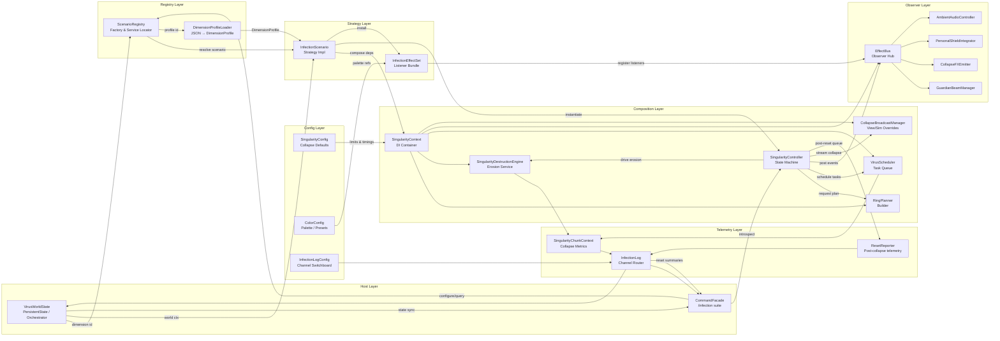
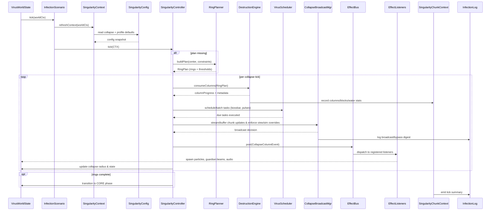
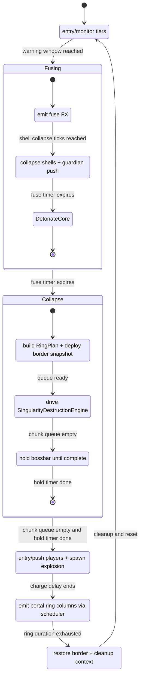

# Infection Architecture Roadmap

This document captures the *engineering* blueprint for extracting the singularity / infection finale out of `VirusWorldState` into reusable components. It focuses on how the current code works today and how the new layers will interlock. Diagrams are provided in Mermaid for clarity.

---

## 1. Current Monolith (High-Level)

`VirusWorldState` currently owns every stage of the singularity process: state machine, ring planning, destruction, FX, commands. The diagram below highlights the tight coupling.

```mermaid
flowchart LR
    subgraph Tick Entry
        TICK[tick()] --> PRE[tickVoidTears / tickShieldFields]
    end

    subgraph Infection Maintenance
        PRE --> HAZ[applyInfectiousContactDamage<br/>applyInfectiousInventoryEffects]
        HAZ --> GATE{infected context?}
        GATE -- no --> EXIT[return early]
        GATE -- yes --> CORE[totalTicks++<br/>removeMissingSources<br/>tickGuardianBeams]
        CORE --> TIER[ensureHealthInitialized<br/>check tier duration]
        TIER -->|tier done & singularity dormant| RAISE[advanceTier<br/>reset tier timers]
        TIER -->|else| DEGRADE[decay containment<br/>maybe reduce level]
        RAISE --> SPREAD
        DEGRADE --> SPREAD
        SPREAD[mutate?<br/>reinforce cores<br/>spawn pillars] --> STRUCT[maybeSpawnMatrixCube<br/>maybePushTierFiveBarrier]
    end

    subgraph Singularity Pipeline
        STRUCT --> DIFF[applyDifficultyRules<br/>matrix cube budget]
        DIFF --> SING[tickSingularity<br/>fuse ➜ collapse ➜ core ➜ ring ➜ dissipation]
        SING --> CFG[apply SingularityConfig<br/>player view/sim overrides]
        CFG --> BCAST[buffer/broadcast collapse chunks<br/>send client schedules]
    end

    subgraph Telemetry & Outputs
        BCAST --> TELE[SingularityChunkContext metrics<br/>InfectionLog channels]
        TELE --> EVENTS[runEvents<br/>boostAmbientSpawns]
        EVENTS --> EQUIP[pulseHelmetTrackers / guardian pushes]
        EQUIP --> DIRTY[[markDirty when state changes]]
    end
```

The single `tick` method fans out into hazard handling, tier bookkeeping, spread routines, defensive structures, the singularity state machine, and the player-facing event systems. Every subsystem mutates shared fields in-place, which explains the fragile coupling we see throughout `VirusWorldState`.

**Pain points**
- Every dimension would need another giant `VirusWorldState`.
- Hard to test singularity-specific behavior in isolation.
- Commands/admin tools directly touch internals.

---

## 2. Target Architecture (Modules & Responsibilities)

We split responsibilities using a Scenario → Controller → Planner/Engine → EffectBus chain. The Scenario Registry routes worlds to the appropriate scenario.



**Key notes**
- `VirusWorldState` becomes a host/coordinator; it asks `ScenarioRegistry` for the active scenario per dimension and delegates.
- `SingularityContext` supplies everything the controller currently pulls from `VirusWorldState`.
- `EffectBus` replaces hard-coded particle/audio calls so each scenario can register its own listeners.
- Design patterns line up with the `virusworld_state_refactor.md` blueprint: `InfectionScenario` is the Strategy, `ScenarioRegistry` acts as a factory/service locator, `SingularityController` encapsulates the State machine, `RingPlanner` is a Builder that feeds the existing destruction engine, `EffectBus` implements the Observer pattern with scenario-scoped listener sets, while `CommandFacade` is the entry-point Facade for tooling.
- `VirusScheduler` and `SingularityContext` round out the DI story—every controller tick receives a composed context so we can unit test each piece without the monolithic `VirusWorldState`.
- Destruction modes (configurable): existing column-based mode for “smooth” visuals and a `chunkSweep` mode for brute-force chunk-at-a-time destruction that works in both single-threaded and worker-driven pipelines.

---

## 3. Detailed Data Flow During Collapse

This sequence diagram mirrors the existing `processSingularityCollapse` logic but shows the future separation of duties—including the context composer, scheduler, and effect bus listeners that the refactor introduces.



---

## 4. Telemetry & Fluid Pre-Processing

Two supporting systems now sit alongside the legacy collapse loop to make troubleshooting and polish dramatically easier:

- **Per-tick metrics:** while the collapse context is active, `SingularityChunkContext` counts how many column tasks were attempted, how many were skipped because the chunk was missing/outside the border, and how many water cells were cleared. When `SingularityConfig.debugLogging` is `true`, the context logs a concise summary at the end of each tick so you can instantly see whether the erosion engine is doing real work or just short-circuiting.
- **Fluid drain pass:** before a layer is carved, the engine walks the next _N_ Y-levels (controlled by `waterDrainOffset`) and clears water/lava cells. This prevents the implosion from spawning massive waterfalls a split second before it reaches an ocean biome. The behavior is toggled via `drainWaterAhead`.

```jsonc
{
  "allowChunkGeneration": true,
  "allowOutsideBorderLoad": true,
  "debugLogging": true,
  "drainWaterAhead": true,
  "waterDrainOffset": 1
}
```

These options (in `config/the-virus-block/singularity.json`) complement the gamerules: server owners lock in defaults at boot, and admins can still tighten restrictions during runtime if needed. The shipping profile now assumes “collapse-friendly” values—generation + outside-border loads enabled, fluid drains tuned tighter—so the event works out of the box on new saves.

### Palette & Logging Abstractions

- **ColorConfig (`config/the-virus-block/colors.json`):** central registry of named ARGB values (guardian beams, barrier hues, corrupted fluids, etc.). Rendering layers query slots like `singularityBeamPrimary` or `singularityBorderCore` instead of sprinkling hex literals throughout GL code, which keeps shields, beams, and UI overlays in sync when designers retheme the infection.
- **InfectionLogConfig (`config/the-virus-block/logs.json`):** channelized logging switchboard. Each noisy subsystem (`Singularity`, `SingularityVisual`, `Fuse`, upcoming schedulers) declares a channel; admins toggle them independently without recompiling. The helper wraps `TheVirusBlock` logger so old saves still benefit from warnings even when the info channel is muted. Runtime control lives under `/virusblock logs list|set|reload`.

### Singularity State Machine

`tickSingularity` advances through five phases with clear transition predicates. Capturing the state machine—now expanded with nested fuse and collapse substates—helps us reason about which responsibilities can be delegated to future controllers and where schedulers, planners, and effect buses plug in.



---

## 5. Migration Overview

| Milestone | Code Impact | Notes |
| --- | --- | --- |
| 1. Interfaces & Context | Add `InfectionScenario`, `ScenarioRegistry`, `SingularityContext`, `EffectBus`, `VirusScheduler` | `VirusWorldState` still runs “default scenario” |
| 2. Controller Extraction | Move `tickSingularity` branches into `OverworldSingularityController` | Behavior parity required |
| 3. Planner Service | Wrap `prepareSingularityChunkQueue` into `RingPlanner` | Feeds `RingPlan` to controller |
| 4. Engine Integration | Teach `SingularityDestructionEngine` to consume `RingPlan` | Remove direct queue management |
| 5. Effect Bus & Scheduler | Replace `spawnCollapseParticles`, guardian beams, bossbar updates with events/tasks | Allows scenario-specific FX |
| 6. JSON Profiles & Commands | Load `dimension_profiles/*.json`; add `/infection scenario`, `/infection singularity` | Keep `/virusblock` compatibility |
| 7. Nether Scenario Pilot | Implement second scenario to validate architecture | Use different collapse profile/FX |

**Milestone detail map**
- **1. Interfaces & Context**
  - **1.1** Create empty interfaces (`InfectionScenario`, `ScenarioRegistry`, `SingularityContext`, `EffectBus`, `VirusScheduler`) and wire serialization helpers so saves do not break.
  - **1.2** Add service locator scaffolding inside `VirusWorldState` with a default scenario binding; ensure existing behavior remains untouched via feature flag.
  - **1.3** Draft unit tests / harnesses that instantiate the new interfaces with no-op implementations for parity verification.
- **2. Controller Extraction**
  - **2.1** Move `tickSingularity` logic into `OverworldSingularityController`, keeping `VirusWorldState` as a thin delegator.
  - **2.2** Expose `SingularityContext` accessors (world, config, scheduler) so the controller no longer reads state directly.
  - **2.3** Add telemetry hooks (log events / bossbar sync) to confirm controller ownership during rollout.
- **3. Planner Service**
  - **3.1** Port `prepareSingularityChunkQueue` into `RingPlanner.build`, returning an immutable `RingPlan`.
  - **3.2** Update `SingularityDestructionEngine` callers to consume `RingPlan` instead of mutating shared queues.
  - **3.3** Provide JSON-driven `RingConstraints` overrides sourced from `DimensionProfile`.
- **4. Engine Integration**
  - **4.1** Teach `SingularityDestructionEngine` to accept ring activation callbacks (on-column/on-ring) and surface progress metrics.
  - **4.2** Swap direct block updates in `VirusWorldState` for engine callbacks so erosion lives entirely in the service.
  - **4.3** Add regression tests verifying collapse completion and border synchronization when fed mock ring plans.
- **5. Effect Bus & Scheduler**
  - **5.1** Implement `EffectBus` dispatch with thread-safe listener registration scoped per scenario.
  - **5.2** Build concrete listeners (`GuardianBeamManager`, `CollapseFXEmitter`, etc.) and migrate hard-coded FX calls to events.
  - **5.3** Introduce `VirusScheduler` with persistence of outstanding tasks plus helpers for the controller to queue FX/bossbar work.
- **6. JSON Profiles & Commands**
  - **6.1** Define `dimension_profiles/*.json` schema and loader, caching profiles per dimension.
  - **6.2** Extend `/infection` commands to query/set scenarios, dump active profiles, and reload config.
  - **6.3** Document the new surface area (`/infection help`, readme updates) so admins can operate the system.
- **7. Nether Scenario Pilot**
  - **7.1** Implement `NetherScenario` leveraging the shared controller/planner but with alternate `DimensionProfile`.
  - **7.2** Override effect set / scheduler knobs (e.g., lava particles, slower erosion) to demonstrate extensibility.
  - **7.3** Run integration playtests across both scenarios and capture telemetry to validate architecture goals.

**Cross-cutting deliverables**
- **Persistence & migration guards:** every milestone should serialize the new context safely (e.g., `ScenarioRegistry` identifiers, scheduler queues) so old saves still load. Feature flags or gamerules allow rolling the scaffolding out gradually.
- **Telemetry & validation hooks:** add lightweight logging/metrics (bossbar sync events, effect bus subscriber counts) to confirm each layer is actually driving the game loop before the next milestone.
- **Documentation parity:** update `virusworld_state_refactor.md`, in-game help, and `/infection` command responses as soon as new abstractions land so ops/admins know how to exercise them.
- **API shims:** when moving logic behind facades, leave adapter methods in `VirusWorldState` temporarily (annotated `@Deprecated`) so downstream mixins or addons can migrate without breaking.

**Testing checkpoints**
- After Milestone 2: automated test verifying singularity countdown + core/ring phases still run.
- After Milestone 4: ensure “world actually collapses” (regression for earlier bug).
- After Milestone 6: verify commands still report accurate data.
- Manual QA passes (owned by Jean) accompany each milestone handoff; log playtest notes alongside release entries so we remember which scenarios were covered.

---

## 6. Next Actions

1. Land scaffolding (Milestone 1) with no behavior change.
2. Extract controller into `OverworldSingularityController` and wire context (Milestone 2).
3. Begin planner/engine integration work (Milestones 3–4), using the new context to pass plans instead of manipulating `Vir‍usWorldState` lists.

All subsequent scenarios—including the future Nether experience—will plug into these foundations.***

