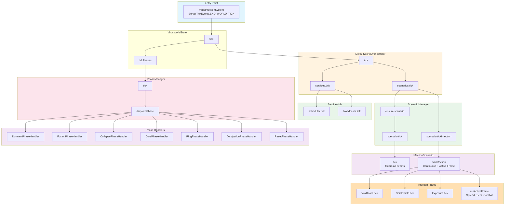
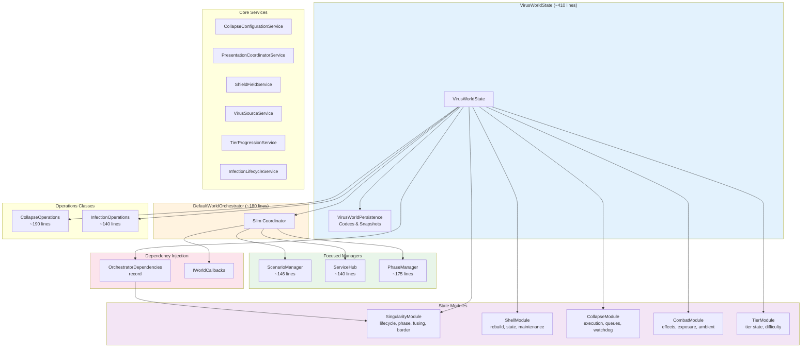
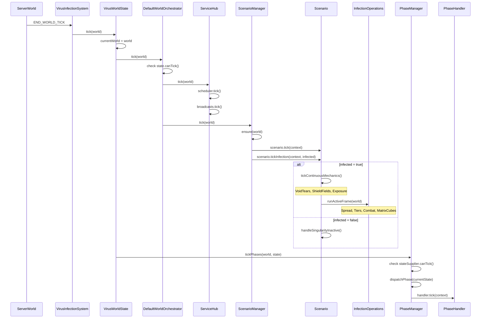

# Infection Architecture

This document describes the architecture of the infection system after refactoring to eliminate circular dependencies, apply Interface Segregation Principle (ISP), and follow Single Responsibility Principle (SRP).

---

## Overview

`VirusWorldState` (~410 lines) is the root aggregate that coordinates:
- Persistence (via `VirusWorldPersistence`)
- Service wiring via dependency injection
- Entry point for world ticks
- World lifecycle events

The orchestrator layer has been decomposed into focused managers:
- `ScenarioManager` - scenario lifecycle and infection tick
- `ServiceHub` - scheduler, effect bus, broadcasts
- `PhaseManager` - singularity phase state machine

---

## Tick Flow Diagram



---

## Component Architecture



---

## Scenario System

### InfectionScenario Interface
Scenarios provide dimension-specific infection behavior. The interface has a **default implementation** that provides standard infection mechanics:

```java
public interface InfectionScenario {
    Identifier id();
    
    default void onAttach(VirusWorldContext context) { }
    
    void tick(VirusWorldContext context);
    
    // Default provides standard infection behavior
    default void tickInfection(VirusWorldContext context, boolean infected) {
        VirusWorldState state = context.state();
        ServerWorld world = context.world();
        
        // Continuous mechanics (always run)
        state.combat().voidTears().tick();
        state.shieldFieldService().tick();
        state.combat().exposure().tickContact();
        state.combat().exposure().tickInventory();
        
        // Active infection or inactive handling
        if (infected) {
            state.runActiveInfectionFrame(world);
        } else {
            state.singularityServices().fusing().handleSingularityInactive();
        }
    }
    
    default void onDetach(VirusWorldContext context) { }
}
```

### Scenario Configuration
Scenarios are bound to dimensions via `scenarios.json`:

```json
{
  "defaultScenario": "the_virus:overworld",
  "scenarios": [
    {"id": "the_virus:overworld", "factory": "overworld"},
    {"id": "the_virus:nether", "factory": "nether"}
  ],
  "bindings": [
    {"dimension": "minecraft:overworld", "scenario": "the_virus:overworld"},
    {"dimension": "minecraft:the_nether", "scenario": "the_virus:nether"}
  ]
}
```

**Unbound dimensions** (like The End) fall back to `defaultScenario`.

### Built-in Scenarios
- `OverworldInfectionScenario` - Overworld-specific effect palettes
- `NetherInfectionScenario` - Nether-specific effect palettes
- Both extend `AbstractDimensionInfectionScenario` which adds guardian beams and dimension profiles

---

## Orchestration Layer

### WorldOrchestrator Interface (ISP-Compliant)
Thin interface with only 8 methods:

```java
public interface WorldOrchestrator {
    // Core lifecycle
    void tick(ServerWorld world);
    void shutdown(ServerWorld world);
    boolean isShutdown();
    OrchestratorState state();
    
    // Manager access
    ScenarioManager scenarios();
    ServiceHub services();
    PhaseManager phases();
    IWorldCallbacks callbacks();
}
```

### DefaultWorldOrchestrator
Slim coordinator (~180 lines) that:
- Creates and owns the three focused managers
- Delegates tick to `services.tick()` then `scenarios.tick()`
- Manages lifecycle state via `OrchestratorState` enum

**Access:** `state.orchestrator()`

### OrchestratorState
Explicit lifecycle enum:
```
INITIALIZING → RUNNING → SHUTTING_DOWN → SHUTDOWN
```
- `canTick()` - returns true only in RUNNING state
- `isShuttingDownOrShutdown()` - guards operations

---

## Focused Managers

### ScenarioManager (~146 lines)
Single responsibility: scenario lifecycle and infection tick
- `ensure(world)` - resolve and attach scenario for dimension
- `detach(world)` - cleanly detach with error isolation
- `tick(world)` - tick scenario AND call `tickInfection()`
- `activeId()` - returns `Optional<Identifier>`

### ServiceHub (~140 lines)
Single responsibility: core services
- `schedulerOrNoop()` - scheduler with null-safe access
- `effectBusOrNoop()` - effect bus with null-safe access
- `collapseBroadcastManagerOrNoop()` - broadcasts with null-safe access
- `tick(world)` - ticks scheduler and broadcasts
- `diagnostics()` - scheduler monitoring

### PhaseManager (~175 lines)
Single responsibility: singularity phase state machine
- Owns all phase handlers directly (no intermediate controller)
- `tick(world, state)` - dispatches to current phase handler
- Phase transition methods with error isolation

---

## Dependency Injection

### OrchestratorDependencies
Record that bundles dependencies to avoid circular references:

```java
public record OrchestratorDependencies(
    SingularityModule singularityModule,
    Function<ServerWorld, VirusWorldContext> contextFactory,
    Function<ServerWorld, SingularityContext> singularityContextFactory,
    CallbacksFactory callbacksFactory
) { }
```

`VirusWorldState` passes factories (lambdas), not `this`, breaking the circular dependency.

### ServiceAccessor Interface
Narrow interface for callbacks to access services:
```java
public interface ServiceAccessor {
    VirusScheduler schedulerOrNoop();
}
```

---

## Singularity Phase Handlers

Each phase has a dedicated stateless handler:

| Phase | Handler | Responsibility |
|-------|---------|----------------|
| DORMANT | `DormantPhaseHandler` | Monitor conditions to begin fusing |
| FUSING | `FusingPhaseHandler` | PreGen, Preload, countdown |
| COLLAPSE | `CollapsePhaseHandler` | CollapseProcessor (duration-based fill), border deployment |
| CORE | `CorePhaseHandler` | Core charge and detonation |
| RING | `RingPhaseHandler` | Visual rings, column carving |
| DISSIPATION | `DissipationPhaseHandler` | Fade out, transition to reset |
| RESET | `ResetPhaseHandler` | Chunk cleanup and state reset |

Handlers receive `SingularityContext` and are dispatched by `PhaseManager.dispatchPhase()`.

---

## Module Details

### SingularityModule
Consolidates all singularity-related services:
- `SingularityLifecycleService` - core singularity state machine
- `SingularityPhaseService` - phase transitions and preparation
- `SingularityFusingService` - fuse countdown and shell triggers
- `SingularityBorderService` - world border management
- `CollapseProcessor` - duration-based collapse using `BulkFillHelper.clearVolume()`
- `ChunkPreparationService` - chunk pre-generation and preloading

**Access:** `state.singularity()` for module, `state.singularityState()` for state

### ShellModule
Consolidates shell-related services:
- `ShellRebuildService` - shell construction logic
- `ShellRebuildState` - shell rebuild state
- `ShellMaintenanceService` - shell upkeep and callbacks

**Access:** `state.shell()`

### CollapseModule
Consolidates collapse execution services:
- `CollapseExecutionService` - block fill operations and utilities
- `CollapseQueueService` - queue management for reset stages
- `CollapseWatchdogService` - health monitoring
- `CollapseSnapshotService` - state snapshots

**Access:** `state.collapseModule()`

### CombatModule
Consolidates player interaction services:
- `EffectService` - status effects
- `InfectionExposureService` - exposure tracking
- `AmbientPressureService` - spawn/difficulty pressure
- `HelmetTelemetryService` - helmet HUD updates
- `VoidTearService` - void tear mechanics
- `TierEventService` - tier-based events
- `GuardianSpawnService` - guardian mob management

**Access:** `state.combat()`

### TierModule
Manages tier progression state:
- Current tier and difficulty
- Tier duration and advancement
- Containment level
- Health tracking

**Access:** `state.tiers()`

---

## Operations Classes

### CollapseOperations (~190 lines)
High-level collapse orchestration with real logic:
- `createBorderSyncData()` - border synchronization
- `hasCollapseWorkRemaining()` - work detection
- `transitionSingularityState()` - state transitions
- `tryCompleteCollapse()` - completion logic
- `forceStartSingularity()` - forced start

**Access:** `state.collapse()`

### InfectionOperations (~140 lines)
High-level infection orchestration:
- `runActiveFrame(world)` - **main infection frame** (spread, tiers, combat, matrix cubes)
- `applyDifficultyRules()` - difficulty rule application
- `applyHealthDamage()` - health damage with tier transitions
- `claimSurfaceMutations()` - mutation budget management

**Access:** `state.infection()`

---

## Null Safety Patterns

### Container Access
```java
// Preferred pattern
InfectionServiceContainer c = InfectionServices.container();
if (c != null) {
    // use c
}

// Or with ternary
SomeService svc = c != null ? c.someService() : fallback;
```

### Noop Accessors
All nullable services have null-safe accessors:
```java
services.schedulerOrNoop()           // never returns null
services.effectBusOrNoop()           // never returns null
services.collapseBroadcastManagerOrNoop()  // never returns null
```

### Optional for IDs
```java
scenarios.activeId()  // returns Optional<Identifier>
```

---

## Infection State Machine

| State | `infected()` | What Happens |
|-------|-------------|--------------|
| **Pre-infection** | `false` | `tickInfection(false)` → `handleSingularityInactive()` |
| **Active infection** | `true` | `tickInfection(true)` → `runActiveFrame()` |
| **Dormant mode** | `true` + `dormant()` | Frame runs but spread is slowed |

---

## State Flow (Detailed)



---

## Error Isolation

All tick methods are wrapped with try-catch:

```java
// ServiceHub.tick()
try {
    schedulerService.tick();
} catch (Exception e) {
    LOGGER.error("[ServiceHub] Scheduler tick failed", e);
}

// ScenarioManager.tick()
try {
    scenario.tick(context);
    scenario.tickInfection(context, infected);
} catch (Exception e) {
    LOGGER.error("[ScenarioManager] Scenario tick failed", e);
}

// PhaseManager.tick()
try {
    dispatchPhase(phase, ctx);
} catch (Exception e) {
    LOGGER.error("[PhaseManager] Phase tick failed", e);
}
```

Each subsystem failure is isolated - one failing won't crash others.

---

## Key Design Decisions

1. **ISP-Compliant Interface**: `WorldOrchestrator` has only 8 methods. Callers access managers directly for specific functionality.

2. **Single Responsibility Managers**: Each manager handles one concern:
   - `ScenarioManager` - scenarios + infection tick
   - `ServiceHub` - services only
   - `PhaseManager` - phases only

3. **Broken Circular Dependencies**: `OrchestratorDependencies` bundles factories instead of `this`, preventing `VirusWorldState ↔ Orchestrator` cycles.

4. **Explicit Lifecycle State**: `OrchestratorState` enum with `canTick()` guards all operations.

5. **Stateless Phase Handlers**: Handlers don't hold state - all state lives in modules.

6. **Null-Safe Accessors**: `*OrNoop()` methods provide safe defaults, eliminating NPE risks.

7. **Error Isolation**: Try-catch in all tick paths ensures one failure doesn't cascade.

8. **Cached World Reference**: `VirusWorldState.world()` caches the current world, eliminating redundant `ServerWorld` parameters in service methods.

9. **Modules as Aggregators**: Related services grouped into modules reduce direct dependencies on `VirusWorldState`.

10. **Operations for Complex Logic**: Multi-service workflows live in Operations classes, keeping tick methods clean.

11. **Default Scenario Behavior**: `InfectionScenario.tickInfection()` has a default implementation, so any scenario works out-of-box.

12. **Configurable Dimension Binding**: Scenarios are bound to dimensions via JSON config, with `defaultScenario` fallback for unbound dimensions.

---

## File Structure

```
orchestrator/
├── WorldOrchestrator.java        (38 lines)  - interface
├── DefaultWorldOrchestrator.java (182 lines) - coordinator
├── ScenarioManager.java          (146 lines) - scenarios + infection tick
├── ServiceHub.java               (139 lines) - services
├── PhaseManager.java             (174 lines) - phases
├── OrchestratorState.java        (35 lines)  - lifecycle enum
├── OrchestratorDependencies.java (44 lines)  - DI record
└── IWorldCallbacks.java          (36 lines)  - callbacks

api/
├── InfectionScenario.java        (58 lines)  - scenario interface with defaults
├── VirusWorldContext.java
├── SingularityContext.java
└── ...

controller/phase/
├── DormantPhaseHandler.java
├── FusingPhaseHandler.java
├── CollapsePhaseHandler.java
├── CorePhaseHandler.java
├── RingPhaseHandler.java
├── DissipationPhaseHandler.java
└── ResetPhaseHandler.java

state/
├── SingularityModule.java
├── CollapseModule.java
├── CombatModule.java
├── ShellModule.java
├── TierModule.java
└── InfectionState.java

scenario/
├── AbstractDimensionInfectionScenario.java
├── OverworldInfectionScenario.java
├── NetherInfectionScenario.java
└── ...
```

---

## Collapse System

### CollapseProcessor
The `CollapseProcessor` handles radius-based block destruction during the COLLAPSE phase:

- **Duration-based timing**: Rings are spread across `durationTicks` (default 1200 = 60 seconds)
- **Uses BulkFillHelper**: Calls `BulkFillHelper.clearVolume()` which uses native `/fill` command when possible
- **Shape-based fill**: Supports OUTLINE (shell), MATRIX (full), COLUMN, ROW, VECTOR shapes
- **Proper logging**: Uses `LogChannel.SINGULARITY` via watchdog for spam-controlled logs

```mermaid
flowchart LR
    subgraph CollapseFlow["Collapse Flow"]
        START[Start Collapse] --> TICK[tick every frame]
        TICK --> CALC[Calculate current ring<br/>based on elapsed/duration]
        CALC --> CHECK{New ring?}
        CHECK -->|No| WAIT[Wait for next tick]
        CHECK -->|Yes| FILL[BulkFillHelper.clearVolume]
        FILL --> LOG[Log progress]
        LOG --> TICK
    end
    
    subgraph FillHelper["BulkFillHelper"]
        FILL --> NATIVE{Volume ≤ 32768<br/>and MATRIX?}
        NATIVE -->|Yes| CMD[/fill command]
        NATIVE -->|No| ITER[Block iteration<br/>with shape filter]
    end
```

### Default Collapse Configuration
Key defaults in `DimensionProfile.Collapse`:

| Setting | Default | Description |
|---------|---------|-------------|
| `barrierStartRadius` | 120.0 | Starting world border radius |
| `barrierEndRadius` | 0.5 | Final world border radius |
| `barrierDurationTicks` | 1200 | Border shrink duration (60 seconds) |
| `outlineThickness` | 2 | Thickness of OUTLINE shape fill |
| `waterDrainMode` | OFF | Water drain ahead during collapse |
| `fillShape` | OUTLINE | Shape for block destruction |
| `fillMode` | AIR | Replace with air (vs DESTROY) |

## Configuration Profiles

### CollapseFillShape
Block destruction patterns:
- `OUTLINE` - shell of the bounding box (6 faces with thickness)
- `MATRIX` - entire volume (uses native /fill when ≤32768 blocks)
- `COLUMN` - vertical column through center
- `ROW` - horizontal row through center
- `VECTOR` - along the longest axis

### CollapseFillProfile
Predefined batching strategies for collapse:
- `DEFAULT` - outline shell processing
- `COLUMN_BY_COLUMN` - vertical slice processing
- `ROW_BY_ROW` - horizontal slice processing
- `VECTOR` - along dominant axis
- `FULL_MATRIX` - all blocks at once

### PreDrainProfile
Predefined strategies for pre-collapse water drainage:
- `DEFAULT` - outline drainage
- `ROW_BY_ROW` - horizontal slices
- `FULL_INSTANT` - all at once
- `FULL_PER_CHUNK` - chunk by chunk

---

## Persistence

`VirusWorldPersistence` handles all serialization:
- Codecs for all state records
- Snapshot records for complex state
- Flag encoding for boolean fields

The persistence layer is separate from domain logic.

---

## Future Improvements (Noted, Not Urgent)

These items are documented for future consideration but don't block shipping:

| Item | Location | Description |
|------|----------|-------------|
| Error isolation in `runActiveFrame()` | `InfectionOperations.java` | Could wrap subsections in try-catch for defensive isolation |
| Error isolation in `CombatModule.tick()` | `CombatModule.java` | Could wrap each service call in try-catch |
| Collapse Y-range optimization | `CollapseProcessor.java` | Could limit Y range around center instead of full world height |
| Native fill for OUTLINE | `BulkFillHelper.java` | Currently only MATRIX uses native /fill command |

These are **minor hardening opportunities**, not bugs.
