# Blocks & Growth

> Custom blocks, block entities, growth system.

**34 classes**

## Key Classes

- **`GrowthForceHandler`** (class)
- **`ProgressiveGrowthBlockEntity`** (class) → `BlockEntity`
- **`ProgressiveGrowthBlock`** (class) → `BlockWithEntity`

## Class Diagram

```mermaid
classDiagram
    class CorruptedCryingObsidianBlock {
        +CODEC: MapCodec
    }
    class CorruptedDiamondBlock {
        +CODEC: MapCodec
        +onStacksDropped(...) void
    }
    class CorruptedDirtBlock {
        +randomTick(...) void
    }
    class CorruptedGlassBlock {
        +STAGE: EnumProperty
        +CODEC: MapCodec
        +onBreak(...) BlockState
        +randomTick(...) void
    }
    class CorruptedGoldBlock {
        +CODEC: MapCodec
        +onStacksDropped(...) void
    }
    class CorruptedIceBlock {
        +onSteppedOn(...) void
        +randomDisplayTick(...) void
    }
    class CorruptedIronBlock {
        +randomTick(...) void
        +onStacksDropped(...) void
    }
    class CorruptedSandBlock
    class CorruptedSnowBlock
    class CorruptedSnowCarpetBlock
    class CorruptedStoneBlock {
        +STAGE: EnumProperty
        +CODEC: MapCodec
        +getColor(...) int
        +randomTick(...) void
    }
    class CorruptedTntBlock {
        +onBreak(...) BlockState
        +onDestroyedByExplosion(...) void
    }
    class CorruptedWoodBlock {
        +onSteppedOn(...) void
    }
    class CorruptionStage {
        <<enumeration>>
    }
    class GrowthCollisionTracker {
        +hasAny() boolean
        +hasAnyInWorld(...) boolean
        +register(...) void
        +unregister(...) void
        +active(...) Collection
    }
    class GrowthEventPublisher {
        +postForceEvent(...) void
        +postBeamEvent(...) void
        +postFuseEvent(...) void
        +sendBeamPayload(...) void
    }
    class GrowthExplosionHandler {
        +startBurstSequence(...) void
        +tickPendingBursts(...) boolean
        +executeBurstExplosion(...) void
        +finalizeBurst(...) boolean
        +applyExplosionDamage(...) void
    }
    class GrowthForceHandler {
        +isForceActive(...) boolean
        +applyForce(...) void
        +tryApplyForceDamage(...) void
        +computeImpulse(...) double
        +buildRingBands(...) List
    }
    class GrowthParticleEmitter {
        +emitAmbientParticles(...) void
        +spawnConfiguredParticles(...) void
        +computeParticleOffset(...) Vec3d
        +randomPointInSphere(...) Vec3d
        +randomDirection(...) Vec3d
    }
    class GrowthShapeBuilder {
        +build(...) ShapeResult
        +buildVanillaShellCollisionShape(...) CollisionResult
        +debugCollisionShape(...) void
    }
    class MatrixCubeBlockEntity {
        +tick(...) void
        +markSettled() void
        +getActiveCount(...) int
        +destroyAll(...) void
        +register(...) void
    }
    class ProgressiveGrowthBlockEntity {
        +serverTick(...) void
        +clientTick(...) void
        +getRenderWobble(...) Vec3d
        +onEntityCollision(...) void
        +canManualFusePreview(...) boolean
    }
    class SingularityBlockEntity {
        +ORB_GROW_TICKS: int
        +ORB_SHRINK_TICKS: int
        +BEAM_DELAY_TICKS: int
        +serverTick(...) void
        +clientTick(...) void
        +startSequence(...) void
        +getStage() SingularityVisualStage
        +notifyStop(...) void
    }
    class VirusBlockEntity {
        +tick(...) void
    }
    class ProgressiveGrowthBlock {
        +LIGHT_LEVEL: IntProperty
        +CODEC: MapCodec
        +getRenderType(...) BlockRenderType
        +createBlockEntity(...) BlockEntity
        +getTicker(...) BlockEntityTicker
        +onPlaced(...) void
        +getOutlineShape(...) VoxelShape
    }
    class GrowthBlockDefinition {
        <<record>>
        +id: Identifier
        +growthEnabled: boolean
        +rateTicks: int
        +rateScale: double
        +defaults() GrowthBlockDefinition
        +sanitizedRate() int
        +clampedRateScale() double
        +clampedStartScale() double
        +clampedTargetScale() double
    }
    class GrowthProfile {
        <<record>>
        +id: Identifier
        +growthEnabled: boolean
        +rateTicks: int
        +rateScale: double
        +defaults() GrowthProfile
        +sanitizedRate() int
        +clampedRateScale() double
        +clampedStartScale() double
        +clampedTargetScale() double
    }
    class GrowthProfileParser {
        +loadGlowProfiles(...) Map
        +loadParticleProfiles(...) Map
        +loadForceProfiles(...) Map
        +loadFieldProfiles(...) Map
        +loadFuseProfiles(...) Map
    }
    class GrowthRegistry {
        +load(...) GrowthRegistry
        +glowProfile(...) GrowthGlowProfile
        +growthProfile(...) GrowthProfile
        +particleProfile(...) GrowthParticleProfile
        +forceProfile(...) GrowthForceProfile
    }
    class GrowthRegistryDefaults {
        +MAGMA_ANIMATION: 
        +LAVA_STILL_ANIMATION: 
        +LAVA_FLOW_ANIMATION: 
        +ensureDefaults(...) void
        +withGlow(...) GrowthBlockDefinition
        +withProfiles(...) GrowthBlockDefinition
        +withGrowth(...) GrowthBlockDefinition
        +withVariant(...) GrowthBlockDefinition
    }
    class CorruptedTntEntity {
        +getBlockState() BlockState
        +spawn(...) CorruptedTntEntity
        +tick() void
    }
    class CorruptedWormEntity {
        +spawn(...) CorruptedWormEntity
    }
    class FallingMatrixCubeEntity {
        +tick() void
        +remove(...) void
        +markRegistered() void
    }
    class VirusFuseEntity {
        +setOwnerPos(...) void
        +getOwnerPos() BlockPos
        +getBlockState() BlockState
        +tick() void
    }
    class Block
    class TransparentBlock
    class TranslucentBlock
    class CarpetBlock
    class FallingBlock
    class TntBlock
    class StringIdentifiable {
        <<interface>>
    }
    class BlockEntity
    class BlockWithEntity
    class TntEntity
    class SilverfishEntity
    class FallingBlockEntity
    class Worldworld
    class Stagestage
    class Builder
    class Builderbuilder
    Block <|-- CorruptedCryingObsidianBlock
    Block <|-- CorruptedDiamondBlock
    Block <|-- CorruptedDirtBlock
    Block <|-- CorruptedGoldBlock
    Block <|-- CorruptedIronBlock
    Block <|-- CorruptedSandBlock
    Block <|-- CorruptedSnowBlock
    Block <|-- CorruptedWoodBlock
    BlockEntity <|-- MatrixCubeBlockEntity
    BlockEntity <|-- ProgressiveGrowthBlockEntity
    BlockEntity <|-- SingularityBlockEntity
    BlockEntity <|-- VirusBlockEntity
    BlockWithEntity <|-- ProgressiveGrowthBlock
    CarpetBlock <|-- CorruptedSnowCarpetBlock
    CorruptedCryingObsidianBlock --> MapCodec : CODEC
    CorruptedCryingObsidianBlock --> MapCodec : returns
    CorruptedDiamondBlock --> BlockStatestate : uses
    CorruptedDiamondBlock --> ItemStackstack : uses
    CorruptedDiamondBlock --> MapCodec : CODEC
    CorruptedDiamondBlock --> MapCodec : returns
    CorruptedDirtBlock --> BlockStatestate : uses
    CorruptedDirtBlock --> Randomrandom : uses
    CorruptedGlassBlock --> EnumProperty : STAGE
    CorruptedGlassBlock --> MapCodec : CODEC
    CorruptedGlassBlock --> MapCodec : returns
    CorruptedGlassBlock --> Worldworld : uses
    CorruptedGoldBlock --> BlockStatestate : uses
    CorruptedGoldBlock --> ItemStackstack : uses
    CorruptedGoldBlock --> MapCodec : CODEC
    CorruptedGoldBlock --> MapCodec : returns
    CorruptedIceBlock --> BlockStatestate : uses
    CorruptedIceBlock --> Randomrandom : uses
    CorruptedIceBlock --> Worldworld : uses
    CorruptedIronBlock --> BlockStatestate : uses
    CorruptedIronBlock --> ItemStackstack : uses
    CorruptedIronBlock --> Randomrandom : uses
    CorruptedStoneBlock --> BlockStatestate : uses
    CorruptedStoneBlock --> EnumProperty : STAGE
    CorruptedStoneBlock --> MapCodec : CODEC
    CorruptedStoneBlock --> MapCodec : returns
    CorruptedTntBlock --> BlockStateoldState : uses
    CorruptedTntBlock --> BlockStatestate : uses
    CorruptedTntBlock --> BooleanProperty : UNSTABLE
    CorruptedTntBlock --> Worldworld : uses
    CorruptedTntEntity --> NullableLivingEntityigniter : uses
    CorruptedWoodBlock --> BlockStatestate : uses
    CorruptedWoodBlock --> Worldworld : uses
    FallingBlock <|-- CorruptedStoneBlock
    FallingBlockEntity <|-- FallingMatrixCubeEntity
    FallingMatrixCubeEntity --> BlockStatestate : uses
    FallingMatrixCubeEntity --> RemovalReasonreason : uses
    GrowthCollisionTracker --> ConcurrentHashMap : ACTIVE
    GrowthCollisionTracker --> ProgressiveGrowthBlockEntity : returns
    GrowthCollisionTracker --> ProgressiveGrowthBlockEntityentity : uses
    GrowthCollisionTracker --> Worldworld : uses
    GrowthEventPublisher --> GrowthForceProfileprofile : uses
    GrowthEventPublisher --> GrowthFuseProfileprofile : uses
    GrowthEventPublisher --> LivingEntitytarget : uses
    GrowthEventPublisher --> Stagestage : uses
    GrowthExplosionHandler --> BurstStatestate : uses
    GrowthExplosionHandler --> GrowthBlockDefinitiondefinition : uses
    GrowthExplosionHandler --> GrowthExplosionProfileexplosion : uses
    GrowthExplosionHandler --> RunnableonMarkDirty : uses
    GrowthForceHandler --> GrowthBlockDefinitiondefinition : uses
    GrowthForceHandler --> GrowthForceProfileprofile : uses
    GrowthForceHandler --> NullableGrowthForceProfileprofile : uses
    GrowthForceHandler --> Object2LongMap : uses
    GrowthParticleEmitter --> EmitterStatestate : uses
    GrowthParticleEmitter --> GrowthParticleProfileprofile : uses
    GrowthParticleEmitter --> NullableIdentifierid : uses
    GrowthParticleEmitter --> ParticleEffect : returns
    GrowthProfileParser --> GrowthFieldProfile : returns
    GrowthProfileParser --> GrowthForceProfile : returns
    GrowthProfileParser --> GrowthGlowProfile : returns
    GrowthProfileParser --> GrowthParticleProfile : returns
    GrowthRegistry --> GrowthFieldProfile : fieldProfiles
    GrowthRegistry --> GrowthForceProfile : forceProfiles
    GrowthRegistry --> GrowthGlowProfile : glowProfiles
    GrowthRegistry --> GrowthParticleProfile : particleProfiles
    GrowthRegistryDefaults --> BooleandoesDestruction : uses
    GrowthRegistryDefaults --> BooleanhasCollision : uses
    GrowthRegistryDefaults --> GrowthBlockDefinition : returns
    GrowthRegistryDefaults --> GrowthBlockDefinitionbase : uses
    GrowthShapeBuilder --> CollisionResult : returns
    GrowthShapeBuilder --> GrowthBlockDefinitiondefinition : uses
    GrowthShapeBuilder --> NullableBoxoutlineBounds : uses
    GrowthShapeBuilder --> ShapeResult : returns
    MatrixCubeBlockEntity --> BlockStatestate : uses
    MatrixCubeBlockEntity --> ConcurrentHashMap : ACTIVE
    MatrixCubeBlockEntity --> ConcurrentHashMap : ACTIVE_POSITIONS
    MatrixCubeBlockEntity --> Worldworld : uses
    ProgressiveGrowthBlock --> Builder : uses
    ProgressiveGrowthBlock --> IntProperty : LIGHT_LEVEL
    ProgressiveGrowthBlock --> MapCodec : CODEC
    ProgressiveGrowthBlock --> MapCodec : returns
    ProgressiveGrowthBlockEntity --> GrowthOverrides : overrides
    ProgressiveGrowthBlockEntity --> Object2LongMap : touchCooldowns
    ProgressiveGrowthBlockEntity --> VoxelShape : collisionShape
    ProgressiveGrowthBlockEntity --> VoxelShape : outlineShape
    SilverfishEntity <|-- CorruptedWormEntity
    SingularityBlockEntity --> BlockStatestate : uses
    SingularityBlockEntity --> SingularityBlockEntityentity : uses
    SingularityBlockEntity --> SingularityVisualStage : stage
    SingularityBlockEntity --> Worldworld : uses
    StringIdentifiable <|.. CorruptionStage
    TntBlock <|-- CorruptedTntBlock
    TntEntity <|-- CorruptedTntEntity
    TntEntity <|-- VirusFuseEntity
    TranslucentBlock <|-- CorruptedIceBlock
    TransparentBlock <|-- CorruptedGlassBlock
    VirusBlockEntity --> BlockStatestate : uses
    VirusBlockEntity --> Object2LongMap : auraCooldowns
    VirusBlockEntity --> VirusBlockEntityentity : uses
    VirusBlockEntity --> Worldworld : uses
    VirusFuseEntity --> Builderbuilder : uses
    VirusFuseEntity --> TrackedData : TRACKED_OWNER_POS
    VirusFuseEntity --> TrackedData : TRACKED_SLIDE
    VirusFuseEntity --> Worldworld : uses
```

---
[Back to README](./README.md)
