# Field System

> Complete field system architecture.

**42 classes** across 5 packages.

## Architecture

```mermaid
classDiagram
    class BeamConfig {
        <<record>>
        +custom(...) BeamConfig
        +toJson() JsonObject
        +isActive() boolean
        +hasPulse() boolean
        +fromJson(...) BeamConfig
    }
    class FieldDefinition {
        <<record>>
        +fromJson(...) FieldDefinition
        +empty(...) FieldDefinition
        +of(...) FieldDefinition
        +of(...) FieldDefinition
        +hasBindings() boolean
    }
    class FieldLayer {
        <<record>>
        +empty(...) FieldLayer
        +of(...) FieldLayer
        +of(...) FieldLayer
        +fromJson(...) FieldLayer
        +builder(...) Builder
    }
    class FieldManager {
        +get(...) FieldManager
        +remove(...) void
        +onSpawn(...) void
        +onRemove(...) void
        +onUpdate(...) void
    }
    class FieldRegistry {
        +initialize(...) void
        +register(...) void
        +get(...) FieldDefinition
        +get(...) FieldDefinition
        +clear() void
    }
    class FieldType {
        <<enumeration>>
    }
    class Modifiers {
        <<record>>
        +builder() Builder
        +toBuilder() Builder
        +withRadius(...) Modifiers
        +withStrength(...) Modifiers
        +visual(...) Modifiers
    }
    class FieldLoader {
        +load(...) void
        +reload() void
        +loadAll() void
        +loadDefinition(...) FieldDefinition
        +getDefinition(...) FieldDefinition
    }
    class ReferenceResolver {
        +resolve(...) JsonObject
        +resolveWithOverrides(...) JsonObject
        +resolveWithOverrides(...) JsonObject
        +clearCache() void
    }
    class EffectProcessor {
        +process(...) void
        +applyPush(...) void
        +applyPull(...) void
        +applyDamage(...) void
        +applyHeal(...) void
    }
    class ActiveTrigger {
        +tick() boolean
        +getProgress() float
        +getEffectValue() float
        +getScaledValue() float
        +config() TriggerConfig
    }
    class BindingResolver {
        +evaluate(...) float
        +evaluateAll(...) Map
        +getOrDefault(...) float
    }
    class LifecycleConfig {
        <<record>>
        +hasFadeIn() boolean
        +hasFadeOut() boolean
        +hasScaleIn() boolean
        +hasScaleOut() boolean
        +hasSpawnAnimation() boolean
    }
    class TriggerConfig {
        <<record>>
        +fromJson(...) TriggerConfig
        +builder() Builder
        +toBuilder() Builder
        +toJson() JsonObject
    }
    class TriggerProcessor {
        +fireEvent(...) void
        +tick() void
        +hasActiveTriggers() boolean
        +getActiveTriggers() List
        +getActiveTriggers(...) List
    }
    class FieldInstance {
        <<abstract>>
        +id() long
        +definitionId() Identifier
        +type() FieldType
        +position() Vec3d
        +scale() float
    }
    class FollowConfig {
        <<record>>
        +withLead(...) FollowConfig
        +trailing(...) FollowConfig
        +leading(...) FollowConfig
        +isActive() boolean
        +isTrailing() boolean
    }
    class LifecycleState {
        <<enumeration>>
    }
    class Builder
    class Primitive
    class Animation
    ActiveTrigger --> TriggerConfig : config
    ActiveTrigger --> TriggerConfig : returns
    ActiveTrigger --> TriggerEffect : returns
    BeamConfig --> Builder : returns
    BeamConfig --> PulseConfig : pulse
    BindingResolver --> BindingConfig : uses
    BindingResolver --> BindingConfigconfig : uses
    BindingResolver --> PlayerEntityplayer : uses
    EffectProcessor --> ActiveEffect : uses
    EffectProcessor --> ActiveEffecteffect : uses
    EffectProcessor --> FieldInstance : uses
    EffectProcessor --> FieldInstanceinstance : uses
    FieldDefinition --> FieldLayer : layers
    FieldDefinition --> FieldType : type
    FieldDefinition --> FollowConfig : follow
    FieldDefinition --> Modifiers : modifiers
    FieldInstance --> FieldType : returns
    FieldInstance --> FieldType : type
    FieldInstance --> LifecycleState : lifecycleState
    FieldInstance --> LifecycleState : returns
    FieldLayer --> Animation : animation
    FieldLayer --> BlendMode : blendMode
    FieldLayer --> Primitive : primitives
    FieldLayer --> Transform : transform
    FieldLoader --> FieldDefinition : loadedDefinitions
    FieldLoader --> FieldDefinition : returns
    FieldLoader --> FieldLayer : returns
    FieldLoader --> ReferenceResolver : referenceResolver
    FieldManager --> FieldInstance : instances
    FieldManager --> FieldInstance : onSpawn
    FieldManager --> FieldInstance : onUpdate
    FieldManager --> FieldInstance : uses
    FieldRegistry --> FieldDefinition : DEFINITIONS
    FieldRegistry --> FieldDefinition : returns
    FieldRegistry --> FieldLoader : loader
    FollowConfig --> Builder : returns
    LifecycleConfig --> Builder : returns
    LifecycleConfig --> DecayConfig : decay
    Modifiers --> Builder : returns
    TriggerConfig --> Builder : returns
    TriggerConfig --> FieldEvent : event
    TriggerConfig --> TriggerEffect : effect
    TriggerProcessor --> ActiveTrigger : activeTriggers
    TriggerProcessor --> ActiveTrigger : returns
    TriggerProcessor --> TriggerConfig : triggers
    TriggerProcessor --> TriggerEffecteffect : uses
```

## Modules

| Module | Classes | Description |
|--------|---------|-------------|
| [Core Classes](./field/core.md) | 15 | field, field.loader |
| [Effects & Triggers](./field/effects.md) | 27 | field.effect, field.influence, field.instance |

---
[Back to README](./README.md)
