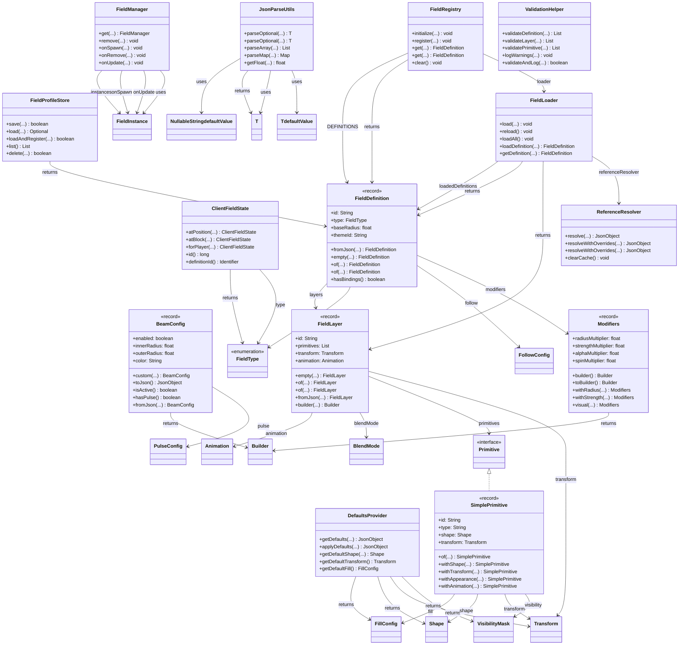

# Core Classes

> Packages: field, field.loader

**15 classes**

## Class Diagram

```mermaid
classDiagram
    class BeamConfig {
        <<record>>
        +enabled: boolean
        +innerRadius: float
        +outerRadius: float
        +color: String
        +custom(...) BeamConfig
        +toJson() JsonObject
        +isActive() boolean
        +hasPulse() boolean
        +fromJson(...) BeamConfig
    }
    class ClientFieldState {
        +atPosition(...) ClientFieldState
        +atBlock(...) ClientFieldState
        +forPlayer(...) ClientFieldState
        +id() long
        +definitionId() Identifier
    }
    class FieldDefinition {
        <<record>>
        +id: String
        +type: FieldType
        +baseRadius: float
        +themeId: String
        +fromJson(...) FieldDefinition
        +empty(...) FieldDefinition
        +of(...) FieldDefinition
        +of(...) FieldDefinition
        +hasBindings() boolean
    }
    class FieldLayer {
        <<record>>
        +id: String
        +primitives: List
        +transform: Transform
        +animation: Animation
        +empty(...) FieldLayer
        +of(...) FieldLayer
        +of(...) FieldLayer
        +fromJson(...) FieldLayer
        +builder(...) Builder
    }
    class FieldManager {
        +get(...) FieldManager
        +remove(...) void
        +onSpawn(...) void
        +onRemove(...) void
        +onUpdate(...) void
    }
    class FieldProfileStore {
        +save(...) boolean
        +load(...) Optional
        +loadAndRegister(...) boolean
        +list() List
        +delete(...) boolean
    }
    class FieldRegistry {
        +initialize(...) void
        +register(...) void
        +get(...) FieldDefinition
        +get(...) FieldDefinition
        +clear() void
    }
    class FieldType {
        <<enumeration>>
    }
    class Modifiers {
        <<record>>
        +radiusMultiplier: float
        +strengthMultiplier: float
        +alphaMultiplier: float
        +spinMultiplier: float
        +builder() Builder
        +toBuilder() Builder
        +withRadius(...) Modifiers
        +withStrength(...) Modifiers
        +visual(...) Modifiers
    }
    class DefaultsProvider {
        +getDefaults(...) JsonObject
        +applyDefaults(...) JsonObject
        +getDefaultShape(...) Shape
        +getDefaultTransform() Transform
        +getDefaultFill() FillConfig
    }
    class FieldLoader {
        +load(...) void
        +reload() void
        +loadAll() void
        +loadDefinition(...) FieldDefinition
        +getDefinition(...) FieldDefinition
    }
    class JsonParseUtils {
        +parseOptional(...) T
        +parseOptional(...) T
        +parseArray(...) List
        +parseMap(...) Map
        +getFloat(...) float
    }
    class ReferenceResolver {
        +resolve(...) JsonObject
        +resolveWithOverrides(...) JsonObject
        +resolveWithOverrides(...) JsonObject
        +clearCache() void
    }
    class SimplePrimitive {
        <<record>>
        +id: String
        +type: String
        +shape: Shape
        +transform: Transform
        +of(...) SimplePrimitive
        +withShape(...) SimplePrimitive
        +withTransform(...) SimplePrimitive
        +withAppearance(...) SimplePrimitive
        +withAnimation(...) SimplePrimitive
    }
    class ValidationHelper {
        +validateDefinition(...) List
        +validateLayer(...) List
        +validatePrimitive(...) List
        +logWarnings(...) void
        +validateAndLog(...) boolean
    }
    class Primitive {
        <<interface>>
    }
    class Builder
    class Animation
    class Shape
    class T
    BeamConfig --> Builder : returns
    BeamConfig --> PulseConfig : pulse
    ClientFieldState --> FieldType : returns
    ClientFieldState --> FieldType : type
    DefaultsProvider --> FillConfig : returns
    DefaultsProvider --> Shape : returns
    DefaultsProvider --> Transform : returns
    DefaultsProvider --> VisibilityMask : returns
    FieldDefinition --> FieldLayer : layers
    FieldDefinition --> FieldType : type
    FieldDefinition --> FollowConfig : follow
    FieldDefinition --> Modifiers : modifiers
    FieldLayer --> Animation : animation
    FieldLayer --> BlendMode : blendMode
    FieldLayer --> Primitive : primitives
    FieldLayer --> Transform : transform
    FieldLoader --> FieldDefinition : loadedDefinitions
    FieldLoader --> FieldDefinition : returns
    FieldLoader --> FieldLayer : returns
    FieldLoader --> ReferenceResolver : referenceResolver
    FieldManager --> FieldInstance : instances
    FieldManager --> FieldInstance : onSpawn
    FieldManager --> FieldInstance : onUpdate
    FieldManager --> FieldInstance : uses
    FieldProfileStore --> FieldDefinition : returns
    FieldRegistry --> FieldDefinition : DEFINITIONS
    FieldRegistry --> FieldDefinition : returns
    FieldRegistry --> FieldLoader : loader
    JsonParseUtils --> NullableStringdefaultValue : uses
    JsonParseUtils --> T : returns
    JsonParseUtils --> T : uses
    JsonParseUtils --> TdefaultValue : uses
    Modifiers --> Builder : returns
    Primitive <|.. SimplePrimitive
    SimplePrimitive --> FillConfig : fill
    SimplePrimitive --> Shape : shape
    SimplePrimitive --> Transform : transform
    SimplePrimitive --> VisibilityMask : visibility
```

---
[Back to Field System](../field.md)
