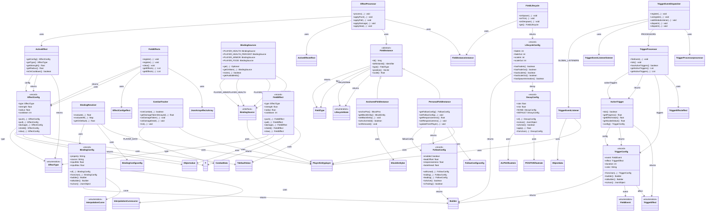

# Effects & Triggers

> Packages: field.effect, field.influence, field.instance

**27 classes**

## Class Diagram

```mermaid
classDiagram
    class ActiveEffect {
        +getConfig() EffectConfig
        +getType() EffectType
        +getStrength() float
        +getRadius() float
        +isOnCooldown() boolean
    }
    class EffectConfig {
        <<record>>
        +type: EffectType
        +strength: float
        +radius: float
        +cooldown: int
        +push(...) EffectConfig
        +pull(...) EffectConfig
        +damage(...) EffectConfig
        +shield() EffectConfig
        +slow(...) EffectConfig
    }
    class EffectProcessor {
        +process(...) void
        +applyPush(...) void
        +applyPull(...) void
        +applyDamage(...) void
        +applyHeal(...) void
    }
    class EffectType {
        <<enumeration>>
    }
    class FieldEffects {
        +register(...) void
        +register(...) void
        +clear() void
        +getEffects(...) List
        +getEffects(...) List
    }
    class ActiveTrigger {
        +tick() boolean
        +getProgress() float
        +getEffectValue() float
        +getScaledValue() float
        +config() TriggerConfig
    }
    class BindingConfig {
        <<record>>
        +property: String
        +source: String
        +inputMin: float
        +inputMax: float
        +of(...) BindingConfig
        +fromJson(...) BindingConfig
        +builder() Builder
        +toBuilder() Builder
        +toJson() JsonObject
    }
    class BindingResolver {
        +evaluate(...) float
        +evaluateAll(...) Map
        +getOrDefault(...) float
    }
    class BindingSource {
        <<interface>>
    }
    class BindingSources {
        +PLAYER_HEALTH: BindingSource
        +PLAYER_HEALTH_PERCENT: BindingSource
        +PLAYER_ARMOR: BindingSource
        +PLAYER_FOOD: BindingSource
        +get(...) Optional
        +getOrWarn(...) BindingSource
        +exists(...) boolean
        +getAvailableIds()
    }
    class CombatTracker {
        +isInCombat(...) boolean
        +getDamageTakenDecayed(...) float
        +onDamageTaken(...) void
        +onDamageDealt(...) void
        +tick(...) void
    }
    class DecayConfig {
        <<record>>
        +rate: float
        +min: float
        +NONE: DecayConfig
        +DEFAULT: DecayConfig
        +of(...) DecayConfig
        +toJson() JsonObject
        +isActive() boolean
        +apply(...) float
        +fromJson(...) DecayConfig
    }
    class FieldEvent {
        <<enumeration>>
    }
    class InterpolationCurve {
        <<enumeration>>
    }
    class LifecycleConfig {
        <<record>>
        +fadeIn: int
        +fadeOut: int
        +scaleIn: int
        +scaleOut: int
        +hasFadeIn() boolean
        +hasFadeOut() boolean
        +hasScaleIn() boolean
        +hasScaleOut() boolean
        +hasSpawnAnimation() boolean
    }
    class TriggerConfig {
        <<record>>
        +event: FieldEvent
        +effect: TriggerEffect
        +duration: int
        +color: String
        +fromJson(...) TriggerConfig
        +builder() Builder
        +toBuilder() Builder
        +toJson() JsonObject
    }
    class TriggerEffect {
        <<enumeration>>
    }
    class TriggerEventDispatcher {
        +register(...) void
        +unregister(...) void
        +addGlobalListener(...) void
        +dispatch(...) void
        +dispatch(...) void
    }
    class TriggerProcessor {
        +fireEvent(...) void
        +tick() void
        +hasActiveTriggers() boolean
        +getActiveTriggers() List
        +getActiveTriggers(...) List
    }
    class AnchoredFieldInstance {
        +anchorPos() BlockPos
        +getBlockEntity() BlockEntity
        +setBlockEntity(...) void
        +isAnchorValid() boolean
        +onRemoved() void
    }
    class FieldEffect {
        <<record>>
        +type: EffectType
        +strength: float
        +radius: float
        +cooldown: int
        +push(...) FieldEffect
        +pull(...) FieldEffect
        +damage(...) FieldEffect
        +shield() FieldEffect
        +slow(...) FieldEffect
    }
    class FieldInstance {
        <<abstract>>
        +id() long
        +definitionId() Identifier
        +type() FieldType
        +position() Vec3d
        +scale() float
    }
    class FieldLifecycle {
        +onSpawn(...) void
        +onTick(...) void
        +onDespawn(...) void
        +get() FieldLifecycle
    }
    class FollowConfig {
        <<record>>
        +enabled: boolean
        +leadOffset: float
        +responsiveness: float
        +lookAhead: float
        +withLead(...) FollowConfig
        +trailing(...) FollowConfig
        +leading(...) FollowConfig
        +isActive() boolean
        +isTrailing() boolean
    }
    class LifecycleState {
        <<enumeration>>
    }
    class PersonalFieldInstance {
        +getFollowConfig() FollowConfig
        +setFollowConfig(...) void
        +getResponsiveness() float
        +setResponsiveness(...) void
        +updateFromPlayer(...) void
    }
    class Objectvalue
    class T
    class Builder
    class POSITIVEfloatrate
    class ALPHAfloatmin
    class Objectdata
    ActiveEffect --> EffectConfig : config
    ActiveEffect --> EffectConfig : returns
    ActiveEffect --> EffectType : returns
    ActiveTrigger --> TriggerConfig : config
    ActiveTrigger --> TriggerConfig : returns
    ActiveTrigger --> TriggerEffect : returns
    AnchoredFieldInstance --> BlockEntitybe : uses
    BindingConfig --> Builder : returns
    BindingConfig --> InterpolationCurve : curve
    BindingConfig --> InterpolationCurvecurve : uses
    BindingResolver --> BindingConfig : uses
    BindingResolver --> BindingConfigconfig : uses
    BindingResolver --> PlayerEntityplayer : uses
    BindingSource --> PlayerEntityplayer : uses
    BindingSources --> BindingSource : PLAYER_ARMOR
    BindingSources --> BindingSource : PLAYER_HEALTH
    BindingSources --> BindingSource : PLAYER_HEALTH_PERCENT
    BindingSources --> BindingSource : SOURCES
    CombatTracker --> CombatData : PLAYER_DATA
    CombatTracker --> PlayerEntityplayer : uses
    DecayConfig --> ALPHAfloatmin : uses
    DecayConfig --> POSITIVEfloatrate : uses
    EffectConfig --> EffectType : type
    EffectConfig --> Objectvalue : uses
    EffectConfig --> T : returns
    EffectConfig --> TdefaultValue : uses
    EffectProcessor --> ActiveEffect : uses
    EffectProcessor --> ActiveEffecteffect : uses
    EffectProcessor --> FieldInstance : uses
    EffectProcessor --> FieldInstanceinstance : uses
    FieldEffect --> EffectType : type
    FieldEffect --> Objectvalue : uses
    FieldEffect --> T : returns
    FieldEffect --> TdefaultValue : uses
    FieldEffects --> EffectConfig : returns
    FieldEffects --> EffectConfig : uses
    FieldEffects --> EffectConfigeffect : uses
    FieldEffects --> JsonArrayeffectsArray : uses
    FieldInstance --> FieldType : returns
    FieldInstance --> FieldType : type
    FieldInstance --> LifecycleState : lifecycleState
    FieldInstance --> LifecycleState : returns
    FieldInstance <|-- AnchoredFieldInstance
    FieldInstance <|-- PersonalFieldInstance
    FieldLifecycle --> FieldInstanceinstance : uses
    FieldLifecycle --> LifecycleConfig : returns
    FollowConfig --> Builder : returns
    LifecycleConfig --> Builder : returns
    LifecycleConfig --> DecayConfig : decay
    PersonalFieldInstance --> FollowConfig : followConfig
    PersonalFieldInstance --> FollowConfig : returns
    PersonalFieldInstance --> FollowConfigconfig : uses
    PersonalFieldInstance --> PlayerEntityplayer : uses
    TriggerConfig --> Builder : returns
    TriggerConfig --> FieldEvent : event
    TriggerConfig --> TriggerEffect : effect
    TriggerEventDispatcher --> TriggerEventListener : GLOBAL_LISTENERS
    TriggerEventDispatcher --> TriggerEventListenerlistener : uses
    TriggerEventDispatcher --> TriggerProcessor : PROCESSORS
    TriggerEventDispatcher --> TriggerProcessorprocessor : uses
    TriggerEventListener --> Objectdata : uses
    TriggerEventListener --> PlayerEntityplayer : uses
    TriggerProcessor --> ActiveTrigger : activeTriggers
    TriggerProcessor --> ActiveTrigger : returns
    TriggerProcessor --> TriggerConfig : triggers
    TriggerProcessor --> TriggerEffecteffect : uses
```

---
[Back to Field System](../field.md)
