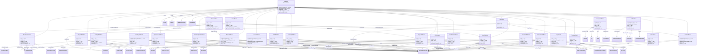

# Panels

> Packages: client.gui.panel, client.gui.panel.sub

**26 classes**

## Class Diagram

```mermaid
classDiagram
    class AbstractPanel {
        <<abstract>>
        +isFeatureSupported() boolean
        +getDisabledTooltip() String
        +setBounds(...) void
        +setBoundsQuiet(...) void
        +getBounds() Bounds
    }
    class ActionPanel {
        +init(...) void
        +tick() void
        +render(...) void
        +getWidgets() List
        +getHeight() int
    }
    class AdvancedPanel {
        +init(...) void
        +tick() void
        +render(...) void
        +mouseScrolled(...) boolean
        +onShapeTypeChanged() void
    }
    class DebugPanel {
        +init(...) void
        +tick() void
        +render(...) void
        +mouseScrolled(...) boolean
        +getTestFieldButton() ButtonWidget
    }
    class LayerPanel {
        +init(...) void
        +setOnLayerChanged(...) void
        +tick() void
        +render(...) void
        +getWidgets() List
    }
    class PrimitivePanel {
        +setOnPrimitiveChanged(...) void
        +init(...) void
        +refreshForLayerChange() void
        +tick() void
        +render(...) void
    }
    class ProfilesPanel {
        +setDualBounds(...) void
        +isDualMode() boolean
        +init(...) void
        +tick() void
        +render(...) void
    }
    class QuickPanel {
        +init(...) void
        +tick() void
        +render(...) void
        +getWidgets() List
    }
    class AnimationSubPanel {
        +init(...) void
        +tick() void
        +render(...) void
        +getHeight() int
        +getWidgets() List
    }
    class AppearanceSubPanel {
        +init(...) void
        +tick() void
        +render(...) void
        +getHeight() int
        +getWidgets() List
    }
    class ArrangeSubPanel {
        +getHeight() int
        +init(...) void
        +tick() void
        +render(...) void
        +getWidgets() List
    }
    class BeamSubPanel {
        +init(...) void
        +render(...) void
        +getHeight() int
        +tick() void
    }
    class BindingsSubPanel {
        +init(...) void
        +getWidgets() List
        +render(...) void
        +mouseClicked(...) boolean
        +getHeight() int
    }
    class FillSubPanel {
        +init(...) void
        +tick() void
        +render(...) void
        +onShapeChanged() void
    }
    class ForceSubPanel {
        +setOnConfigureRequest(...) void
        +init(...) void
        +getSelectedConfig() ForceFieldConfig
        +setCustomConfig(...) void
        +tick() void
    }
    class LifecycleSubPanel {
        +init(...) void
        +tick() void
        +render(...) void
        +getHeight() int
        +getWidgets() List
    }
    class LinkingSubPanel {
        +init(...) void
        +getWidgets() List
        +render(...) void
        +getHeight() int
        +tick() void
    }
    class ModifiersSubPanel {
        +init(...) void
        +tick() void
        +render(...) void
        +getWidgets() List
        +getContentHeight() int
    }
    class OrbitSubPanel {
        +init(...) void
        +tick() void
        +render(...) void
        +getWidgets() List
        +getContentHeight() int
    }
    class PredictionSubPanel {
        +init(...) void
        +getWidgets() List
        +render(...) void
        +getHeight() int
        +tick() void
    }
    class ShapeSubPanel {
        +setWarningCallback(...) void
        +setShapeChangedCallback(...) void
        +init(...) void
        +rebuildForCurrentShape() void
        +tick() void
    }
    class TraceSubPanel {
        +init(...) void
        +render(...) void
        +tick() void
        +getHeight() int
    }
    class TransformQuickSubPanel {
        +init(...) void
        +tick() void
        +render(...) void
        +getHeight() int
        +getWidgets() List
    }
    class TransformSubPanel {
        +init(...) void
        +tick() void
        +render(...) void
        +getHeight() int
        +getWidgets() List
    }
    class TriggerSubPanel {
        +init(...) void
        +tick() void
        +render(...) void
        +getHeight() int
        +getWidgets() List
    }
    class VisibilitySubPanel {
        +setWidgetChangedCallback(...) void
        +init(...) void
        +tick() void
        +render(...) void
        +getHeight() int
    }
    class Screen
    class Bounds
    AbstractPanel --> Bounds : bounds
    AbstractPanel --> ExpandableSection : sections
    AbstractPanel --> FieldEditState : state
    AbstractPanel --> Screen : parent
    AbstractPanel <|-- ActionPanel
    AbstractPanel <|-- AdvancedPanel
    AbstractPanel <|-- AnimationSubPanel
    AbstractPanel <|-- AppearanceSubPanel
    AbstractPanel <|-- ArrangeSubPanel
    AbstractPanel <|-- BeamSubPanel
    AbstractPanel <|-- BindingsSubPanel
    AbstractPanel <|-- DebugPanel
    AbstractPanel <|-- FillSubPanel
    AbstractPanel <|-- ForceSubPanel
    AbstractPanel <|-- LayerPanel
    AbstractPanel <|-- LifecycleSubPanel
    AbstractPanel <|-- LinkingSubPanel
    AbstractPanel <|-- ModifiersSubPanel
    AbstractPanel <|-- OrbitSubPanel
    AbstractPanel <|-- PredictionSubPanel
    AbstractPanel <|-- PrimitivePanel
    AbstractPanel <|-- ProfilesPanel
    AbstractPanel <|-- QuickPanel
    AbstractPanel <|-- ShapeSubPanel
    AbstractPanel <|-- TraceSubPanel
    AbstractPanel <|-- TransformQuickSubPanel
    AbstractPanel <|-- TransformSubPanel
    AbstractPanel <|-- TriggerSubPanel
    AbstractPanel <|-- VisibilitySubPanel
    ActionPanel --> CyclingButtonWidget : autoSaveToggle
    ActionPanel --> CyclingButtonWidget : livePreviewToggle
    ActionPanel --> DrawContextcontext : uses
    AdvancedPanel --> AnimationSubPanel : animationSubPanel
    AdvancedPanel --> AppearanceSubPanel : appearanceSubPanel
    AdvancedPanel --> ModifiersSubPanel : modifiersSubPanel
    AdvancedPanel --> ShapeSubPanel : shapeSubPanel
    AnimationSubPanel --> CyclingButtonWidget : fragmentDropdown
    AnimationSubPanel --> CyclingButtonWidget : pulseToggle
    AnimationSubPanel --> CyclingButtonWidget : spinAxis
    AnimationSubPanel --> CyclingButtonWidget : spinToggle
    AppearanceSubPanel --> ColorButton : primaryColorBtn
    AppearanceSubPanel --> ColorButton : secondaryColorBtn
    AppearanceSubPanel --> DrawContextcontext : uses
    ArrangeSubPanel --> CellType : currentCellType
    ArrangeSubPanel --> Tab : currentTab
    ArrangeSubPanel --> Tabtab : uses
    ArrangeSubPanel --> TextRenderer : textRenderer
    BeamSubPanel --> CyclingButtonWidget : enableToggle
    BeamSubPanel --> CyclingButtonWidget : fragmentDropdown
    BeamSubPanel --> CyclingButtonWidget : pulseToggle
    BeamSubPanel --> GuiLayout : layout
    BindingsSubPanel --> BindableProperty : selectedProperty
    BindingsSubPanel --> CyclingButtonWidget : propertyButton
    BindingsSubPanel --> GuiLayout : layout
    BindingsSubPanel --> InterpolationCurve : selectedCurve
    DebugPanel --> BeamSubPanel : beamPanel
    DebugPanel --> BindingsSubPanel : bindingsPanel
    DebugPanel --> LifecycleSubPanel : lifecyclePanel
    DebugPanel --> TriggerSubPanel : triggerPanel
    FillSubPanel --> CageOptionsAdapter : cageAdapter
    FillSubPanel --> CyclingButtonWidget : depthWriteToggle
    FillSubPanel --> CyclingButtonWidget : fillModeDropdown
    FillSubPanel --> CyclingButtonWidget : fragmentDropdown
    ForceSubPanel --> CyclingButtonWidget : locationDropdown
    ForceSubPanel --> CyclingButtonWidget : presetDropdown
    ForceSubPanel --> ForceFieldConfig : customConfig
    ForceSubPanel --> SpawnLocation : spawnLocation
    LayerPanel --> CyclingButtonWidget : blendModeDropdown
    LayerPanel --> DrawContextcontext : uses
    LayerPanel --> RunnableonLayerChanged : uses
    LifecycleSubPanel --> DecayConfig : uses
    LifecycleSubPanel --> LifecycleConfig : returns
    LifecycleSubPanel --> LifecycleConfig : uses
    LifecycleSubPanel --> LifecycleConfigpreset : uses
    LinkingSubPanel --> CyclingButtonWidget : followButton
    LinkingSubPanel --> CyclingButtonWidget : mirrorButton
    LinkingSubPanel --> CyclingButtonWidget : scaleWithButton
    LinkingSubPanel --> GuiLayout : layout
    ModifiersSubPanel --> CheckboxWidget : colorCycleBlend
    ModifiersSubPanel --> CheckboxWidget : colorCycleEnabled
    ModifiersSubPanel --> CheckboxWidget : waveEnabled
    ModifiersSubPanel --> CheckboxWidget : wobbleEnabled
    OrbitSubPanel --> CheckboxWidget : enabledCheckbox
    OrbitSubPanel --> CyclingButtonWidget : axisDropdown
    OrbitSubPanel --> DrawContextcontext : uses
    PredictionSubPanel --> CyclingButtonWidget : enabledButton
    PredictionSubPanel --> CyclingButtonWidget : presetButton
    PredictionSubPanel --> DrawContextcontext : uses
    PredictionSubPanel --> GuiLayout : layout
    PrimitivePanel --> DrawContextcontext : uses
    PrimitivePanel --> Runnablecallback : uses
    ProfilesPanel --> ProfileActionService : actionService
    ProfilesPanel --> ProfileEntry : allProfiles
    ProfilesPanel --> ProfileEntry : filteredProfiles
    ProfilesPanel --> ProfilesPanelLayout : layout
    QuickPanel --> ColorButton : colorButton
    QuickPanel --> CyclingButtonWidget : shapeDropdown
    QuickPanel --> LayerPanel : layerPanel
    QuickPanel --> PrimitivePanel : primitivePanel
    ShapeSubPanel --> BiConsumer : warningCallback
    ShapeSubPanel --> CyclingButtonWidget : fragmentDropdown
    ShapeSubPanel --> CyclingButtonWidget : patternFaces
    ShapeSubPanel --> CyclingButtonWidget : shapeTypeDropdown
    TraceSubPanel --> DrawContextcontext : uses
    TransformQuickSubPanel --> CyclingButtonWidget : anchorDropdown
    TransformQuickSubPanel --> CyclingButtonWidget : billboardDropdown
    TransformQuickSubPanel --> CyclingButtonWidget : facingDropdown
    TransformQuickSubPanel --> CyclingButtonWidget : uniformScaleToggle
    TransformSubPanel --> CyclingButtonWidget : anchorDropdown
    TransformSubPanel --> CyclingButtonWidget : uniformScaleToggle
    TransformSubPanel --> Vec3Editor : offsetEditor
    TransformSubPanel --> Vec3Editor : rotationEditor
    TriggerSubPanel --> CyclingButtonWidget : triggerEffect
    TriggerSubPanel --> CyclingButtonWidget : triggerType
    TriggerSubPanel --> DrawContextcontext : uses
    VisibilitySubPanel --> CyclingButtonWidget : animateToggle
    VisibilitySubPanel --> CyclingButtonWidget : fragmentDropdown
    VisibilitySubPanel --> CyclingButtonWidget : invertToggle
    VisibilitySubPanel --> CyclingButtonWidget : maskTypeDropdown
```

---
[Back to GUI System](../gui.md)
