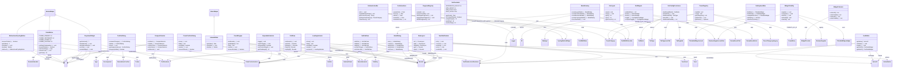

# Widgets

> Packages: client.gui.widget, client.gui.util

**28 classes**

## Class Diagram

```mermaid
classDiagram
    class BidirectionalCyclingButton {
        +mouseClicked(...) boolean
        +getValue() T
        +setValue(...) void
        +builder() Builder
        +forEnum(...) BidirectionalCyclingButton
    }
    class BottomActionBar {
        +init(...) void
        +updateButtonStates() void
        +getCurrentPreset() String
        +getSelectedCategory() PresetCategory
        +resetPreset() void
    }
    class ColorButton {
        +THEME_PRIMARY: int
        +THEME_SECONDARY: int
        +THEME_ACCENT: int
        +THEME_SUCCESS: int
        +setRightClickHandler(...) void
        +mouseClicked(...) boolean
        +setColorString(...) void
        +setHexColor(...) void
        +getColor() int
    }
    class CompactSelector {
        +onSelect(...) CompactSelector
        +onAdd(...) CompactSelector
        +onItemClick(...) CompactSelector
        +selectIndex(...) CompactSelector
        +setBounds(...) void
    }
    class ConfirmDialog {
        +unsavedChanges(...) ConfirmDialog
        +delete(...) ConfirmDialog
        +show(...) void
        +getLegacyInstance() ConfirmDialog
        +isLegacyVisible() boolean
    }
    class DropdownWidget {
        +getSelected() T
        +setSelected(...) void
        +setSelectedIndex(...) void
        +onClick(...) void
        +renderWidget(...) void
    }
    class ExpandableSection {
        +toggle() void
        +setOnToggle(...) void
        +isExpanded() boolean
        +setContentHeight(...) void
        +getTotalHeight() int
    }
    class GridPane {
        +setBounds(...) void
        +getCell(...) Bounds
        +getSpan(...) Bounds
        +topLeft() Bounds
        +topRight() Bounds
    }
    class LabeledSlider {
        +getValue() float
        +setValue(...) void
        +builder(...) Builder
    }
    class LoadingIndicator {
        +show() void
        +hide() void
        +isVisible() boolean
        +render(...) void
        +centered(...) LoadingIndicator
    }
    class ModalDialog {
        +size(...) ModalDialog
        +content(...) ModalDialog
        +addAction(...) ModalDialog
        +addAction(...) ModalDialog
        +onClose(...) ModalDialog
    }
    class ModalFactory {
        +createLayerModal(...) ModalDialog
        +createPrimitiveModal(...) ModalDialog
        +createRenameModal(...) ModalDialog
        +createColorInputModal(...) ModalDialog
        +focusTextField(...) void
    }
    class PanelWrapper {
        +setBounds(...) void
        +getWidgets() List
        +tick() void
        +render(...) void
        +mouseScrolled(...) boolean
    }
    class PresetConfirmDialog {
        +show(...) void
        +hide() void
        +isVisible() boolean
        +render(...) void
        +mouseClicked(...) boolean
    }
    class SubTabPane {
        +addTab(...) SubTabPane
        +addTab(...) SubTabPane
        +addTab(...) SubTabPane
        +onTabChange(...) SubTabPane
        +setActiveTab(...) SubTabPane
    }
    class ToastNotification {
        +info(...) void
        +success(...) void
        +warning(...) void
        +error(...) void
        +renderAll(...) void
    }
    class Vec3Editor {
        +getValue() Vector3f
        +setValue(...) void
        +render(...) void
        +getFieldX() TextFieldWidget
        +getFieldY() TextFieldWidget
    }
    class FragmentRegistry {
        +reload() void
        +ensureLoaded() void
        +listShapeFragments(...) List
        +applyShapeFragment(...) void
        +listFillFragments() List
    }
    class GuiAnimations {
        +easeInOut(...) float
        +bounce(...) float
        +elastic(...) float
        +transition(...) float
        +transitionColor(...) int
    }
    class GuiConfigPersistence {
        +loadSavedMode() GuiMode
        +saveMode(...) void
        +loadSavedTab() TabType
        +saveTab(...) void
        +loadSavedSubtab(...) int
    }
    class GuiConstants {
        +REFERENCE_HEIGHT: int
        +MIN_HEIGHT: int
        +MIN_SCALE: float
        +MAX_SCALE: float
        +getScale() float
        +isCompactMode() boolean
        +widgetHeight() int
        +padding() int
        +sectionGap() int
    }
    class GuiKeyboardNav {
        +findNext(...) ClickableWidget
        +findAtGrid(...) ClickableWidget
        +navigateDirection(...) ClickableWidget
        +isNavKey(...) boolean
        +directionFromKey(...)
    }
    class GuiLayout {
        +reset() void
        +reset(...) void
        +getX() int
        +getY() int
        +getCurrentY() int
    }
    class GuiWidgets {
        +visibleWhen(...) W
        +button(...) ButtonWidget
        +button(...) ButtonWidget
        +toggle(...) CyclingButtonWidget
        +compactToggle(...) CyclingButtonWidget
    }
    class PresetRegistry {
        +loadAll() void
        +reset() void
        +getCategories() List
        +getPresets(...) List
        +getPreset(...) Optional
    }
    class RowLayout {
        +of(...) RowLayout
        +gap(...) RowLayout
        +weights() RowLayout
        +get(...) Bounds
        +span(...) Bounds
    }
    class WidgetCollector {
        +collectAll() List
        +collectVisible() List
        +collectAll(...) List
        +collectVisible(...) List
    }
    class WidgetVisibility {
        +register(...) void
        +unregister(...) void
        +refresh(...) void
        +refreshAll() void
        +clearAll() void
    }
    class ButtonWidget
    class SliderWidget
    class T
    class Bounds
    class Screenparent
    class Boundsbounds
    class Builder
    class Logger
    class W
    class Wwidget
    BidirectionalCyclingButton --> T : formatter
    BidirectionalCyclingButton --> T : onChange
    BidirectionalCyclingButton --> T : values
    BidirectionalCyclingButton --> Tvalue : uses
    BottomActionBar --> CyclingButtonWidget : presetCategoryDropdown
    BottomActionBar --> CyclingButtonWidget : presetDropdown
    BottomActionBar --> FieldEditState : state
    BottomActionBar --> PresetCategory : selectedCategory
    ButtonWidget <|-- BidirectionalCyclingButton
    ButtonWidget <|-- ColorButton
    ButtonWidget <|-- DropdownWidget
    ColorButton --> DrawContextcontext : uses
    ColorButton --> Runnablehandler : uses
    CompactSelector --> Bounds : bounds
    CompactSelector --> T : items
    CompactSelector --> T : nameExtractor
    CompactSelector --> TextRenderer : textRenderer
    ConfirmDialog --> DrawContextcontext : uses
    ConfirmDialog --> RunnableonConfirm : uses
    ConfirmDialog --> Screenparent : uses
    ConfirmDialog --> Type : type
    DropdownWidget --> T : labelProvider
    DropdownWidget --> T : onSelect
    DropdownWidget --> T : options
    DropdownWidget --> TextRenderer : textRenderer
    ExpandableSection --> DrawContextcontext : uses
    ExpandableSection --> TextRenderertextRenderer : uses
    FragmentRegistry --> FieldEditStatestate : uses
    FragmentRegistry --> Logger : LOGGER
    GridPane --> Bounds : bounds
    GridPane --> Bounds : cells
    GridPane --> Bounds : returns
    GridPane --> Boundsbounds : uses
    GuiConfigPersistence --> GuiMode : returns
    GuiConfigPersistence --> TabType : returns
    GuiConfigPersistence --> TabTypemainTab : uses
    GuiConfigPersistence --> TabTypetab : uses
    GuiKeyboardNav --> ClickableWidgetcurrent : uses
    GuiWidgets --> BooleanSuppliercondition : uses
    GuiWidgets --> RunnableonClick : uses
    GuiWidgets --> W : returns
    GuiWidgets --> Wwidget : uses
    LabeledSlider --> Builder : returns
    LoadingIndicator --> DrawContextcontext : uses
    LoadingIndicator --> TextRenderertextRenderer : uses
    ModalDialog --> ActionButton : actions
    ModalDialog --> Bounds : contentBounds
    ModalDialog --> Bounds : dialogBounds
    ModalDialog --> TextRenderer : textRenderer
    ModalFactory --> FieldEditStatestate : uses
    ModalFactory --> ModalDialog : returns
    ModalFactory --> RunnableonDelete : uses
    ModalFactory --> TextRenderertextRenderer : uses
    PanelWrapper --> AbstractPanel : panel
    PanelWrapper --> Bounds : currentBounds
    PanelWrapper --> Boundsbounds : uses
    PanelWrapper --> DrawContextcontext : uses
    PresetConfirmDialog --> DrawContextcontext : uses
    PresetRegistry --> PresetCategory : PRESETS_BY_CATEGORY
    PresetRegistry --> PresetCategory : returns
    PresetRegistry --> PresetCategorycategory : uses
    PresetRegistry --> PresetEntry : PRESETS_BY_ID
    RowLayout --> Bounds : bounds
    RowLayout --> Bounds : returns
    RowLayout --> Boundsbounds : uses
    SliderWidget <|-- LabeledSlider
    SubTabPane --> Bounds : bounds
    SubTabPane --> Bounds : tabBarBounds
    SubTabPane --> TabEntry : tabs
    SubTabPane --> TextRenderer : textRenderer
    ToastNotification --> DrawContextcontext : uses
    ToastNotification --> TextRenderertextRenderer : uses
    ToastNotification --> Toast : toasts
    ToastNotification --> Toasttoast : uses
    Vec3Editor --> TextRenderertextRenderer : uses
    Vec3Editor --> Vector3f : currentValue
    Vec3Editor --> Vector3f : onChange
    Vec3Editor --> Vector3f : returns
    WidgetCollector --> WidgetProvider : uses
    WidgetVisibility --> BooleanSupplier : registry
    WidgetVisibility --> BooleanSuppliercondition : uses
    WidgetVisibility --> ClickableWidgetwidget : uses
```

---
[Back to GUI System](../gui.md)
