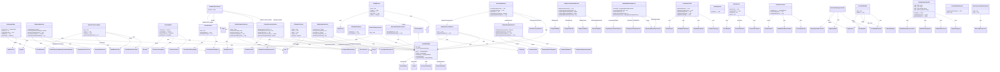

# Infection System

> Virus spreading and scenario management.

**83 classes**

## Key Classes

## Class Diagram

```mermaid
classDiagram
    class BoobytrapHelper {
        +selectTrap(...) TrapSelection
        +spread(...) int
        +triggerExplosion(...) void
        +debugList(...) void
        +placeTrap(...) BlockPos
    }
    class CollapseOperations {
        +createBorderSyncData(...)
        +hasCollapseWorkRemaining() boolean
        +transitionSingularityState(...) void
        +tryCompleteCollapse(...) boolean
        +computeInitialCollapseRadius(...) int
    }
    class CorruptionProfiler {
        +logChunkRewrite(...) void
        +logBoobytrapPlacement(...) void
        +logBoobytrapSpread(...) void
        +logBoobytrapTrigger(...) void
        +logMatrixCubeSkip(...) void
    }
    class GlobalTerrainCorruption {
        +init() void
        +trigger(...) void
        +cleanse(...) void
        +getTrackedChunkCount(...) int
    }
    class InfectionOperations {
        +ensureDebugInfection(...) void
        +applyDifficultyRules(...) void
        +broadcast(...) void
        +getSingularitySnapshot() Optional
        +applySingularitySnapshot(...) void
    }
    class TierCookbook {
        +isEnabled(...) boolean
        +anyEnabled(...) boolean
        +activeFeatures(...) EnumSet
        +defaultPlan() EnumMap
    }
    class VirusDamageClassifier {
        +KEY_BED: String
        +KEY_TNT: String
        +KEY_EXPLOSION: String
        +KEY_MELEE_PREFIX: String
        +classify(...) String
        +classifyExplosion(...) String
        +getDisplayName(...) String
    }
    class VirusInventoryAnnouncements {
        +init() void
        +tick(...) void
    }
    class VirusItemAlerts {
        +init() void
        +broadcastBurn(...) void
        +broadcastPickup(...) void
    }
    class VirusTierBossBar {
        +init() void
        +update(...) void
    }
    class VirusWorldPersistence {
        +CODEC: Codec
    }
    class VirusWorldState {
        +ID: String
        +TYPE: PersistentStateType
        +get(...) VirusWorldState
        +world() ServerWorld
        +singularity() SingularityModule
        +singularityState()
        +collapseModule() CollapseModule
    }
    class AlertingService {
        +dispatch(...) void
    }
    class AmbientPressureService {
        +tick(...) void
        +applyDifficultyRules(...) void
    }
    class ChunkPreparationService {
        +state() State
        +tickChunkPreload() void
        +tickPreGeneration() void
        +rebuildPreGenQueue(...) void
        +logChunkLoadException(...) void
    }
    class CollapseConfigurationService {
        +applyDimensionProfile(...) void
        +configuredCollapseMaxRadius() int
        +configuredBarrierStartRadius() double
        +configuredBarrierEndRadius() double
        +configuredBorderDurationTicks() long
    }
    class CollapseExecutionService {
        +getOperationsThisTick() int
        +resetOperationsThisTick() void
        +spawnChunkVeil(...) void
        +chunkDistanceFromCenter(...) double
        +getCurrentCollapseRadius() double
    }
    class CollapseProcessor {
        +state() State
        +start(...) void
        +start(...) void
        +stop() void
        +isActive() boolean
    }
    class CollapseQueueService {
        +chunkQueue() Deque
        +chunkQueueSnapshot() List
        +resetQueue() Deque
        +resetQueueSnapshot() List
        +clearResetProcessed() void
    }
    class CollapseSnapshotService {
        +buildSingularitySnapshot() Optional
        +buildBorderSnapshot() Optional
        +applySingularitySnapshot(...) void
        +applySingularityBorderSnapshot(...) void
    }
    class CollapseWatchdogService {
        +controller() SingularityWatchdogController
        +resetCollapseStallTicks() void
        +collapseStallTicks() int
        +diagnosticsSampleInterval() int
        +presentationService() SingularityPresentationService
    }
    class ConfigService {
        +root() Path
        +resolve(...) Path
        +readJson(...) T
        +writeJson(...) void
        +exists(...) boolean
    }
    class EffectBusTelemetry {
        +onRegister(...) void
        +onUnregister(...) void
    }
    class EffectService {
        +registerSet(...) void
        +unregisterSet(...) void
        +clearSets() void
        +close() void
    }
    class GuardianFxService {
        +pushPlayers(...) GuardianResult
        +notifyShieldStatus(...) void
        +notifyShieldFailure(...) void
    }
    class GuardianSpawnService {
        +spawnCoreGuardians(...) void
        +tick() void
    }
    class HelmetTelemetryService {
        +tick() void
    }
    class HorizonDarkeningController
    class InfectionDisturbanceService {
        +disturbByPlayer() void
        +handleExplosionImpact(...) void
    }
    class PersistentState
    class Codec
    class State
    class Deque
    class T
    class Objectvalue
    AmbientPressureService --> EntityType : uses
    AmbientPressureService --> InfectionTiertier : uses
    AmbientPressureService --> Randomrandom : uses
    AmbientPressureService --> VirusWorldState : host
    BoobytrapHelper --> BlockStatestate : uses
    BoobytrapHelper --> ServerPlayerEntityplayer : uses
    BoobytrapHelper --> TrapSelection : returns
    BoobytrapHelper --> Typetype : uses
    ChunkPreparationService --> ChunkPoscenter : uses
    ChunkPreparationService --> State : returns
    ChunkPreparationService --> State : state
    ChunkPreparationService --> VirusWorldState : host
    CollapseConfigurationService --> CollapseFillMode : fillModeConfig
    CollapseConfigurationService --> CollapseFillProfile : fillProfileConfig
    CollapseConfigurationService --> CollapseFillShape : fillShapeConfig
    CollapseConfigurationService --> WaterDrainMode : waterDrainModeConfig
    CollapseExecutionService --> ChunkPoschunk : uses
    CollapseExecutionService --> CollapseErosionSettingserosion : uses
    CollapseExecutionService --> CollapseFillShapeshape : uses
    CollapseExecutionService --> VirusWorldState : host
    CollapseOperations --> CollapseBroadcastManagerbroadcastManager : uses
    CollapseOperations --> SingularityPhaseService : singularityPhaseService
    CollapseOperations --> SingularityStatenext : uses
    CollapseOperations --> VirusWorldState : state
    CollapseProcessor --> Deque : deferredDrainQueue
    CollapseProcessor --> State : returns
    CollapseProcessor --> State : state
    CollapseProcessor --> VirusWorldState : host
    CollapseQueueService --> Deque : chunkQueue
    CollapseQueueService --> Deque : resetQueue
    CollapseQueueService --> PreCollapseDrainageJob : preCollapseDrainageJob
    CollapseQueueService --> VirusWorldState : host
    CollapseSnapshotService --> SingularityBorderSnapshot : returns
    CollapseSnapshotService --> SingularitySnapshot : returns
    CollapseSnapshotService --> SingularitySnapshotsnapshot : uses
    CollapseSnapshotService --> VirusWorldState : host
    CollapseWatchdogService --> SingularityPresentationService : presentationFallback
    CollapseWatchdogService --> SingularityTelemetryService : FALLBACK_TELEMETRY
    CollapseWatchdogService --> SingularityWatchdogController : returns
    CollapseWatchdogService --> SingularityWatchdogController : watchdogController
    ConfigService --> Objectvalue : uses
    ConfigService --> T : returns
    ConfigService --> T : uses
    CorruptionProfiler --> ChunkPospos : uses
    CorruptionProfiler --> NullableBlockPospos : uses
    CorruptionProfiler --> NullableStringdetail : uses
    CorruptionProfiler --> VirusEventTypetype : uses
    EffectBusTelemetry --> VirusWorldState : state
    EffectService --> EffectBusbus : uses
    EffectService --> ScenarioEffectSet : activeSets
    EffectService --> ScenarioEffectSetset : uses
    GlobalTerrainCorruption --> BlockStatestate : uses
    GlobalTerrainCorruption --> ChunkWorkTracker : TRACKERS
    GlobalTerrainCorruption --> ChunkWorkTracker : returns
    GlobalTerrainCorruption --> ChunkWorkTrackertracker : uses
    GuardianFxService --> GuardianResult : returns
    GuardianFxService --> NullableEffectBuseffectBus : uses
    GuardianFxService --> ServerPlayerEntity : uses
    HelmetTelemetryService --> ServerPlayerEntityplayer : uses
    HelmetTelemetryService --> VirusWorldState : host
    HorizonDarkeningController --> RegistryKey : worlds
    HorizonDarkeningController --> SingularityHudServicehud : uses
    HorizonDarkeningController --> SingularityState : uses
    HorizonDarkeningController --> VirusWorldStatestate : uses
    InfectionDisturbanceService --> VirusWorldState : host
    InfectionOperations --> AmbientPressureService : ambientPressureService
    InfectionOperations --> CollapseSnapshotService : snapshotService
    InfectionOperations --> InfectionLifecycleService : infectionLifecycleService
    InfectionOperations --> VirusWorldState : state
    PersistentState <|-- VirusWorldState
    TierCookbook --> EnumSet : returns
    TierCookbook --> InfectionTiertier : uses
    TierCookbook --> TierFeatureGroupgroup : uses
    TierCookbook --> TierFeaturefeature : uses
    VirusDamageClassifier --> NullableDamageSourcesource : uses
    VirusDamageClassifier --> NullableEntityattacker : uses
    VirusDamageClassifier --> NullableEntitysource : uses
    VirusDamageClassifier --> PlayerEntityplayer : uses
    VirusInventoryAnnouncements --> MinecraftServerserver : uses
    VirusItemAlerts --> ServerPlayerEntitydropper : uses
    VirusItemAlerts --> ServerPlayerEntityplayer : uses
    VirusTierBossBar --> BossBarsbars : uses
    VirusTierBossBar --> Object2ByteMap : SKY_TINT
    VirusTierBossBar --> RegistryKey : BARS
    VirusTierBossBar --> VirusWorldStatestate : uses
    VirusWorldPersistence --> Codec : BOOBYTRAP_CODEC
    VirusWorldPersistence --> Codec : CODEC
    VirusWorldPersistence --> Codec : SHIELD_FIELD_CODEC
    VirusWorldPersistence --> Codec : SPREAD_CODEC
    VirusWorldState --> InfectionState : infectionState
    VirusWorldState --> LongSet : pillarChunks
    VirusWorldState --> PersistentStateType : TYPE
    VirusWorldState --> SingularityModule : singularityModule
```

---
[Back to README](./README.md)
