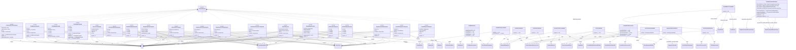

# Network & Commands

> Client-server packets and commands.

**31 classes**

## Key Classes

## Class Diagram

```mermaid
classDiagram
    class DifficultySyncPayload {
        <<record>>
        +difficulty: VirusDifficulty
        +ID: Id
        +CODEC: PacketCodec
        +getId() Id
    }
    class FieldDefinitionSyncPayload {
        <<record>>
        +definitionId: String
        +definitionJson: String
        +ID: Id
        +CODEC: PacketCodec
        +read(...) FieldDefinitionSyncPayload
        +getId() Id
        +definitionIdentifier() Identifier
    }
    class FieldNetworking {
        +registerPayloads() void
        +sendSpawn(...) void
        +sendSpawn(...) void
        +sendRemove(...) void
        +sendUpdate(...) void
    }
    class FieldRemovePayload {
        <<record>>
        +id: long
        +PACKET_ID: Identifier
        +ID: Id
        +CODEC: PacketCodec
        +read(...) FieldRemovePayload
        +getId() Id
    }
    class FieldSpawnPayload {
        <<record>>
        +id: long
        +definitionId: String
        +x: double
        +y: double
        +getId() Id
        +definitionIdentifier() Identifier
    }
    class FieldUpdatePayload {
        <<record>>
        +id: long
        +x: double
        +y: double
        +z: double
        +read(...) FieldUpdatePayload
        +getId() Id
        +position(...) FieldUpdatePayload
        +withShuffle(...) FieldUpdatePayload
        +full(...) FieldUpdatePayload
    }
    class GrowthBeamPayload {
        <<record>>
        +worldKey: RegistryKey
        +origin: BlockPos
        +targetEntityId: int
        +targetX: double
        +targetPosition() Vec3d
        +getId() Id
    }
    class GrowthRingFieldPayload {
        <<record>>
        +worldKey: RegistryKey
        +origin: BlockPos
        +rings: List
        +ID: Id
        +getId() Id
    }
    class HorizonTintPayload {
        <<record>>
        +enabled: boolean
        +intensity: float
        +argb: int
        +ID: Id
        +getId() Id
    }
    class PurificationTotemSelectPayload {
        <<record>>
        +syncId: int
        +option: PurificationOption
        +ID: Id
        +CODEC: PacketCodec
        +getId() Id
    }
    class ShieldFieldRemovePayload {
        <<record>>
        +id: long
        +ID: Id
        +CODEC: PacketCodec
        +getId() Id
    }
    class ShieldFieldSpawnPayload {
        <<record>>
        +id: long
        +x: double
        +y: double
        +z: double
        +getId() Id
    }
    class SingularityBorderPayload {
        <<record>>
        +active: boolean
        +centerX: double
        +centerZ: double
        +initialDiameter: double
        +getId() Id
    }
    class SingularitySchedulePayload {
        <<record>>
        +rings: List
        +ID: Id
        +CODEC: PacketCodec
        +rings() List
        +getId() Id
    }
    class SingularityVisualStartPayload {
        <<record>>
        +pos: BlockPos
        +ID: Id
        +CODEC: PacketCodec
        +getId() Id
    }
    class SingularityVisualStopPayload {
        <<record>>
        +pos: BlockPos
        +ID: Id
        +CODEC: PacketCodec
        +getId() Id
    }
    class SkyTintPayload {
        <<record>>
        +skyCorrupted: boolean
        +fluidsCorrupted: boolean
        +ID: Id
        +CODEC: PacketCodec
        +getId() Id
    }
    class VirusDifficultySelectPayload {
        <<record>>
        +syncId: int
        +difficulty: VirusDifficulty
        +ID: Id
        +CODEC: PacketCodec
        +getId() Id
    }
    class VoidTearBurstPayload {
        <<record>>
        +id: long
        +x: double
        +y: double
        +z: double
        +getId() Id
    }
    class VoidTearSpawnPayload {
        <<record>>
        +id: long
        +x: double
        +y: double
        +z: double
        +getId() Id
    }
    class FieldSubcommands {
        +register(...) void
    }
    class GrowthBlockCommands {
        +register() void
    }
    class GrowthCollisionCommand {
        +register() void
    }
    class GrowthCommandHandlers {
        +NO_GROWTH_STACK: SimpleCommandExceptionType
        +NO_BLOCK_TARGET: SimpleCommandExceptionType
        +NO_TARGET: SimpleCommandExceptionType
        +UNKNOWN_DEFINITION: DynamicCommandExceptionType
        +traceGrowthBlock(...) ProgressiveGrowthBlockEntity
        +requireGrowthBlock(...) ProgressiveGrowthBlockEntity
        +findHeldGrowthBlock(...)
        +applyAuto(...) int
        +applyMutationToBlock(...) int
    }
    class GrowthProfileDescriber {
        +reportDefinition(...) void
        +describeGlow(...) String
        +describeAnimation(...) String
        +describeOpacity(...) String
        +describeSpin(...) String
    }
    class InfectionSubcommands {
        +build() LiteralArgumentBuilder
    }
    class SingularitySubcommands {
        +build() LiteralArgumentBuilder
    }
    class VirusCommand {
        +register(...) void
    }
    class VirusDebugCommands {
        +register() void
    }
    class VirusDifficultyCommand {
        +register(...) void
        +openMenuFor(...) boolean
    }
    class VirusStatsCommand {
        +register(...) void
    }
    class CustomPayload {
        <<interface>>
    }
    class Id
    CustomPayload <|.. DifficultySyncPayload
    CustomPayload <|.. FieldDefinitionSyncPayload
    CustomPayload <|.. FieldRemovePayload
    CustomPayload <|.. FieldSpawnPayload
    CustomPayload <|.. FieldUpdatePayload
    CustomPayload <|.. GrowthBeamPayload
    CustomPayload <|.. GrowthRingFieldPayload
    CustomPayload <|.. HorizonTintPayload
    CustomPayload <|.. PurificationTotemSelectPayload
    CustomPayload <|.. ShieldFieldRemovePayload
    CustomPayload <|.. ShieldFieldSpawnPayload
    CustomPayload <|.. SingularityBorderPayload
    CustomPayload <|.. SingularitySchedulePayload
    CustomPayload <|.. SingularityVisualStartPayload
    CustomPayload <|.. SingularityVisualStopPayload
    CustomPayload <|.. SkyTintPayload
    CustomPayload <|.. VirusDifficultySelectPayload
    CustomPayload <|.. VoidTearBurstPayload
    CustomPayload <|.. VoidTearSpawnPayload
    DifficultySyncPayload --> Id : ID
    DifficultySyncPayload --> PacketByteBufbuf : uses
    DifficultySyncPayload --> PacketCodec : CODEC
    DifficultySyncPayload --> VirusDifficulty : difficulty
    FieldDefinitionSyncPayload --> Id : ID
    FieldDefinitionSyncPayload --> Id : returns
    FieldDefinitionSyncPayload --> PacketByteBufbuf : uses
    FieldDefinitionSyncPayload --> PacketCodec : CODEC
    FieldNetworking --> FieldInstance : uses
    FieldNetworking --> FieldInstanceinstance : uses
    FieldNetworking --> ServerPlayerEntityplayer : uses
    FieldRemovePayload --> Id : ID
    FieldRemovePayload --> Id : returns
    FieldRemovePayload --> PacketByteBufbuf : uses
    FieldRemovePayload --> PacketCodec : CODEC
    FieldSpawnPayload --> Id : ID
    FieldSpawnPayload --> Id : returns
    FieldSpawnPayload --> PacketByteBufbuf : uses
    FieldSpawnPayload --> PacketCodec : CODEC
    FieldSubcommands --> CommandDispatcher : uses
    FieldSubcommands --> ServerCommandSourcesource : uses
    FieldUpdatePayload --> Id : ID
    FieldUpdatePayload --> Id : returns
    FieldUpdatePayload --> PacketByteBufbuf : uses
    FieldUpdatePayload --> PacketCodec : CODEC
    GrowthBeamPayload --> Id : ID
    GrowthBeamPayload --> PacketByteBufbuf : uses
    GrowthBeamPayload --> PacketCodec : CODEC
    GrowthBeamPayload --> RegistryKey : worldKey
    GrowthBlockCommands --> GrowthField : BOOLEAN_FIELDS
    GrowthBlockCommands --> GrowthField : FIELD_LOOKUP
    GrowthBlockCommands --> GrowthField : JSON_KEY_MAP
    GrowthBlockCommands --> ProfileSpec : PROFILE_SPECS
    GrowthCollisionCommand --> CommandContext : uses
    GrowthCollisionCommand --> CommandDispatcher : uses
    GrowthCollisionCommand --> ServerCommandSource : uses
    GrowthCollisionCommand --> ShapeMode : returns
    GrowthCommandHandlers --> DynamicCommandExceptionType : UNKNOWN_DEFINITION
    GrowthCommandHandlers --> SimpleCommandExceptionType : NO_BLOCK_TARGET
    GrowthCommandHandlers --> SimpleCommandExceptionType : NO_GROWTH_STACK
    GrowthCommandHandlers --> SimpleCommandExceptionType : NO_TARGET
    GrowthProfileDescriber --> GrowthBlockDefinitiondefinition : uses
    GrowthProfileDescriber --> GrowthGlowProfileprofile : uses
    GrowthProfileDescriber --> GrowthOverridesoverrides : uses
    GrowthProfileDescriber --> ServerCommandSourcesource : uses
    GrowthRingFieldPayload --> Id : ID
    GrowthRingFieldPayload --> PacketCodec : CODEC
    GrowthRingFieldPayload --> RegistryKey : worldKey
    GrowthRingFieldPayload --> RingEntry : rings
    HorizonTintPayload --> Id : ID
    HorizonTintPayload --> Id : returns
    HorizonTintPayload --> PacketByteBufbuf : uses
    HorizonTintPayload --> PacketCodec : CODEC
    InfectionSubcommands --> LiteralArgumentBuilder : returns
    InfectionSubcommands --> ServerCommandSource : returns
    InfectionSubcommands --> ServerCommandSourcesource : uses
    InfectionSubcommands --> SuggestionProvider : SCENARIO_SUGGESTIONS
    PurificationTotemSelectPayload --> Id : ID
    PurificationTotemSelectPayload --> Id : returns
    PurificationTotemSelectPayload --> PacketCodec : CODEC
    PurificationTotemSelectPayload --> PurificationOption : option
    ShieldFieldRemovePayload --> Id : ID
    ShieldFieldRemovePayload --> Id : returns
    ShieldFieldRemovePayload --> PacketByteBufbuf : uses
    ShieldFieldRemovePayload --> PacketCodec : CODEC
    ShieldFieldSpawnPayload --> Id : ID
    ShieldFieldSpawnPayload --> Id : returns
    ShieldFieldSpawnPayload --> PacketByteBufbuf : uses
    ShieldFieldSpawnPayload --> PacketCodec : CODEC
    SingularityBorderPayload --> Id : ID
    SingularityBorderPayload --> Id : returns
    SingularityBorderPayload --> PacketByteBufbuf : uses
    SingularityBorderPayload --> PacketCodec : CODEC
    SingularitySchedulePayload --> Id : ID
    SingularitySchedulePayload --> PacketByteBufbuf : uses
    SingularitySchedulePayload --> PacketCodec : CODEC
    SingularitySchedulePayload --> RingEntry : rings
    SingularitySubcommands --> LiteralArgumentBuilder : returns
    SingularitySubcommands --> ServerCommandSource : returns
    SingularitySubcommands --> ServerCommandSourcesource : uses
    SingularitySubcommands --> ServerPlayerEntitytarget : uses
    SingularityVisualStartPayload --> Id : ID
    SingularityVisualStartPayload --> Id : returns
    SingularityVisualStartPayload --> PacketByteBufbuf : uses
    SingularityVisualStartPayload --> PacketCodec : CODEC
    SingularityVisualStopPayload --> Id : ID
    SingularityVisualStopPayload --> Id : returns
    SingularityVisualStopPayload --> PacketByteBufbuf : uses
    SingularityVisualStopPayload --> PacketCodec : CODEC
    SkyTintPayload --> Id : ID
    SkyTintPayload --> Id : returns
    SkyTintPayload --> PacketByteBufbuf : uses
    SkyTintPayload --> PacketCodec : CODEC
    VirusCommand --> CommandDispatcher : uses
    VirusCommand --> LiteralArgumentBuilder : returns
    VirusCommand --> ServerCommandSource : returns
    VirusCommand --> ServerCommandSourcesource : uses
    VirusDebugCommands --> InfectionTiercurrentTier : uses
    VirusDebugCommands --> ServerCommandSourcesource : uses
    VirusDebugCommands --> TierFeaturefeature : uses
    VirusDifficultyCommand --> CommandDispatcher : uses
    VirusDifficultyCommand --> ServerCommandSourcesource : uses
    VirusDifficultyCommand --> ServerPlayerEntityplayer : uses
    VirusDifficultyCommand --> VirusDifficulty : returns
    VirusDifficultySelectPayload --> Id : ID
    VirusDifficultySelectPayload --> PacketByteBufbuf : uses
    VirusDifficultySelectPayload --> PacketCodec : CODEC
    VirusDifficultySelectPayload --> VirusDifficulty : difficulty
    VirusStatsCommand --> CommandDispatcher : uses
    VirusStatsCommand --> ServerCommandSourcesource : uses
    VoidTearBurstPayload --> Id : ID
    VoidTearBurstPayload --> Id : returns
    VoidTearBurstPayload --> PacketByteBufbuf : uses
    VoidTearBurstPayload --> PacketCodec : CODEC
    VoidTearSpawnPayload --> Id : ID
    VoidTearSpawnPayload --> Id : returns
    VoidTearSpawnPayload --> PacketByteBufbuf : uses
    VoidTearSpawnPayload --> PacketCodec : CODEC
```

---
[Back to README](./README.md)
