# Rendering Pipeline

> Mesh building, tessellators, and renderers.

**39 classes**

## Key Classes

- **`MeshBuilder`** (class)
- **`PrismTessellator`** (class)
- **`SphereTessellator`** (class)
- **`AbstractPrimitiveRenderer`** (class)
- **`FieldRenderer`** (class)
- **`LayerRenderer`** (class)

## Class Diagram

```mermaid
classDiagram
    class ClientFieldManager {
        +get() ClientFieldManager
        +addOrUpdate(...) void
        +get(...) ClientFieldState
        +remove(...) void
        +clear() void
    }
    class PersonalFieldTracker {
        +setDefinition(...) void
        +setResponsiveness(...) void
        +setScale(...) void
        +setEnabled(...) void
        +setVisible(...) void
    }
    class CapsuleTessellator {
        +tessellate(...) Mesh
        +tessellate(...) Mesh
        +tessellate(...) Mesh
    }
    class ConeTessellator {
        +tessellate(...) Mesh
        +tessellate(...) Mesh
        +tessellate(...) Mesh
    }
    class CylinderTessellator {
        +tessellate(...) Mesh
        +tessellate(...) Mesh
        +tessellate(...) Mesh
        +tessellate(...) Mesh
    }
    class GeometryMath {
        +TWO_PI: float
        +PI: float
        +HALF_PI: float
        +ringPoint(...) Vertex
        +ringInnerPoint(...) Vertex
        +ringOuterPoint(...) Vertex
        +discPoint(...) Vertex
        +discCenter(...) Vertex
    }
    class Mesh {
        +empty() Mesh
        +vertices() List
        +indices()
        +primitiveType() PrimitiveType
        +vertexCount() int
    }
    class MeshBuilder {
        +triangles() MeshBuilder
        +quads() MeshBuilder
        +lines() MeshBuilder
        +addVertex(...) int
        +vertex(...) int
    }
    class PolyhedronTessellator {
        +builder() Builder
        +fromShape(...) PolyhedronTessellator
        +tessellate(...) Mesh
        +tessellate(...) Mesh
        +defaultDetail() int
    }
    class PrimitiveType {
        <<enumeration>>
    }
    class PrismTessellator {
        +tessellate(...) Mesh
        +tessellate(...) Mesh
        +tessellate(...) Mesh
        +tessellate(...) Mesh
    }
    class RingTessellator {
        +tessellate(...) Mesh
        +tessellate(...) Mesh
        +tessellate(...) Mesh
    }
    class SphereTessellator {
        +tessellate(...) Mesh
        +tessellate(...) Mesh
        +tessellate(...) Mesh
        +requiresDirectRendering(...) boolean
    }
    class Tessellator {
        <<interface>>
    }
    class TorusTessellator {
        +tessellate(...) Mesh
        +tessellate(...) Mesh
        +tessellate(...) Mesh
    }
    class Vertex {
        <<record>>
        +x: float
        +y: float
        +z: float
        +nx: float
        +pos(...) Vertex
        +posNormal(...) Vertex
        +posUV(...) Vertex
        +spherical(...) Vertex
        +spherical(...) Vertex
    }
    class FieldRenderLayers {
        +solidTranslucent() RenderLayer
        +solidTranslucentCull() RenderLayer
        +solidTranslucentNoDepth() RenderLayer
        +solidTranslucentNoCull() RenderLayer
        +solidTranslucent(...) RenderLayer
    }
    class GlowRenderer {
        +DEFAULT_INTENSITY: float
        +MAX_INTENSITY: float
        +render(...) void
        +render(...) void
        +renderAdditive(...) void
        +renderHalo(...) void
        +renderSimpleHalo(...) void
    }
    class RenderLayerFactory {
        +solid() RenderLayer
        +translucent() RenderLayer
        +lines() RenderLayer
        +glow() RenderLayer
    }
    class VertexEmitter {
        +color(...) VertexEmitter
        +color(...) VertexEmitter
        +color(...) VertexEmitter
        +alpha(...) VertexEmitter
        +light(...) VertexEmitter
    }
    class WaveRenderLayer {
        +translucent() RenderLayer
        +isGpuWaveAvailable() boolean
    }
    class WaveShaderRegistry {
        +register() void
        +isAvailable() boolean
        +setWaveUniforms(...) void
    }
    class AbstractPrimitiveRenderer {
        <<abstract>>
        +render(...) void
    }
    class BeamRenderer {
        +render(...) void
    }
    class CapsuleRenderer {
        +shapeType() String
    }
    class ConeRenderer {
        +shapeType() String
    }
    class CylinderRenderer {
        +shapeType() String
    }
    class FieldRenderer {
        +render(...) void
        +renderWithFollow(...) void
        +renderWithPrediction(...) void
        +renderInstance(...) void
        +renderWithBindings(...) void
    }
    class LayerRenderer {
        +render(...) void
        +render(...) void
    }
    class PolyhedronRenderer {
        +shapeType() String
    }
    class PrimitiveRenderer {
        <<interface>>
    }
    class PrimitiveRenderers {
        +registerAlias(...) void
        +register(...) void
        +get(...) PrimitiveRenderer
        +get(...) PrimitiveRenderer
        +get(...) PrimitiveRenderer
    }
    class PrismRenderer {
        +shapeType() String
    }
    class RenderOverrides {
        <<record>>
        +vertexPattern: VertexPattern
        +colorOverride: Integer
        +alphaMultiplier: float
        +scaleMultiplier: float
        +withPattern(...) RenderOverrides
        +withAlpha(...) RenderOverrides
        +hasOverrides() boolean
        +builder() Builder
    }
    class RingRenderer {
        +shapeType() String
    }
    class RenderPhase
    class Builder
    class Shapeshape
    class Meshmesh
    class Matrix4f
    class Matrix3f
    class Primitiveprimitive
    AbstractPrimitiveRenderer --> ColorResolverresolver : uses
    AbstractPrimitiveRenderer --> MatrixStackmatrices : uses
    AbstractPrimitiveRenderer --> Primitiveprimitive : uses
    AbstractPrimitiveRenderer --> VertexConsumerconsumer : uses
    AbstractPrimitiveRenderer <|-- CapsuleRenderer
    AbstractPrimitiveRenderer <|-- ConeRenderer
    AbstractPrimitiveRenderer <|-- CylinderRenderer
    AbstractPrimitiveRenderer <|-- PolyhedronRenderer
    AbstractPrimitiveRenderer <|-- PrismRenderer
    AbstractPrimitiveRenderer <|-- RingRenderer
    BeamRenderer --> BeamConfigbeam : uses
    BeamRenderer --> ColorResolverresolver : uses
    BeamRenderer --> MatrixStackmatrices : uses
    BeamRenderer --> VertexConsumerProviderconsumers : uses
    CapsuleRenderer --> MatrixStackmatrices : uses
    CapsuleRenderer --> Mesh : returns
    CapsuleRenderer --> Primitiveprimitive : uses
    CapsuleRenderer --> WaveConfigwave : uses
    CapsuleTessellator --> CapsuleShapeshape : uses
    CapsuleTessellator --> Mesh : returns
    CapsuleTessellator --> VertexPatternpattern : uses
    CapsuleTessellator --> VisibilityMaskvisibility : uses
    ClientFieldManager --> ClientFieldState : returns
    ClientFieldManager --> ClientFieldState : states
    ClientFieldManager --> ClientFieldStatestate : uses
    ClientFieldManager --> PersonalFieldTracker : personalTracker
    ConeRenderer --> MatrixStackmatrices : uses
    ConeRenderer --> Mesh : returns
    ConeRenderer --> Primitiveprimitive : uses
    ConeRenderer --> WaveConfigwave : uses
    ConeTessellator --> ConeShapeshape : uses
    ConeTessellator --> Mesh : returns
    ConeTessellator --> VertexPatternpattern : uses
    ConeTessellator --> VisibilityMaskvisibility : uses
    CylinderRenderer --> MatrixStackmatrices : uses
    CylinderRenderer --> Mesh : returns
    CylinderRenderer --> Primitiveprimitive : uses
    CylinderRenderer --> WaveConfigwave : uses
    CylinderTessellator --> CylinderShapeshape : uses
    CylinderTessellator --> Mesh : returns
    CylinderTessellator --> VertexPatterncapPattern : uses
    CylinderTessellator --> VertexPatternsidesPattern : uses
    FieldRenderLayers --> RenderLayer : SOLID_TRANSLUCENT
    FieldRenderLayers --> RenderLayer : SOLID_TRANSLUCENT_CULL
    FieldRenderLayers --> RenderLayer : SOLID_TRANSLUCENT_NO_CULL
    FieldRenderLayers --> RenderLayer : SOLID_TRANSLUCENT_NO_DEPTH
    FieldRenderer --> FollowConfigfollow : uses
    FieldRenderer --> MatrixStackmatrices : uses
    FieldRenderer --> PlayerEntityplayer : uses
    FieldRenderer --> VertexConsumerProviderconsumers : uses
    GeometryMath --> Vector3f : returns
    GeometryMath --> Vertex : returns
    GeometryMath --> Vertexv0 : uses
    GeometryMath --> Vertexv1 : uses
    GlowRenderer --> MatrixStackmatrices : uses
    GlowRenderer --> Meshmesh : uses
    GlowRenderer --> VertexConsumerProviderconsumers : uses
    GlowRenderer --> VertexConsumerconsumer : uses
    LayerRenderer --> MatrixStackmatrices : uses
    LayerRenderer --> ThreadLocal : positionCache
    LayerRenderer --> Vector3f : returns
    LayerRenderer --> Vector3fposition : uses
    Mesh --> PrimitiveType : primitiveType
    Mesh --> PrimitiveType : returns
    Mesh --> Vertex : returns
    Mesh --> Vertex : vertices
    MeshBuilder --> PrimitiveType : primitiveType
    MeshBuilder --> Vertex : vertices
    MeshBuilder --> VertexPatternpattern : uses
    MeshBuilder --> Vertexvertex : uses
    PersonalFieldTracker --> FieldDefinition : returns
    PersonalFieldTracker --> PlayerEntityplayer : uses
    PolyhedronRenderer --> MatrixStackmatrices : uses
    PolyhedronRenderer --> Mesh : returns
    PolyhedronRenderer --> Primitiveprimitive : uses
    PolyhedronRenderer --> WaveConfigwave : uses
    PolyhedronTessellator --> Builder : returns
    PolyhedronTessellator --> PolyType : polyType
    PolyhedronTessellator --> VertexPattern : pattern
    PolyhedronTessellator --> WaveConfig : wave
    PrimitiveRenderer --> ColorResolverresolver : uses
    PrimitiveRenderer --> MatrixStackmatrices : uses
    PrimitiveRenderer --> Primitiveprimitive : uses
    PrimitiveRenderer --> VertexConsumerconsumer : uses
    PrimitiveRenderer <|.. AbstractPrimitiveRenderer
    PrimitiveRenderers --> PrimitiveRenderer : RENDERERS
    PrimitiveRenderers --> PrimitiveRenderer : returns
    PrimitiveRenderers --> PrimitiveRendererrenderer : uses
    PrimitiveRenderers --> Primitiveprimitive : uses
    PrismRenderer --> MatrixStackmatrices : uses
    PrismRenderer --> Mesh : returns
    PrismRenderer --> Primitiveprimitive : uses
    PrismRenderer --> WaveConfigwave : uses
    PrismTessellator --> Mesh : returns
    PrismTessellator --> PrismShapeshape : uses
    PrismTessellator --> VertexPatterncapPattern : uses
    PrismTessellator --> VertexPatternsidesPattern : uses
    RenderLayerFactory --> RenderLayer : returns
    RenderOverrides --> Builder : returns
    RenderOverrides --> VertexPattern : vertexPattern
    RenderOverrides --> VertexPatternpattern : uses
    RenderPhase <|-- FieldRenderLayers
    RingRenderer --> MatrixStackmatrices : uses
    RingRenderer --> Mesh : returns
    RingRenderer --> Primitiveprimitive : uses
    RingRenderer --> WaveConfigwave : uses
    RingTessellator --> Mesh : returns
    RingTessellator --> RingShapeshape : uses
    RingTessellator --> VertexPatternpattern : uses
    RingTessellator --> VisibilityMaskvisibility : uses
    SphereTessellator --> Mesh : returns
    SphereTessellator --> SphereShapeshape : uses
    SphereTessellator --> VertexPatternpattern : uses
    SphereTessellator --> VisibilityMaskvisibility : uses
    Tessellator --> Mesh : returns
    Tessellator --> Shapeshape : uses
    Tessellator <|.. PolyhedronTessellator
    TorusTessellator --> Mesh : returns
    TorusTessellator --> TorusShapeshape : uses
    TorusTessellator --> VertexPatternpattern : uses
    TorusTessellator --> VisibilityMaskvisibility : uses
    Vertex --> Vector3f : returns
    Vertex --> Vertexother : uses
    VertexEmitter --> Matrix3f : normalMatrix
    VertexEmitter --> Matrix4f : positionMatrix
    VertexEmitter --> VertexConsumer : consumer
    VertexEmitter --> WaveConfig : waveConfig
    WaveRenderLayer --> RenderLayer : returns
    WaveShaderRegistry --> WaveConfigwave : uses
```

---
[Back to README](./README.md)
